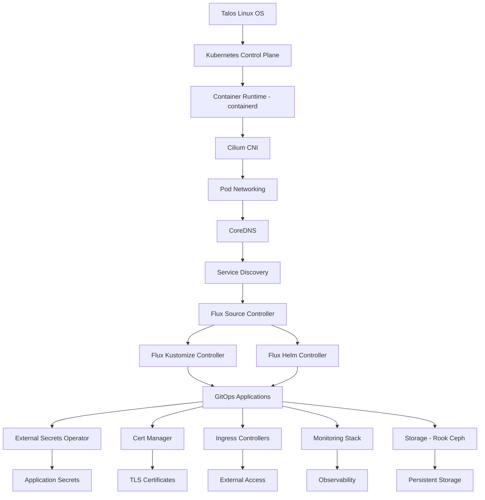

# Kubernetes Infrastructure Dependencies

This document maps out the critical dependencies in the homelab Kubernetes cluster to help understand the bootstrap order and troubleshooting hierarchy.

## Dependency Tree



## Component Layers

### Layer 1: Operating System
- **Talos Linux**: Immutable, API-driven OS
- **Dependencies**: Hardware, network connectivity
- **Recovery**: Physical/console access required

### Layer 2: Kubernetes Core
- **Components**: API Server, Controller Manager, Scheduler, etcd
- **Dependencies**: Talos Linux, valid configuration
- **Recovery**: `talosctl` commands, node reboot

### Layer 3: Container Networking
- **Cilium CNI**: eBPF-based networking, kube-proxy replacement
- **Dependencies**: Kubernetes API, node access
- **Recovery**: Helmfile bootstrap

### Layer 4: Cluster DNS
- **CoreDNS**: Internal DNS resolution
- **Dependencies**: CNI for pod networking
- **Recovery**: Helmfile bootstrap after CNI

### Layer 5: Certificate Management
- **Cert-Manager**: TLS certificate automation
- **Dependencies**: DNS, CRDs
- **Recovery**: Helmfile bootstrap

### Layer 6: GitOps Engine
- **Flux**: Continuous deployment from Git
- **Components**:
  - flux-operator: Manages Flux lifecycle
  - source-controller: Fetches Git/Helm/OCI artifacts
  - kustomize-controller: Applies Kustomizations
  - helm-controller: Manages HelmReleases
  - notification-controller: Sends alerts/notifications
- **Dependencies**: DNS, networking, Git access
- **Recovery**: Helmfile bootstrap, then FluxInstance

### Layer 7: Platform Services
- **External Secrets**: Secret management integration
- **Ingress Controllers**: External traffic routing
- **Monitoring**: Prometheus, Grafana, Loki
- **Storage**: Rook-Ceph distributed storage
- **Dependencies**: Flux, CRDs, namespace creation
- **Recovery**: Flux reconciliation

### Layer 8: Applications
- **User Workloads**: Deployed via GitOps
- **Dependencies**: All platform services
- **Recovery**: Automatic via Flux

## Bootstrap Sequence

### Phase 1: Helmfile Bootstrap
Executed via `task bootstrap:apps` or `helmfile sync`:

1. **Namespaces**: Create all required namespaces
2. **SOPS Secrets**: Deploy age key for secret decryption
3. **CRDs**: Install Custom Resource Definitions
4. **Cilium**: Deploy CNI (no dependencies)
5. **CoreDNS**: Deploy DNS (depends on Cilium)
6. **Spegel**: Container registry mirror (depends on CoreDNS)
7. **Cert-Manager**: Certificate management (depends on DNS)
8. **Flux Operator**: Flux lifecycle manager (depends on Cert-Manager)
9. **Flux Instance**: Deploy Flux controllers (depends on Flux Operator)

### Phase 2: GitOps Reconciliation
Managed by Flux from Git repository:

1. **cluster-meta**: Helm repositories and shared resources
2. **cluster-apps**: All applications in dependency order
   - External Secrets (for secret management)
   - Storage providers
   - Ingress controllers
   - Monitoring stack
   - User applications

## Dependency Rules

### Hard Dependencies (Must Exist)
- No pods can run without CNI
- No service discovery without DNS
- No GitOps without Flux controllers
- No encrypted secrets without SOPS key
- No external secrets without ESO CRDs

### Soft Dependencies (Should Exist)
- Ingress prefers cert-manager for TLS
- Apps prefer external-secrets for credentials
- Monitoring prefers all components for full visibility

## Troubleshooting Order

When diagnosing issues, check in this order:

1. **Node Status**: `kubectl get nodes`
2. **CNI Health**: `kubectl get pods -n kube-system -l app.kubernetes.io/name=cilium`
3. **DNS Function**: `kubectl run test --image=busybox --rm -it -- nslookup kubernetes`
4. **Flux Status**: `flux check`
5. **Source Sync**: `flux get sources git -A`
6. **Kustomizations**: `flux get kustomization -A`
7. **Helm Releases**: `flux get helmrelease -A`
8. **Application Pods**: `kubectl get pods -A`

## Recovery Strategies by Failure Type

### CNI Failure
```bash
export ROOT_DIR=$(pwd)
helmfile --file bootstrap/helmfile.yaml -l name=cilium sync
```

### DNS Failure
```bash
# First ensure CNI is working
helmfile --file bootstrap/helmfile.yaml -l name=coredns sync
```

### Flux Failure
```bash
# Ensure CNI and DNS are working first
helmfile --file bootstrap/helmfile.yaml -l name=flux-operator sync
helmfile --file bootstrap/helmfile.yaml -l name=flux-instance sync
# If FluxInstance deleted, recreate:
helm get manifest flux-instance -n flux-system | kubectl apply -f -
```

### Complete Infrastructure Failure
```bash
# Full bootstrap from scratch
task bootstrap:apps
# Or manually:
export ROOT_DIR=$(pwd)
helmfile --file bootstrap/helmfile.yaml sync
```

## Key Files and Locations

- **Bootstrap Configuration**: `/bootstrap/helmfile.yaml`
- **Helm Values**: `/kubernetes/apps/{namespace}/{app}/app/helm/values.yaml`
- **Flux Entry Point**: `/kubernetes/flux/cluster/ks.yaml`
- **Apps Root Kustomization**: `/kubernetes/apps/kustomization.yaml`
- **Repository Configuration**: `/kubernetes/flux/meta/repos/`

## Component Versions

Critical infrastructure versions (from helmfile.yaml):
- Cilium: 1.17.4
- CoreDNS: 1.42.1
- Spegel: 0.2.0
- Cert-Manager: v1.17.2
- Flux Distribution: 2.6.1

## Health Verification Commands

```bash
# Verify each layer
# Layer 1: OS
talosctl -n 192.168.1.98,192.168.1.99,192.168.1.100 health

# Layer 2: Kubernetes
kubectl get nodes
kubectl get pods -n kube-system -l component=kube-apiserver

# Layer 3: CNI
kubectl get ds -n kube-system cilium
cilium status  # if cilium CLI installed

# Layer 4: DNS
kubectl get deploy -n kube-system coredns
kubectl get svc -n kube-system kube-dns

# Layer 5: Cert-Manager
kubectl get deploy -n cert-manager cert-manager

# Layer 6: GitOps
flux check

# Layer 7: Platform Services
kubectl get crd | grep -E "external-secrets|certificates|ingressroutes"

# Layer 8: Applications
kubectl get pods -A | grep -v "kube-system\|flux-system"
```

Understanding these dependencies is crucial for effective troubleshooting and recovery. Always work from the bottom up when diagnosing issues, as higher layers cannot function without their foundational dependencies.