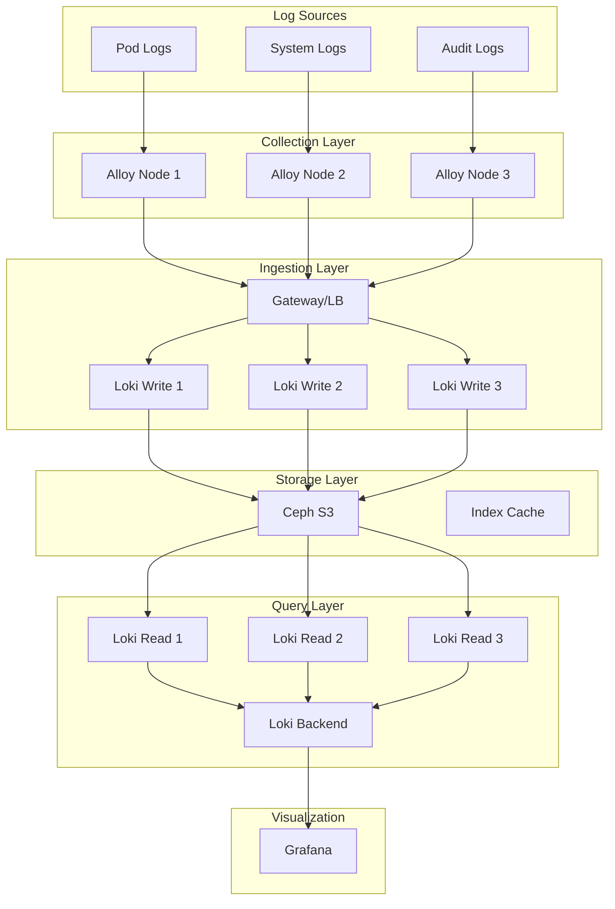

# Loki + Alloy Logging Stack Planning & Design

## Executive Summary

This document outlines the detailed implementation plan for deploying Grafana Loki 3.x with Alloy as a centralized logging solution. The deployment will use Simple Scalable mode with Ceph S3 backend storage to provide production-grade log aggregation for the Kubernetes homelab.

## MCP Server Usage for Planning

Leverage MCP servers for informed architectural decisions:

### Architecture Research
```bash
# Get latest Loki architecture best practices
/mcp context7:get-library-docs /grafana/loki "simple scalable architecture" 5000

# Research storage backend options
/mcp context7:get-library-docs /grafana/loki "storage backends s3 vs filesystem" 4000

# Understand Alloy collection patterns
/mcp context7:get-library-docs /grafana/alloy "kubernetes log collection" 3000
```

### Design Validation
```bash
# Validate architecture design
/mcp sequential-thinking:sequential_thinking "Analyze the proposed Loki Simple Scalable architecture with 3 write replicas, 3 read replicas, 1 backend, and 2 gateways for a 100GB/day log volume. Consider failure scenarios, query performance, and operational complexity"

# Plan resource allocation
/mcp sequential-thinking:sequential_thinking "Given 3 nodes with 96GB RAM each, design optimal resource allocation for Loki components considering node failure tolerance and leaving 40% headroom for other workloads"
```

### Current State Analysis
```bash
# Check existing Ceph configuration
/mcp kubernetes:kubectl_get "cephobjectstore" "storage"
/mcp kubernetes:kubectl_describe "storageclass" "ceph-bucket"

# Verify namespace setup
/mcp kubernetes:kubectl_get "namespace" "monitoring"
/mcp kubernetes:kubectl_get "kustomization" "flux-system" "-l app.kubernetes.io/part-of=monitoring"
```

## Architecture Design

### Component Overview



### Deployment Mode: Simple Scalable

**Rationale for Simple Scalable Mode:**
1. **Scalability**: Can handle TB/day of logs
2. **Separation of Concerns**: Read/write path isolation
3. **Production Ready**: Battle-tested architecture
4. **Future Proof**: Easy to scale components independently

### Storage Architecture

**Ceph S3 Configuration:**
- **Chunks**: Log data stored in compressed chunks
- **Index**: TSDB index for fast queries
- **Retention**: 30-day default, configurable per tenant

## Implementation Phases

### Phase 0: S3 Prerequisites (1 hour) - REQUIRED FIRST
1. Enable Ceph ObjectStore (rename ks.yaml.disabled)
2. Wait for RGW pods to be operational
3. Validate S3 endpoint connectivity
4. Create test bucket to verify functionality
5. See detailed guide: [S3 Prerequisites](00-s3-prerequisites.md)

### Phase 1: Infrastructure Preparation (2 hours)
1. Create Ceph S3 buckets via ObjectBucketClaim
2. Configure S3 credentials via External Secrets
3. Add Grafana Helm repository
4. Create namespace configurations

### Phase 2: Loki Deployment (4 hours)
1. Deploy Loki in Simple Scalable mode
2. Configure S3 backend storage
3. Set up Gateway/Load Balancer
4. Validate component health

### Phase 3: Alloy Configuration (3 hours)
1. Deploy Alloy DaemonSet
2. Configure log collection pipelines
3. Set up service discovery
4. Implement filtering rules

### Phase 4: Integration & Testing (2 hours)
1. Configure Grafana data source
2. Import dashboards
3. Test log ingestion
4. Validate query performance

### Phase 5: Migration & Cleanup (3 hours)
1. Migrate Airflow to centralized logging
2. Implement retention policies
3. Document operational procedures
4. Decommission old logging PVCs

## Configuration Details

### Loki Configuration

```yaml
# Simple Scalable Mode Configuration
loki:
  auth_enabled: false
  
  schemaConfig:
    configs:
      - from: "2024-04-01"
        store: tsdb
        object_store: s3
        schema: v13
        index:
          prefix: loki_index_
          period: 24h
  
  storage_config:
    aws:
      s3: "http://rook-ceph-rgw-storage.storage.svc.cluster.local/loki"
      s3forcepathstyle: true
      region: "us-east-1"  # Required but ignored
    tsdb_shipper:
      active_index_directory: /loki/index
      cache_location: /loki/cache
      cache_ttl: 24h
  
  limits_config:
    enforce_metric_name: false
    reject_old_samples: true
    reject_old_samples_max_age: 168h
    max_cache_freshness_per_query: 10m
    retention_period: 720h  # 30 days
```

### Alloy Configuration

```yaml
# Kubernetes Log Collection
logging {
  write_to = [loki.write.default.receiver]
  
  // Discover all pods
  discovery.kubernetes "pods" {
    role = "pod"
  }
  
  // Relabel and filter
  discovery.relabel "pods" {
    targets = discovery.kubernetes.pods.targets
    
    // Add namespace label
    rule {
      source_labels = ["__meta_kubernetes_namespace"]
      target_label  = "namespace"
    }
    
    // Add pod name
    rule {
      source_labels = ["__meta_kubernetes_pod_name"]
      target_label  = "pod"
    }
    
    // Add container name
    rule {
      source_labels = ["__meta_kubernetes_pod_container_name"]
      target_label  = "container"
    }
    
    // Drop system namespaces
    rule {
      source_labels = ["namespace"]
      regex         = "kube-system|kube-public"
      action        = "drop"
    }
  }
  
  // Configure Loki endpoint
  loki.write "default" {
    endpoint {
      url = "http://loki-gateway.monitoring.svc.cluster.local/loki/api/v1/push"
    }
  }
}
```

## Resource Allocation

### Production Configuration

| Component | Replicas | CPU | Memory | Storage |
|-----------|----------|-----|---------|---------|
| Loki Write | 3 | 1 core | 2Gi | 10Gi cache |
| Loki Read | 3 | 1 core | 2Gi | 5Gi cache |
| Loki Backend | 1 | 500m | 1Gi | - |
| Gateway | 2 | 500m | 512Mi | - |
| Alloy | 3 (DaemonSet) | 500m | 512Mi | 1Gi buffer |

### Storage Projections

| Metric | Value | Notes |
|--------|-------|-------|
| Daily Log Volume | 100GB | Based on current Airflow usage |
| Compression Ratio | 10:1 | Typical for structured logs |
| Storage per Day | 10GB | After compression |
| 30-day Storage | 300GB | With retention policy |
| Index Size | 30GB | ~10% of data size |

## Security Considerations

### Access Control
1. **Network Policies**: Restrict component communication
2. **S3 Credentials**: Managed via External Secrets
3. **Query Limits**: Prevent resource exhaustion
4. **Multi-tenancy**: Logical separation by namespace

### Data Protection
1. **Encryption at Rest**: Via Ceph encryption
2. **Encryption in Transit**: TLS for S3 communication
3. **Backup**: S3 bucket replication
4. **Audit Logging**: Track query access

## Monitoring & Alerting

### Key Metrics to Monitor

| Metric | Warning | Critical | Alert |
|--------|---------|----------|-------|
| Ingestion Rate | >1GB/hour | >2GB/hour | Scale writes |
| Query Latency | >2s | >5s | Investigate |
| Storage Usage | 70% | 85% | Expand storage |
| Error Rate | >1% | >5% | Check health |

### Dashboards to Import
1. **Loki Operational**: Ingestion, latency, errors
2. **Loki Resources**: CPU, memory, network
3. **Log Volume**: By namespace, pod, level
4. **Query Performance**: Top queries, slow queries

## Operational Procedures

### Daily Tasks
1. Check ingestion rate and errors
2. Monitor storage growth
3. Review slow query log
4. Validate retention policy execution

### Weekly Tasks
1. Analyze log volume trends
2. Optimize high-volume sources
3. Review and tune queries
4. Update filtering rules

### Monthly Tasks
1. Capacity planning review
2. Performance optimization
3. Security audit
4. Documentation updates

## Migration Strategy

### Phase 1: Parallel Running (Week 1)
- Deploy logging stack
- Keep existing Airflow logs
- Validate data completeness

### Phase 2: Gradual Cutover (Week 2)
- Point new deployments to Loki
- Monitor both systems
- Build confidence

### Phase 3: Full Migration (Week 3)
- Switch Airflow to stdout logging
- Retire 100Gi PVC
- Update all dashboards

### Phase 4: Optimization (Week 4)
- Tune retention policies
- Optimize queries
- Document lessons learned

## Success Metrics

| Metric | Target | Measurement |
|--------|--------|-------------|
| Log Coverage | 100% | All pods sending logs |
| Query Performance | <1s | P95 for 24h queries |
| Availability | 99.9% | Write path uptime |
| Storage Efficiency | 10:1 | Compression ratio |
| Cost Reduction | 50% | vs PVC storage |

## Risk Mitigation

| Risk | Impact | Probability | Mitigation |
|------|--------|-------------|------------|
| S3 Misconfiguration | High | Medium | Test in dev namespace first |
| Performance Issues | Medium | Medium | Start with conservative limits |
| Storage Growth | Medium | High | Implement strict retention |
| Complexity | Medium | Low | Excellent documentation |

## Next Steps

1. **Approval**: Review and approve this plan
2. **Preparation**: Complete infrastructure setup
3. **Deployment**: Follow implementation phases
4. **Validation**: Execute test plan
5. **Migration**: Begin parallel running

---

**Plan Version**: 1.0  
**Created**: January 2025  
**Status**: PENDING APPROVAL