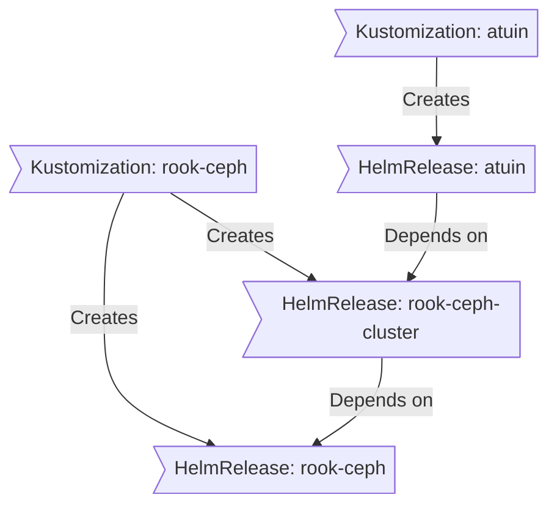

Directory structure:
└── onedr0p-home-ops/
    ├── README.md
    ├── LICENSE
    ├── Taskfile.yaml
    ├── .editorconfig
    ├── .minijinja.toml
    ├── .mise.toml
    ├── .renovaterc.json5
    ├── .shellcheckrc
    ├── .sops.yaml
    ├── bootstrap/
    │   ├── helmfile.yaml
    │   └── resources.yaml.j2
    ├── kubernetes/
    │   ├── apps/
    │   │   ├── actions-runner-system/
    │   │   │   ├── kustomization.yaml
    │   │   │   └── actions-runner-controller/
    │   │   │       ├── ks.yaml
    │   │   │       ├── app/
    │   │   │       │   ├── helmrelease.yaml
    │   │   │       │   └── kustomization.yaml
    │   │   │       └── runners/
    │   │   │           ├── kustomization.yaml
    │   │   │           └── home-ops/
    │   │   │               ├── externalsecret.yaml
    │   │   │               ├── helmrelease.yaml
    │   │   │               ├── kustomization.yaml
    │   │   │               └── rbac.yaml
    │   │   ├── cert-manager/
    │   │   │   ├── kustomization.yaml
    │   │   │   └── cert-manager/
    │   │   │       ├── ks.yaml
    │   │   │       └── app/
    │   │   │           ├── clusterissuer.yaml
    │   │   │           ├── externalsecret.yaml
    │   │   │           ├── helmrelease.yaml
    │   │   │           ├── kustomization.yaml
    │   │   │           ├── prometheusrule.yaml
    │   │   │           └── helm/
    │   │   │               ├── kustomizeconfig.yaml
    │   │   │               └── values.yaml
    │   │   ├── default/
    │   │   │   ├── kustomization.yaml
    │   │   │   ├── atuin/
    │   │   │   │   ├── ks.yaml
    │   │   │   │   └── app/
    │   │   │   │       ├── helmrelease.yaml
    │   │   │   │       └── kustomization.yaml
    │   │   │   ├── autobrr/
    │   │   │   │   ├── ks.yaml
    │   │   │   │   └── app/
    │   │   │   │       ├── externalsecret.yaml
    │   │   │   │       ├── helmrelease.yaml
    │   │   │   │       ├── kustomization.yaml
    │   │   │   │       ├── lokirule.yaml
    │   │   │   │       └── prometheusrule.yaml
    │   │   │   ├── bazarr/
    │   │   │   │   ├── ks.yaml
    │   │   │   │   └── app/
    │   │   │   │       ├── helmrelease.yaml
    │   │   │   │       └── kustomization.yaml
    │   │   │   ├── beets/
    │   │   │   │   ├── ks.yaml
    │   │   │   │   └── app/
    │   │   │   │       ├── externalsecret.yaml
    │   │   │   │       ├── helmrelease.yaml
    │   │   │   │       ├── kustomization.yaml
    │   │   │   │       └── resources/
    │   │   │   │           └── config.yaml
    │   │   │   ├── cross-seed/
    │   │   │   │   ├── ks.yaml
    │   │   │   │   └── app/
    │   │   │   │       ├── externalsecret.yaml
    │   │   │   │       ├── helmrelease.yaml
    │   │   │   │       ├── kustomization.yaml
    │   │   │   │       └── lokirule.yaml
    │   │   │   ├── emqx/
    │   │   │   │   ├── ks.yaml
    │   │   │   │   ├── app/
    │   │   │   │   │   ├── externalsecret.yaml
    │   │   │   │   │   ├── helmrelease.yaml
    │   │   │   │   │   └── kustomization.yaml
    │   │   │   │   └── cluster/
    │   │   │   │       ├── cluster.yaml
    │   │   │   │       ├── gatus.yaml
    │   │   │   │       ├── kustomization.yaml
    │   │   │   │       └── podmonitor.yaml
    │   │   │   ├── fusion/
    │   │   │   │   ├── ks.yaml
    │   │   │   │   └── app/
    │   │   │   │       ├── helmrelease.yaml
    │   │   │   │       └── kustomization.yaml
    │   │   │   ├── go2rtc/
    │   │   │   │   ├── ks.yaml
    │   │   │   │   └── app/
    │   │   │   │       ├── helmrelease.yaml
    │   │   │   │       ├── kustomization.yaml
    │   │   │   │       └── resources/
    │   │   │   │           └── go2rtc.yaml
    │   │   │   ├── home-assistant/
    │   │   │   │   ├── ks.yaml
    │   │   │   │   └── app/
    │   │   │   │       ├── externalsecret.yaml
    │   │   │   │       ├── helmrelease.yaml
    │   │   │   │       ├── kustomization.yaml
    │   │   │   │       └── pvc.yaml
    │   │   │   ├── jellyseerr/
    │   │   │   │   ├── ks.yaml
    │   │   │   │   └── app/
    │   │   │   │       ├── externalsecret.yaml
    │   │   │   │       ├── helmrelease.yaml
    │   │   │   │       ├── kustomization.yaml
    │   │   │   │       └── pvc.yaml
    │   │   │   ├── pinchflat/
    │   │   │   │   ├── ks.yaml
    │   │   │   │   └── app/
    │   │   │   │       ├── helmrelease.yaml
    │   │   │   │       └── kustomization.yaml
    │   │   │   ├── plex/
    │   │   │   │   ├── ks.yaml
    │   │   │   │   ├── app/
    │   │   │   │   │   ├── helmrelease.yaml
    │   │   │   │   │   ├── kustomization.yaml
    │   │   │   │   │   ├── lokirule.yaml
    │   │   │   │   │   └── pvc.yaml
    │   │   │   │   └── tools/
    │   │   │   │       ├── kustomization.yaml
    │   │   │   │       └── off-deck/
    │   │   │   │           ├── externalsecret.yaml
    │   │   │   │           ├── helmrelease.yaml
    │   │   │   │           └── kustomization.yaml
    │   │   │   ├── prowlarr/
    │   │   │   │   ├── ks.yaml
    │   │   │   │   └── app/
    │   │   │   │       ├── externalsecret.yaml
    │   │   │   │       ├── helmrelease.yaml
    │   │   │   │       ├── kustomization.yaml
    │   │   │   │       └── lokirule.yaml
    │   │   │   ├── qbittorrent/
    │   │   │   │   ├── ks.yaml
    │   │   │   │   ├── app/
    │   │   │   │   │   ├── helmrelease.yaml
    │   │   │   │   │   ├── kustomization.yaml
    │   │   │   │   │   └── lokirule.yaml
    │   │   │   │   └── tools/
    │   │   │   │       ├── externalsecret.yaml
    │   │   │   │       ├── helmrelease.yaml
    │   │   │   │       ├── kustomization.yaml
    │   │   │   │       └── qbtools-config.sops.yaml
    │   │   │   ├── radarr/
    │   │   │   │   ├── ks.yaml
    │   │   │   │   └── app/
    │   │   │   │       ├── externalsecret.yaml
    │   │   │   │       ├── helmrelease.yaml
    │   │   │   │       ├── kustomization.yaml
    │   │   │   │       ├── lokirule.yaml
    │   │   │   │       └── pvc.yaml
    │   │   │   ├── recyclarr/
    │   │   │   │   ├── ks.yaml
    │   │   │   │   └── app/
    │   │   │   │       ├── externalsecret.yaml
    │   │   │   │       ├── helmrelease.yaml
    │   │   │   │       ├── kustomization.yaml
    │   │   │   │       └── resources/
    │   │   │   │           └── recyclarr.yml
    │   │   │   ├── sabnzbd/
    │   │   │   │   ├── ks.yaml
    │   │   │   │   └── app/
    │   │   │   │       ├── externalsecret.yaml
    │   │   │   │       ├── helmrelease.yaml
    │   │   │   │       └── kustomization.yaml
    │   │   │   ├── slskd/
    │   │   │   │   ├── ks.yaml
    │   │   │   │   └── app/
    │   │   │   │       ├── externalsecret.yaml
    │   │   │   │       ├── helmrelease.yaml
    │   │   │   │       ├── kustomization.yaml
    │   │   │   │       ├── pvc.yaml
    │   │   │   │       └── resources/
    │   │   │   │           └── slskd.yml
    │   │   │   ├── sonarr/
    │   │   │   │   ├── ks.yaml
    │   │   │   │   └── app/
    │   │   │   │       ├── externalsecret.yaml
    │   │   │   │       ├── helmrelease.yaml
    │   │   │   │       ├── kustomization.yaml
    │   │   │   │       ├── lokirule.yaml
    │   │   │   │       └── pvc.yaml
    │   │   │   ├── tautulli/
    │   │   │   │   ├── ks.yaml
    │   │   │   │   └── app/
    │   │   │   │       ├── helmrelease.yaml
    │   │   │   │       ├── kustomization.yaml
    │   │   │   │       └── pvc.yaml
    │   │   │   ├── webhook/
    │   │   │   │   ├── ks.yaml
    │   │   │   │   └── app/
    │   │   │   │       ├── externalsecret.yaml
    │   │   │   │       ├── helmrelease.yaml
    │   │   │   │       ├── kustomization.yaml
    │   │   │   │       └── resources/
    │   │   │   │           ├── hooks.yaml
    │   │   │   │           ├── jellyseerr-pushover.sh
    │   │   │   │           ├── radarr-pushover.sh
    │   │   │   │           ├── sonarr-pushover.sh
    │   │   │   │           ├── sonarr-refresh-series.sh
    │   │   │   │           └── sonarr-tag-codecs.sh
    │   │   │   ├── zigbee/
    │   │   │   │   ├── ks.yaml
    │   │   │   │   └── app/
    │   │   │   │       ├── externalsecret.yaml
    │   │   │   │       ├── helmrelease.yaml
    │   │   │   │       ├── kustomization.yaml
    │   │   │   │       └── lokirule.yaml
    │   │   │   └── zwave/
    │   │   │       ├── ks.yaml
    │   │   │       └── app/
    │   │   │           ├── helmrelease.yaml
    │   │   │           ├── kustomization.yaml
    │   │   │           └── pvc.yaml
    │   │   ├── external-secrets/
    │   │   │   ├── kustomization.yaml
    │   │   │   └── external-secrets/
    │   │   │       ├── README.md
    │   │   │       ├── ks.yaml
    │   │   │       └── app/
    │   │   │           ├── clustersecretstore.yaml
    │   │   │           ├── helmrelease.yaml
    │   │   │           ├── kustomization.yaml
    │   │   │           └── helm/
    │   │   │               ├── kustomizeconfig.yaml
    │   │   │               └── values.yaml
    │   │   ├── flux-system/
    │   │   │   ├── kustomization.yaml
    │   │   │   ├── flux-instance/
    │   │   │   │   ├── ks.yaml
    │   │   │   │   └── app/
    │   │   │   │       ├── externalsecret.yaml
    │   │   │   │       ├── helmrelease.yaml
    │   │   │   │       ├── httproute.yaml
    │   │   │   │       ├── kustomization.yaml
    │   │   │   │       ├── prometheusrule.yaml
    │   │   │   │       ├── receiver.yaml
    │   │   │   │       └── helm/
    │   │   │   │           ├── kustomizeconfig.yaml
    │   │   │   │           └── values.yaml
    │   │   │   └── flux-operator/
    │   │   │       ├── ks.yaml
    │   │   │       └── app/
    │   │   │           ├── helmrelease.yaml
    │   │   │           ├── kustomization.yaml
    │   │   │           └── helm/
    │   │   │               ├── kustomizeconfig.yaml
    │   │   │               └── values.yaml
    │   │   ├── kube-system/
    │   │   │   ├── kustomization.yaml
    │   │   │   ├── cilium/
    │   │   │   │   ├── README.md
    │   │   │   │   ├── ks.yaml
    │   │   │   │   ├── app/
    │   │   │   │   │   ├── helmrelease.yaml
    │   │   │   │   │   ├── kustomization.yaml
    │   │   │   │   │   ├── networks.yaml
    │   │   │   │   │   └── helm/
    │   │   │   │   │       ├── kustomizeconfig.yaml
    │   │   │   │   │       └── values.yaml
    │   │   │   │   └── gateway/
    │   │   │   │       ├── certificate.yaml
    │   │   │   │       ├── external.yaml
    │   │   │   │       ├── internal.yaml
    │   │   │   │       ├── kustomization.yaml
    │   │   │   │       ├── pushsecret.yaml
    │   │   │   │       └── redirect.yaml
    │   │   │   ├── coredns/
    │   │   │   │   ├── ks.yaml
    │   │   │   │   └── app/
    │   │   │   │       ├── helmrelease.yaml
    │   │   │   │       ├── kustomization.yaml
    │   │   │   │       └── helm/
    │   │   │   │           ├── kustomizeconfig.yaml
    │   │   │   │           └── values.yaml
    │   │   │   ├── csi-driver-nfs/
    │   │   │   │   ├── ks.yaml
    │   │   │   │   └── app/
    │   │   │   │       ├── helmrelease.yaml
    │   │   │   │       └── kustomization.yaml
    │   │   │   ├── descheduler/
    │   │   │   │   ├── ks.yaml
    │   │   │   │   └── app/
    │   │   │   │       ├── helmrelease.yaml
    │   │   │   │       └── kustomization.yaml
    │   │   │   ├── intel-device-plugin-operator/
    │   │   │   │   ├── ks.yaml
    │   │   │   │   ├── app/
    │   │   │   │   │   ├── helmrelease.yaml
    │   │   │   │   │   └── kustomization.yaml
    │   │   │   │   └── gpu/
    │   │   │   │       ├── helmrelease.yaml
    │   │   │   │       └── kustomization.yaml
    │   │   │   ├── metrics-server/
    │   │   │   │   ├── ks.yaml
    │   │   │   │   └── app/
    │   │   │   │       ├── helmrelease.yaml
    │   │   │   │       └── kustomization.yaml
    │   │   │   ├── reloader/
    │   │   │   │   ├── ks.yaml
    │   │   │   │   └── app/
    │   │   │   │       ├── helmrelease.yaml
    │   │   │   │       └── kustomization.yaml
    │   │   │   ├── snapshot-controller/
    │   │   │   │   ├── ks.yaml
    │   │   │   │   └── app/
    │   │   │   │       ├── helmrelease.yaml
    │   │   │   │       └── kustomization.yaml
    │   │   │   └── spegel/
    │   │   │       ├── ks.yaml
    │   │   │       └── app/
    │   │   │           ├── helmrelease.yaml
    │   │   │           ├── kustomization.yaml
    │   │   │           └── helm/
    │   │   │               ├── kustomizeconfig.yaml
    │   │   │               └── values.yaml
    │   │   ├── network/
    │   │   │   ├── kustomization.yaml
    │   │   │   ├── cloudflare-dns/
    │   │   │   │   ├── ks.yaml
    │   │   │   │   └── app/
    │   │   │   │       ├── externalsecret.yaml
    │   │   │   │       ├── helmrelease.yaml
    │   │   │   │       ├── kustomization.yaml
    │   │   │   │       └── prometheusrule.yaml
    │   │   │   ├── cloudflare-tunnel/
    │   │   │   │   ├── ks.yaml
    │   │   │   │   └── app/
    │   │   │   │       ├── dnsendpoint.yaml
    │   │   │   │       ├── externalsecret.yaml
    │   │   │   │       ├── helmrelease.yaml
    │   │   │   │       ├── kustomization.yaml
    │   │   │   │       └── resources/
    │   │   │   │           └── config.yaml
    │   │   │   ├── echo/
    │   │   │   │   ├── ks.yaml
    │   │   │   │   └── app/
    │   │   │   │       ├── helmrelease.yaml
    │   │   │   │       └── kustomization.yaml
    │   │   │   └── unifi-dns/
    │   │   │       ├── ks.yaml
    │   │   │       └── app/
    │   │   │           ├── externalsecret.yaml
    │   │   │           ├── helmrelease.yaml
    │   │   │           └── kustomization.yaml
    │   │   ├── observability/
    │   │   │   ├── kustomization.yaml
    │   │   │   ├── blackbox-exporter/
    │   │   │   │   ├── ks.yaml
    │   │   │   │   └── app/
    │   │   │   │       ├── helmrelease.yaml
    │   │   │   │       ├── kustomization.yaml
    │   │   │   │       └── probes.yaml
    │   │   │   ├── gatus/
    │   │   │   │   ├── ks.yaml
    │   │   │   │   └── app/
    │   │   │   │       ├── helmrelease.yaml
    │   │   │   │       ├── kustomization.yaml
    │   │   │   │       ├── prometheusrule.yaml
    │   │   │   │       ├── pvc.yaml
    │   │   │   │       ├── rbac.yaml
    │   │   │   │       └── resources/
    │   │   │   │           └── config.yaml
    │   │   │   ├── grafana/
    │   │   │   │   ├── ks.yaml
    │   │   │   │   └── app/
    │   │   │   │       ├── externalsecret.yaml
    │   │   │   │       ├── helmrelease.yaml
    │   │   │   │       └── kustomization.yaml
    │   │   │   ├── kromgo/
    │   │   │   │   ├── ks.yaml
    │   │   │   │   └── app/
    │   │   │   │       ├── helmrelease.yaml
    │   │   │   │       ├── kustomization.yaml
    │   │   │   │       └── resources/
    │   │   │   │           └── config.yaml
    │   │   │   ├── kube-prometheus-stack/
    │   │   │   │   ├── README.md
    │   │   │   │   ├── ks.yaml
    │   │   │   │   └── app/
    │   │   │   │       ├── alertmanagerconfig.yaml
    │   │   │   │       ├── externalsecret.yaml
    │   │   │   │       ├── helmrelease.yaml
    │   │   │   │       ├── kustomization.yaml
    │   │   │   │       └── scrapeconfig.yaml
    │   │   │   ├── loki/
    │   │   │   │   ├── ks.yaml
    │   │   │   │   └── app/
    │   │   │   │       ├── helmrelease.yaml
    │   │   │   │       └── kustomization.yaml
    │   │   │   ├── promtail/
    │   │   │   │   ├── ks.yaml
    │   │   │   │   └── app/
    │   │   │   │       ├── helmrelease.yaml
    │   │   │   │       └── kustomization.yaml
    │   │   │   ├── silence-operator/
    │   │   │   │   ├── ks.yaml
    │   │   │   │   ├── app/
    │   │   │   │   │   ├── helmrelease.yaml
    │   │   │   │   │   └── kustomization.yaml
    │   │   │   │   └── crds/
    │   │   │   │       ├── helmrelease.yaml
    │   │   │   │       └── kustomization.yaml
    │   │   │   ├── smartctl-exporter/
    │   │   │   │   ├── ks.yaml
    │   │   │   │   └── app/
    │   │   │   │       ├── helmrelease.yaml
    │   │   │   │       ├── kustomization.yaml
    │   │   │   │       └── prometheusrule.yaml
    │   │   │   ├── snmp-exporter/
    │   │   │   │   ├── ks.yaml
    │   │   │   │   └── app/
    │   │   │   │       ├── helmrelease.yaml
    │   │   │   │       ├── kustomization.yaml
    │   │   │   │       └── prometheusrule.yaml
    │   │   │   └── unpoller/
    │   │   │       ├── ks.yaml
    │   │   │       └── app/
    │   │   │           ├── externalsecret.yaml
    │   │   │           ├── helmrelease.yaml
    │   │   │           └── kustomization.yaml
    │   │   ├── openebs-system/
    │   │   │   ├── kustomization.yaml
    │   │   │   └── openebs/
    │   │   │       ├── ks.yaml
    │   │   │       └── app/
    │   │   │           ├── helmrelease.yaml
    │   │   │           └── kustomization.yaml
    │   │   ├── rook-ceph/
    │   │   │   ├── kustomization.yaml
    │   │   │   └── rook-ceph/
    │   │   │       ├── ks.yaml
    │   │   │       ├── app/
    │   │   │       │   ├── externalsecret.yaml
    │   │   │       │   ├── helmrelease.yaml
    │   │   │       │   └── kustomization.yaml
    │   │   │       └── cluster/
    │   │   │           ├── helmrelease.yaml
    │   │   │           ├── httproute.yaml
    │   │   │           └── kustomization.yaml
    │   │   ├── system-upgrade/
    │   │   │   ├── kustomization.yaml
    │   │   │   ├── kustomizeconfig.yaml
    │   │   │   ├── versions.env
    │   │   │   └── system-upgrade-controller/
    │   │   │       ├── ks.yaml
    │   │   │       ├── app/
    │   │   │       │   ├── helmrelease.yaml
    │   │   │       │   ├── kustomization.yaml
    │   │   │       │   └── rbac.yaml
    │   │   │       └── plans/
    │   │   │           ├── kubernetes.yaml
    │   │   │           ├── kustomization.yaml
    │   │   │           └── talos.yaml
    │   │   └── volsync-system/
    │   │       ├── kustomization.yaml
    │   │       └── volsync/
    │   │           ├── ks.yaml
    │   │           └── app/
    │   │               ├── helmrelease.yaml
    │   │               ├── kustomization.yaml
    │   │               ├── mutatingadmissionpolicy.yaml
    │   │               └── prometheusrule.yaml
    │   ├── components/
    │   │   ├── common/
    │   │   │   ├── kustomization.yaml
    │   │   │   ├── namespace.yaml
    │   │   │   ├── alerts/
    │   │   │   │   ├── kustomization.yaml
    │   │   │   │   ├── alertmanager/
    │   │   │   │   │   ├── alert.yaml
    │   │   │   │   │   ├── kustomization.yaml
    │   │   │   │   │   └── provider.yaml
    │   │   │   │   └── github-status/
    │   │   │   │       ├── alert.yaml
    │   │   │   │       ├── externalsecret.yaml
    │   │   │   │       ├── kustomization.yaml
    │   │   │   │       └── provider.yaml
    │   │   │   ├── repos/
    │   │   │   │   ├── kustomization.yaml
    │   │   │   │   └── app-template/
    │   │   │   │       ├── kustomization.yaml
    │   │   │   │       └── ocirepository.yaml
    │   │   │   └── sops/
    │   │   │       ├── kustomization.yaml
    │   │   │       └── secret.sops.yaml
    │   │   ├── gatus/
    │   │   │   ├── external/
    │   │   │   │   ├── config.yaml
    │   │   │   │   └── kustomization.yaml
    │   │   │   └── guarded/
    │   │   │       ├── config.yaml
    │   │   │       └── kustomization.yaml
    │   │   └── volsync/
    │   │       ├── kustomization.yaml
    │   │       ├── pvc.yaml
    │   │       ├── local/
    │   │       │   ├── externalsecret.yaml
    │   │       │   ├── kustomization.yaml
    │   │       │   ├── replicationdestination.yaml
    │   │       │   └── replicationsource.yaml
    │   │       └── remote/
    │   │           ├── externalsecret.yaml
    │   │           ├── kustomization.yaml
    │   │           └── replicationsource.yaml
    │   └── flux/
    │       └── cluster/
    │           └── ks.yaml
    ├── scripts/
    │   ├── bootstrap-cluster.sh
    │   ├── render-machine-config.sh
    │   └── lib/
    │       └── common.sh
    ├── talos/
    │   ├── controlplane.yaml.j2
    │   └── nodes/
    │       ├── 192.168.42.10.yaml.j2
    │       ├── 192.168.42.11.yaml.j2
    │       └── 192.168.42.12.yaml.j2
    ├── .github/
    │   ├── CODE_OF_CONDUCT.md
    │   ├── CODEOWNERS
    │   ├── CONTRIBUTING.md
    │   ├── labeler.yaml
    │   ├── labels.yaml
    │   ├── ISSUE_TEMPLATE/
    │   │   ├── 01-issue.yml
    │   │   └── config.yml
    │   └── workflows/
    │       ├── flux-local.yaml
    │       ├── image-pull.yaml
    │       ├── label-sync.yaml
    │       ├── labeler.yaml
    │       ├── renovate.yaml
    │       ├── schemas.yaml
    │       └── tag.yaml
    ├── .renovate/
    │   ├── autoMerge.json5
    │   ├── customManagers.json5
    │   ├── grafanaDashboards.json5
    │   ├── groups.json5
    │   ├── labels.json5
    │   └── semanticCommits.json5
    └── .taskfiles/
        ├── bootstrap/
        │   └── Taskfile.yaml
        ├── kubernetes/
        │   └── Taskfile.yaml
        ├── talos/
        │   └── Taskfile.yaml
        ├── volsync/
        │   ├── Taskfile.yaml
        │   └── resources/
        │       ├── replicationdestination.yaml.j2
        │       └── unlock.yaml.j2
        └── workstation/
            ├── Taskfile.yaml
            └── resources/
                └── Brewfile


Files Content:

(Files content cropped to 300k characters, download full ingest to see more)
================================================
FILE: README.md
================================================
<div align="center">


###  My Home Operations Repository 

_... managed with Flux, Renovate, and GitHub Actions_ 

</div>

<div align="center">

[](https://discord.gg/home-operations)&nbsp;&nbsp;
[](https://talos.dev)&nbsp;&nbsp;
[](https://kubernetes.io)&nbsp;&nbsp;
[](https://fluxcd.io)&nbsp;&nbsp;
[](https://github.com/onedr0p/home-ops/actions/workflows/renovate.yaml)

</div>

<div align="center">

[](https://status.devbu.io)&nbsp;&nbsp;
[](https://status.devbu.io)&nbsp;&nbsp;
[](https://status.devbu.io)

</div>

<div align="center">

[](https://github.com/kashalls/kromgo)&nbsp;&nbsp;
[](https://github.com/kashalls/kromgo)&nbsp;&nbsp;
[](https://github.com/kashalls/kromgo)&nbsp;&nbsp;
[](https://github.com/kashalls/kromgo)&nbsp;&nbsp;
[](https://github.com/kashalls/kromgo)&nbsp;&nbsp;
[](https://github.com/kashalls/kromgo)&nbsp;&nbsp;
[](https://github.com/kashalls/kromgo)&nbsp;&nbsp;
[](https://github.com/kashalls/kromgo)

</div>

---

##  Overview

This is a mono repository for my home infrastructure and Kubernetes cluster. I try to adhere to Infrastructure as Code (IaC) and GitOps practices using tools like [Ansible](https://www.ansible.com/), [Terraform](https://www.terraform.io/), [Kubernetes](https://kubernetes.io/), [Flux](https://github.com/fluxcd/flux2), [Renovate](https://github.com/renovatebot/renovate), and [GitHub Actions](https://github.com/features/actions).

---

##  Kubernetes

My Kubernetes cluster is deployed with [Talos](https://www.talos.dev). This is a semi-hyper-converged cluster, workloads and block storage are sharing the same available resources on my nodes while I have a separate server with ZFS for NFS/SMB shares, bulk file storage and backups.

There is a template over at [onedr0p/cluster-template](https://github.com/onedr0p/cluster-template) if you want to try and follow along with some of the practices I use here.

### Core Components

- [actions-runner-controller](https://github.com/actions/actions-runner-controller): Self-hosted Github runners.
- [cert-manager](https://github.com/cert-manager/cert-manager): Creates SSL certificates for services in my cluster.
- [cilium](https://github.com/cilium/cilium): eBPF-based networking for my workloads.
- [cloudflared](https://github.com/cloudflare/cloudflared): Enables Cloudflare secure access to my routes.
- [external-dns](https://github.com/kubernetes-sigs/external-dns): Automatically syncs ingress DNS records to a DNS provider.
- [external-secrets](https://github.com/external-secrets/external-secrets): Managed Kubernetes secrets using [1Password Connect](https://github.com/1Password/connect).
- [rook](https://github.com/rook/rook): Distributed block storage for peristent storage.
- [sops](https://github.com/getsops/sops): Managed secrets for Kubernetes and Terraform which are commited to Git.
- [spegel](https://github.com/spegel-org/spegel): Stateless cluster local OCI registry mirror.
- [volsync](https://github.com/backube/volsync): Backup and recovery of persistent volume claims.

### GitOps

[Flux](https://github.com/fluxcd/flux2) watches the clusters in my [kubernetes](./kubernetes/) folder (see Directories below) and makes the changes to my clusters based on the state of my Git repository.

The way Flux works for me here is it will recursively search the `kubernetes/apps` folder until it finds the most top level `kustomization.yaml` per directory and then apply all the resources listed in it. That aforementioned `kustomization.yaml` will generally only have a namespace resource and one or many Flux kustomizations (`ks.yaml`). Under the control of those Flux kustomizations there will be a `HelmRelease` or other resources related to the application which will be applied.

[Renovate](https://github.com/renovatebot/renovate) watches my **entire** repository looking for dependency updates, when they are found a PR is automatically created. When some PRs are merged Flux applies the changes to my cluster.

### Directories

This Git repository contains the following directories under [Kubernetes](./kubernetes/).

```sh
📁 kubernetes
├── 📁 apps       # applications
├── 📁 components # re-useable kustomize components
└── 📁 flux       # flux system configuration
```

### Flux Workflow

This is a high-level look how Flux deploys my applications with dependencies. In most cases a `HelmRelease` will depend on other `HelmRelease`'s, in other cases a `Kustomization` will depend on other `Kustomization`'s, and in rare situations an app can depend on a `HelmRelease` and a `Kustomization`. The example below shows that `atuin` won't be deployed or upgrade until the `rook-ceph-cluster` Helm release is installed or in a healthy state.



### Networking

<details>
  <summary>Click here to see my high-level network diagram</summary>

  
</details>

---

##  Cloud Dependencies

While most of my infrastructure and workloads are self-hosted I do rely upon the cloud for certain key parts of my setup. This saves me from having to worry about three things. (1) Dealing with chicken/egg scenarios, (2) services I critically need whether my cluster is online or not and (3) The "hit by a bus factor" - what happens to critical apps (e.g. Email, Password Manager, Photos) that my family relies on when I no longer around.

Alternative solutions to the first two of these problems would be to host a Kubernetes cluster in the cloud and deploy applications like [HCVault](https://www.vaultproject.io/), [Vaultwarden](https://github.com/dani-garcia/vaultwarden), [ntfy](https://ntfy.sh/), and [Gatus](https://gatus.io/); however, maintaining another cluster and monitoring another group of workloads would be more work and probably be more or equal out to the same costs as described below.

| Service                                         | Use                                                               | Cost           |
|-------------------------------------------------|-------------------------------------------------------------------|----------------|
| [1Password](https://1password.com/)             | Secrets with [External Secrets](https://external-secrets.io/)     | ~$65/yr        |
| [Cloudflare](https://www.cloudflare.com/)       | Domain and S3                                                     | ~$30/yr        |
| [GCP](https://cloud.google.com/)                | Voice interactions with Home Assistant over Google Assistant      | Free           |
| [GitHub](https://github.com/)                   | Hosting this repository and continuous integration/deployments    | Free           |
| [Migadu](https://migadu.com/)                   | Email hosting                                                     | ~$20/yr        |
| [Pushover](https://pushover.net/)               | Kubernetes Alerts and application notifications                   | $5 OTP         |
| [UptimeRobot](https://uptimerobot.com/)         | Monitoring internet connectivity and external facing applications | ~$58/yr        |
|                                                 |                                                                   | Total: ~$20/mo |

---

##  DNS

In my cluster there are two instances of [ExternalDNS](https://github.com/kubernetes-sigs/external-dns) running. One for syncing private DNS records to my `UDM Pro Max` using [ExternalDNS webhook provider for UniFi](https://github.com/kashalls/external-dns-unifi-webhook), while another instance syncs public DNS to `Cloudflare`. This setup is managed by creating ingresses with two specific classes: `internal` for private DNS and `external` for public DNS. The `external-dns` instances then syncs the DNS records to their respective platforms accordingly.

---

##  Hardware

<details>
  <summary>Click here to see my server rack</summary>

  
</details>

| Device                      | Num | OS Disk Size | Data Disk Size                  | Ram  | OS            | Function                |
|-----------------------------|-----|--------------|---------------------------------|------|---------------|-------------------------|
| ASUS NUC 14 Pro CU 5 125H   | 3   | 1TB SSD      | 1TB (local) / 800GB (rook-ceph) | 96GB | Talos         | Kubernetes              |
| Dell PowerEdge T340         | 1   | 1TB SSD      | 8x22TB ZFS (mirrored vdevs)     | 64GB | TrueNAS SCALE | NFS + Backup Server     |
| PiKVM (RasPi 4)             | 1   | 64GB (SD)    | -                               | 4GB  | PiKVM         | KVM                     |
| TESmart 8 Port KVM Switch   | 1   | -            | -                               | -    | -             | Network KVM (for PiKVM) |
| UniFi UDMP Max              | 1   | -            | 2x4TB HDD                       | -    | -             | Router & NVR            |
| UniFi US-16-XG              | 1   | -            | -                               | -    | -             | 10Gb Core Switch        |
| UniFi USW-Enterprise-24-PoE | 1   | -            | -                               | -    | -             | 2.5Gb PoE Switch        |
| UniFi USP PDU Pro           | 1   | -            | -                               | -    | -             | PDU                     |
| APC SMT1500RM2U             | 1   | -            | -                               | -    | -             | UPS                     |

---

##  Stargazers

<div align="center">

<a href="https://star-history.com/#onedr0p/home-ops&Date">
  <picture>
    <source media="(prefers-color-scheme: dark)" srcset="https://api.star-history.com/svg?repos=onedr0p/home-ops&type=Date&theme=dark" />
    <source media="(prefers-color-scheme: light)" srcset="https://api.star-history.com/svg?repos=onedr0p/home-ops&type=Date" />
    
  </picture>
</a>

</div>

---

##  Gratitude and Thanks

Thanks to all the people who donate their time to the [Home Operations](https://discord.gg/home-operations) Discord community. Be sure to check out [kubesearch.dev](https://kubesearch.dev/) for ideas on how to deploy applications or get ideas on what you could deploy.


================================================
FILE: LICENSE
================================================
            DO WHAT THE FUCK YOU WANT TO PUBLIC LICENSE
                    Version 2, December 2004

 Copyright (C) 2025 Devin Buhl <devin.kray@gmail.com>

 Everyone is permitted to copy and distribute verbatim or modified
 copies of this license document, and changing it is allowed as long
 as the name is changed.

            DO WHAT THE FUCK YOU WANT TO PUBLIC LICENSE
   TERMS AND CONDITIONS FOR COPYING, DISTRIBUTION AND MODIFICATION

  0. You just DO WHAT THE FUCK YOU WANT TO.


================================================
FILE: Taskfile.yaml
================================================
---
# yaml-language-server: $schema=https://taskfile.dev/schema.json
version: '3'

set: [pipefail]
shopt: [globstar]

vars:
  BOOTSTRAP_DIR: '{{.ROOT_DIR}}/bootstrap'
  KUBERNETES_DIR: '{{.ROOT_DIR}}/kubernetes'
  SCRIPTS_DIR: '{{.ROOT_DIR}}/scripts'
  TALOS_DIR: '{{.ROOT_DIR}}/talos'

dotenv:
  - '{{.ROOT_DIR}}/onepassword.env'
  - '{{.KUBERNETES_DIR}}/apps/system-upgrade/versions.env'

env:
  KUBECONFIG: '{{.ROOT_DIR}}/kubeconfig'
  MINIJINJA_CONFIG_FILE: '{{.ROOT_DIR}}/.minijinja.toml'
  SOPS_AGE_KEY_FILE: '{{.ROOT_DIR}}/age.key'
  TALOSCONFIG: '{{.ROOT_DIR}}/talosconfig'

includes:
  bootstrap: .taskfiles/bootstrap
  kubernetes: .taskfiles/kubernetes
  talos: .taskfiles/talos
  volsync: .taskfiles/volsync
  workstation: .taskfiles/workstation

tasks:

  default:
    cmd: task --list
    silent: true


================================================
FILE: .editorconfig
================================================
; https://editorconfig.org/

root = true

[*]
indent_style = space
indent_size = 2
end_of_line = lf
charset = utf-8
trim_trailing_whitespace = true
insert_final_newline = true

[*.md]
indent_size = 4
trim_trailing_whitespace = false

[*.sh]
indent_size = 4


================================================
FILE: .minijinja.toml
================================================
autoescape = "none"
newline = true
trim-blocks = true
lstrip-blocks = true
env = true


================================================
FILE: .mise.toml
================================================
[env]
# File paths
KUBECONFIG = "{{config_root}}/kubeconfig"
MINIJINJA_CONFIG_FILE = "{{config_root}}/.minijinja.toml"
SOPS_AGE_KEY_FILE = "{{config_root}}/age.key"
TALOSCONFIG = "{{config_root}}/talosconfig"
# Included file paths
_.file = [
  "{{config_root}}/onepassword.env",
  "{{config_root}}/kubernetes/apps/system-upgrade/versions.env"
]
# _.python.venv = { path = "{{config_root}}/.venv", create = true }

# [tools]
# "python" = "3.13"
# "uv" = "latest"
# "pipx:flux-local" = "latest"


================================================
FILE: .renovaterc.json5
================================================
{
  $schema: "https://docs.renovatebot.com/renovate-schema.json",
  extends: [
    "config:recommended",
    "docker:enableMajor",
    "helpers:pinGitHubActionDigests",
    "github>onedr0p/home-ops//.renovate/autoMerge.json5",
    "github>onedr0p/home-ops//.renovate/customManagers.json5",
    "github>onedr0p/home-ops//.renovate/grafanaDashboards.json5",
    "github>onedr0p/home-ops//.renovate/groups.json5",
    "github>onedr0p/home-ops//.renovate/labels.json5",
    "github>onedr0p/home-ops//.renovate/semanticCommits.json5",
    ":automergeBranch",
    ":disableRateLimiting",
    ":dependencyDashboard",
    ":semanticCommits",
    ":timezone(America/New_York)",
  ],
  dependencyDashboardTitle: "Renovate Dashboard 🤖",
  suppressNotifications: [
    "prEditedNotification",
    "prIgnoreNotification",
  ],
  ignorePaths: [
    "**/*.sops.*",
    "**/resources/**",
  ],
  flux: {
    fileMatch: ["(^|/)kubernetes/.+\\.ya?ml$"]
  },
  "helm-values": {
    fileMatch: ["(^|/)kubernetes/.+\\.ya?ml$"]
  },
  kubernetes: {
    fileMatch: ["(^|/)kubernetes/.+\\.ya?ml$"]
  },
}


================================================
FILE: .shellcheckrc
================================================
disable=SC1091
disable=SC2155


================================================
FILE: .sops.yaml
================================================
---
creation_rules:
  - path_regex: kubernetes/.+\.sops\.yaml
    encrypted_regex: ^(data|stringData)$
    mac_only_encrypted: true
    key_groups:
      - age:
          - age15uzrw396e67z9wdzsxzdk7ka0g2gr3l460e0slaea563zll3hdfqwqxdta
stores:
  yaml:
    indent: 2


================================================
FILE: bootstrap/helmfile.yaml
================================================
---
# yaml-language-server: $schema=https://json.schemastore.org/helmfile

helmDefaults:
  cleanupOnFail: true
  wait: true
  waitForJobs: true

releases:
  - name: cilium
    namespace: kube-system
    chart: oci://ghcr.io/home-operations/charts-mirror/cilium
    version: 1.17.4
    values: ['../kubernetes/apps/kube-system/cilium/app/helm/values.yaml']

  - name: coredns
    namespace: kube-system
    chart: oci://ghcr.io/coredns/charts/coredns
    version: 1.42.1
    values: ['../kubernetes/apps/kube-system/coredns/app/helm/values.yaml']
    needs: ['kube-system/cilium']

  - name: spegel
    namespace: kube-system
    chart: oci://ghcr.io/spegel-org/helm-charts/spegel
    version: 0.2.0
    values: ['../kubernetes/apps/kube-system/spegel/app/helm/values.yaml']
    needs: ['kube-system/coredns']

  - name: cert-manager
    namespace: cert-manager
    chart: oci://quay.io/jetstack/charts/cert-manager
    version: v1.17.2
    values: ['../kubernetes/apps/cert-manager/cert-manager/app/helm/values.yaml']
    needs: ['kube-system/spegel']

  - name: external-secrets
    namespace: external-secrets
    chart: oci://ghcr.io/external-secrets/charts/external-secrets
    version: 0.17.0
    values: ['../kubernetes/apps/external-secrets/external-secrets/app/helm/values.yaml']
    hooks:
      - # Apply cluster secret store
        events: ['postsync']
        command: kubectl
        args:
          - apply
          - --namespace=external-secrets
          - --server-side
          - --field-manager=kustomize-controller
          - --filename
          - ../kubernetes/apps/external-secrets/external-secrets/app/clustersecretstore.yaml
          - --wait=true
        showlogs: true
    needs: ['cert-manager/cert-manager']

  - name: flux-operator
    namespace: flux-system
    chart: oci://ghcr.io/controlplaneio-fluxcd/charts/flux-operator
    version: 0.20.0
    values: ['../kubernetes/apps/flux-system/flux-operator/app/helm/values.yaml']
    needs: ['external-secrets/external-secrets']

  - name: flux-instance
    namespace: flux-system
    chart: oci://ghcr.io/controlplaneio-fluxcd/charts/flux-instance
    version: 0.20.0
    values: ['../kubernetes/apps/flux-system/flux-instance/app/helm/values.yaml']
    needs: ['flux-system/flux-operator']


================================================
FILE: bootstrap/resources.yaml.j2
================================================

---
apiVersion: v1
kind: Namespace
metadata:
  name: {{ namespace }}

---
apiVersion: v1
kind: Secret
metadata:
  name: onepassword-secret
  namespace: external-secrets
stringData:
  token: op://kubernetes/1password/OP_CONNECT_TOKEN
---
apiVersion: v1
kind: Secret
metadata:
  name: sops-age
  namespace: flux-system
stringData:
  age.agekey: op://kubernetes/sops/SOPS_PRIVATE_KEY
---
apiVersion: v1
kind: Secret
metadata:
  name: devbu-io-tls
  namespace: kube-system
  annotations:
    cert-manager.io/alt-names: '*.devbu.io,devbu.io'
    cert-manager.io/certificate-name: devbu-io
    cert-manager.io/common-name: devbu.io
    cert-manager.io/ip-sans: ""
    cert-manager.io/issuer-group: ""
    cert-manager.io/issuer-kind: ClusterIssuer
    cert-manager.io/issuer-name: letsencrypt-production
    cert-manager.io/uri-sans: ""
  labels:
    controller.cert-manager.io/fao: "true"
type: kubernetes.io/tls
data:
  tls.crt: op://kubernetes/devbu-io-tls/tls.crt
  tls.key: op://kubernetes/devbu-io-tls/tls.key
---
apiVersion: v1
kind: Secret
metadata:
  name: cloudflare-tunnel-id-secret
  namespace: network
stringData:
  CLOUDFLARE_TUNNEL_ID: op://kubernetes/cloudflare/CLOUDFLARE_TUNNEL_ID


================================================
FILE: kubernetes/apps/actions-runner-system/kustomization.yaml
================================================
---
# yaml-language-server: $schema=https://json.schemastore.org/kustomization
apiVersion: kustomize.config.k8s.io/v1beta1
kind: Kustomization
namespace: actions-runner-system
components:
  - ../../components/common
resources:
  - ./actions-runner-controller/ks.yaml


================================================
FILE: kubernetes/apps/actions-runner-system/actions-runner-controller/ks.yaml
================================================
---
# yaml-language-server: $schema=https://kubernetes-schemas.pages.dev/kustomize.toolkit.fluxcd.io/kustomization_v1.json
apiVersion: kustomize.toolkit.fluxcd.io/v1
kind: Kustomization
metadata:
  name: &app actions-runner-controller
  namespace: &namespace actions-runner-system
spec:
  commonMetadata:
    labels:
      app.kubernetes.io/name: *app
  healthChecks:
    - apiVersion: helm.toolkit.fluxcd.io/v2
      kind: HelmRelease
      name: *app
      namespace: *namespace
  interval: 1h
  path: ./kubernetes/apps/actions-runner-system/actions-runner-controller/app
  prune: true
  retryInterval: 2m
  sourceRef:
    kind: GitRepository
    name: flux-system
    namespace: flux-system
  targetNamespace: *namespace
  timeout: 5m
---
# yaml-language-server: $schema=https://kubernetes-schemas.pages.dev/kustomize.toolkit.fluxcd.io/kustomization_v1.json
apiVersion: kustomize.toolkit.fluxcd.io/v1
kind: Kustomization
metadata:
  name: &app actions-runner-controller-runners
  namespace: &namespace actions-runner-system
spec:
  commonMetadata:
    labels:
      app.kubernetes.io/name: *app
  dependsOn:
    - name: actions-runner-controller
      namespace: *namespace
    - name: openebs
      namespace: openebs-system
  interval: 1h
  path: ./kubernetes/apps/actions-runner-system/actions-runner-controller/runners
  prune: true
  retryInterval: 2m
  sourceRef:
    kind: GitRepository
    name: flux-system
    namespace: flux-system
  targetNamespace: *namespace
  timeout: 5m
  wait: false


================================================
FILE: kubernetes/apps/actions-runner-system/actions-runner-controller/app/helmrelease.yaml
================================================
---
# yaml-language-server: $schema=https://kubernetes-schemas.pages.dev/source.toolkit.fluxcd.io/ocirepository_v1beta2.json
apiVersion: source.toolkit.fluxcd.io/v1beta2
kind: OCIRepository
metadata:
  name: gha-runner-scale-set-controller
spec:
  interval: 5m
  layerSelector:
    mediaType: application/vnd.cncf.helm.chart.content.v1.tar+gzip
    operation: copy
  ref:
    tag: 0.11.0
  url: oci://ghcr.io/actions/actions-runner-controller-charts/gha-runner-scale-set-controller
---
# yaml-language-server: $schema=https://kubernetes-schemas.pages.dev/helm.toolkit.fluxcd.io/helmrelease_v2.json
apiVersion: helm.toolkit.fluxcd.io/v2
kind: HelmRelease
metadata:
  name: &name actions-runner-controller
spec:
  interval: 1h
  chartRef:
    kind: OCIRepository
    name: gha-runner-scale-set-controller
  install:
    crds: CreateReplace
    remediation:
      retries: -1
  upgrade:
    cleanupOnFail: true
    crds: CreateReplace
    remediation:
      retries: 3
  values:
    fullnameOverride: *name
    replicaCount: 1


================================================
FILE: kubernetes/apps/actions-runner-system/actions-runner-controller/app/kustomization.yaml
================================================
---
# yaml-language-server: $schema=https://json.schemastore.org/kustomization
apiVersion: kustomize.config.k8s.io/v1beta1
kind: Kustomization
resources:
  - ./helmrelease.yaml


================================================
FILE: kubernetes/apps/actions-runner-system/actions-runner-controller/runners/kustomization.yaml
================================================
---
# yaml-language-server: $schema=https://json.schemastore.org/kustomization
apiVersion: kustomize.config.k8s.io/v1beta1
kind: Kustomization
resources:
  - ./home-ops


================================================
FILE: kubernetes/apps/actions-runner-system/actions-runner-controller/runners/home-ops/externalsecret.yaml
================================================
---
# yaml-language-server: $schema=https://kubernetes-schemas.pages.dev/external-secrets.io/externalsecret_v1.json
apiVersion: external-secrets.io/v1
kind: ExternalSecret
metadata:
  name: home-ops-runner
spec:
  secretStoreRef:
    kind: ClusterSecretStore
    name: onepassword
  target:
    name: home-ops-runner-secret
    template:
      data:
        github_app_id: '{{ .ACTIONS_RUNNER_APP_ID }}'
        github_app_installation_id: '{{ .ACTIONS_RUNNER_INSTALLATION_ID }}'
        github_app_private_key: '{{ .ACTIONS_RUNNER_PRIVATE_KEY }}'
  dataFrom:
    - extract:
        key: actions-runner


================================================
FILE: kubernetes/apps/actions-runner-system/actions-runner-controller/runners/home-ops/helmrelease.yaml
================================================
---
# yaml-language-server: $schema=https://kubernetes-schemas.pages.dev/source.toolkit.fluxcd.io/ocirepository_v1beta2.json
apiVersion: source.toolkit.fluxcd.io/v1beta2
kind: OCIRepository
metadata:
  name: gha-runner-scale-set
spec:
  interval: 5m
  layerSelector:
    mediaType: application/vnd.cncf.helm.chart.content.v1.tar+gzip
    operation: copy
  ref:
    tag: 0.11.0
  url: oci://ghcr.io/actions/actions-runner-controller-charts/gha-runner-scale-set
---
# yaml-language-server: $schema=https://kubernetes-schemas.pages.dev/helm.toolkit.fluxcd.io/helmrelease_v2.json
apiVersion: helm.toolkit.fluxcd.io/v2
kind: HelmRelease
metadata:
  name: &name home-ops-runner
spec:
  interval: 1h
  chartRef:
    kind: OCIRepository
    name: gha-runner-scale-set
  install:
    remediation:
      retries: -1
  upgrade:
    cleanupOnFail: true
    remediation:
      retries: 3
  values:
    githubConfigUrl: https://github.com/onedr0p/home-ops
    githubConfigSecret: home-ops-runner-secret
    minRunners: 1
    maxRunners: 3
    containerMode:
      type: kubernetes
      kubernetesModeWorkVolumeClaim:
        accessModes: ["ReadWriteOnce"]
        storageClassName: openebs-hostpath
        resources:
          requests:
            storage: 25Gi
    controllerServiceAccount:
      name: actions-runner-controller
      namespace: actions-runner-system
    template:
      spec:
        containers:
          - name: runner
            image: ghcr.io/home-operations/actions-runner:2.324.0@sha256:a8a54cd667ca1e12d05a3933b6c8b56dc84b35cdb1538db37a6623ef93ed789c
            command: ["/home/runner/run.sh"]
            env:
              - name: ACTIONS_RUNNER_REQUIRE_JOB_CONTAINER
                value: "false"
              - name: NODE
                valueFrom:
                  fieldRef:
                    fieldPath: status.hostIP
            volumeMounts:
              - mountPath: /var/run/secrets/talos.dev
                name: talos
                readOnly: true
        serviceAccountName: *name
        volumes:
          - name: talos
            secret:
              secretName: *name


================================================
FILE: kubernetes/apps/actions-runner-system/actions-runner-controller/runners/home-ops/kustomization.yaml
================================================
---
# yaml-language-server: $schema=https://json.schemastore.org/kustomization
apiVersion: kustomize.config.k8s.io/v1beta1
kind: Kustomization
resources:
  - ./externalsecret.yaml
  - ./helmrelease.yaml
  - ./rbac.yaml


================================================
FILE: kubernetes/apps/actions-runner-system/actions-runner-controller/runners/home-ops/rbac.yaml
================================================
---
apiVersion: v1
kind: ServiceAccount
metadata:
  name: home-ops-runner
---
apiVersion: rbac.authorization.k8s.io/v1
kind: ClusterRoleBinding
metadata:
  name: home-ops-runner
roleRef:
  apiGroup: rbac.authorization.k8s.io
  kind: ClusterRole
  name: cluster-admin
subjects:
  - kind: ServiceAccount
    name: home-ops-runner
    namespace: actions-runner-system
---
apiVersion: talos.dev/v1alpha1
kind: ServiceAccount
metadata:
  name: home-ops-runner
spec:
  roles: ["os:admin"]


================================================
FILE: kubernetes/apps/cert-manager/kustomization.yaml
================================================
---
# yaml-language-server: $schema=https://json.schemastore.org/kustomization
apiVersion: kustomize.config.k8s.io/v1beta1
kind: Kustomization
namespace: cert-manager
components:
  - ../../components/common
resources:
  - ./cert-manager/ks.yaml


================================================
FILE: kubernetes/apps/cert-manager/cert-manager/ks.yaml
================================================
---
# yaml-language-server: $schema=https://kubernetes-schemas.pages.dev/kustomize.toolkit.fluxcd.io/kustomization_v1.json
apiVersion: kustomize.toolkit.fluxcd.io/v1
kind: Kustomization
metadata:
  name: &app cert-manager
  namespace: &namespace cert-manager
spec:
  commonMetadata:
    labels:
      app.kubernetes.io/name: *app
  healthChecks:
    - apiVersion: helm.toolkit.fluxcd.io/v2
      kind: HelmRelease
      name: *app
      namespace: *namespace
    - apiVersion: cert-manager.io/v1
      kind: ClusterIssuer
      name: letsencrypt-production
  healthCheckExprs:
    - apiVersion: cert-manager.io/v1
      kind: ClusterIssuer
      failed: status.conditions.filter(e, e.type == 'Ready').all(e, e.status == 'False')
      current: status.conditions.filter(e, e.type == 'Ready').all(e, e.status == 'True')
  interval: 1h
  path: ./kubernetes/apps/cert-manager/cert-manager/app
  prune: true
  retryInterval: 2m
  sourceRef:
    kind: GitRepository
    name: flux-system
    namespace: flux-system
  targetNamespace: *namespace
  timeout: 5m


================================================
FILE: kubernetes/apps/cert-manager/cert-manager/app/clusterissuer.yaml
================================================
---
# yaml-language-server: $schema=https://kubernetes-schemas.pages.dev/cert-manager.io/clusterissuer_v1.json
apiVersion: cert-manager.io/v1
kind: ClusterIssuer
metadata:
  name: letsencrypt-production
spec:
  acme:
    server: https://acme-v02.api.letsencrypt.org/directory
    privateKeySecretRef:
      name: letsencrypt-production
    solvers:
      - dns01:
          cloudflare:
            apiTokenSecretRef:
              name: cloudflare-issuer-secret
              key: CLOUDFLARE_DNS_TOKEN
        selector:
          dnsZones: ["devbu.io"]


================================================
FILE: kubernetes/apps/cert-manager/cert-manager/app/externalsecret.yaml
================================================
---
# yaml-language-server: $schema=https://kubernetes-schemas.pages.dev/external-secrets.io/externalsecret_v1.json
apiVersion: external-secrets.io/v1
kind: ExternalSecret
metadata:
  name: cloudflare-issuer
spec:
  secretStoreRef:
    kind: ClusterSecretStore
    name: onepassword
  target:
    name: cloudflare-issuer-secret
    template:
      data:
        CLOUDFLARE_DNS_TOKEN: "{{ .CLOUDFLARE_DNS_TOKEN }}"
  dataFrom:
    - extract:
        key: cloudflare


================================================
FILE: kubernetes/apps/cert-manager/cert-manager/app/helmrelease.yaml
================================================
---
# yaml-language-server: $schema=https://kubernetes-schemas.pages.dev/source.toolkit.fluxcd.io/ocirepository_v1beta2.json
apiVersion: source.toolkit.fluxcd.io/v1beta2
kind: OCIRepository
metadata:
  name: cert-manager
spec:
  interval: 5m
  layerSelector:
    mediaType: application/vnd.cncf.helm.chart.content.v1.tar+gzip
    operation: copy
  ref:
    tag: v1.17.2
  url: oci://quay.io/jetstack/charts/cert-manager
---
# yaml-language-server: $schema=https://kubernetes-schemas.pages.dev/helm.toolkit.fluxcd.io/helmrelease_v2.json
apiVersion: helm.toolkit.fluxcd.io/v2
kind: HelmRelease
metadata:
  name: cert-manager
spec:
  interval: 1h
  chartRef:
    kind: OCIRepository
    name: cert-manager
  install:
    remediation:
      retries: -1
  upgrade:
    cleanupOnFail: true
    remediation:
      retries: 3
  valuesFrom:
    - kind: ConfigMap
      name: cert-manager-values


================================================
FILE: kubernetes/apps/cert-manager/cert-manager/app/kustomization.yaml
================================================
---
# yaml-language-server: $schema=https://json.schemastore.org/kustomization
apiVersion: kustomize.config.k8s.io/v1beta1
kind: Kustomization
resources:
  - ./externalsecret.yaml
  - ./clusterissuer.yaml
  - ./helmrelease.yaml
  - ./prometheusrule.yaml
configMapGenerator:
  - name: cert-manager-values
    files:
      - values.yaml=./helm/values.yaml
configurations:
  - ./helm/kustomizeconfig.yaml


================================================
FILE: kubernetes/apps/cert-manager/cert-manager/app/prometheusrule.yaml
================================================
---
# yaml-language-server: $schema=https://kubernetes-schemas.pages.dev/monitoring.coreos.com/prometheusrule_v1.json
apiVersion: monitoring.coreos.com/v1
kind: PrometheusRule
metadata:
  name: cert-manager-rules
spec:
  groups:
    - name: cert-manager.rules
      rules:
        - alert: CertManagerAbsent
          expr: |
            absent(up{job="cert-manager"})
          for: 5m
          annotations:
            summary: >-
              Cert Manager has dissapeared from Prometheus service discovery
          labels:
            severity: critical

    - name: certificates
      rules:
        - alert: CertManagerCertExpirySoon
          expr: |
            avg by (exported_namespace, namespace, name) (certmanager_certificate_expiration_timestamp_seconds - time()) < (21 * 24 * 3600)
          for: 5m
          annotations:
            summary: >-
              The cert {{ $labels.name }} is {{ $value | humanizeDuration }} from expiry, it should have renewed over a week ago
          labels:
            severity: critical

        - alert: CertManagerCertNotReady
          expr: |
            max by (name, exported_namespace, namespace, condition) (certmanager_certificate_ready_status{condition!="True"} == 1)
          for: 5m
          annotations:
            summary: >-
              The cert {{ $labels.name }} is not ready to serve traffic
          labels:
            severity: critical

        - alert: CertManagerHittingRateLimits
          expr: |
            sum by (host) (rate(certmanager_http_acme_client_request_count{status="429"}[5m])) > 0
          for: 5m
          annotations:
            summary: >-
              Cert manager hitting LetsEncrypt rate limits
          labels:
            severity: critical


================================================
FILE: kubernetes/apps/cert-manager/cert-manager/app/helm/kustomizeconfig.yaml
================================================
---
nameReference:
  - kind: ConfigMap
    version: v1
    fieldSpecs:
      - path: spec/valuesFrom/name
        kind: HelmRelease


================================================
FILE: kubernetes/apps/cert-manager/cert-manager/app/helm/values.yaml
================================================
---
crds:
  enabled: true
replicaCount: 1
dns01RecursiveNameservers: https://1.1.1.1:443/dns-query,https://1.0.0.1:443/dns-query
dns01RecursiveNameserversOnly: true
prometheus:
  enabled: true
  servicemonitor:
    enabled: true


================================================
FILE: kubernetes/apps/default/kustomization.yaml
================================================
---
# yaml-language-server: $schema=https://json.schemastore.org/kustomization
apiVersion: kustomize.config.k8s.io/v1beta1
kind: Kustomization
namespace: default
components:
  - ../../components/common
resources:
  - ./atuin/ks.yaml
  - ./autobrr/ks.yaml
  - ./bazarr/ks.yaml
  - ./beets/ks.yaml
  - ./cross-seed/ks.yaml
  - ./emqx/ks.yaml
  - ./fusion/ks.yaml
  - ./go2rtc/ks.yaml
  - ./home-assistant/ks.yaml
  - ./jellyseerr/ks.yaml
  - ./pinchflat/ks.yaml
  - ./plex/ks.yaml
  - ./prowlarr/ks.yaml
  - ./qbittorrent/ks.yaml
  - ./radarr/ks.yaml
  - ./recyclarr/ks.yaml
  - ./sabnzbd/ks.yaml
  - ./slskd/ks.yaml
  - ./sonarr/ks.yaml
  - ./tautulli/ks.yaml
  - ./webhook/ks.yaml
  - ./zigbee/ks.yaml
  - ./zwave/ks.yaml


================================================
FILE: kubernetes/apps/default/atuin/ks.yaml
================================================
---
# yaml-language-server: $schema=https://kubernetes-schemas.pages.dev/kustomize.toolkit.fluxcd.io/kustomization_v1.json
apiVersion: kustomize.toolkit.fluxcd.io/v1
kind: Kustomization
metadata:
  name: &app atuin
  namespace: &namespace default
spec:
  commonMetadata:
    labels:
      app.kubernetes.io/name: *app
  components:
    - ../../../../components/gatus/guarded
    - ../../../../components/volsync
  dependsOn:
    - name: rook-ceph-cluster
      namespace: rook-ceph
  interval: 1h
  path: ./kubernetes/apps/default/atuin/app
  postBuild:
    substitute:
      APP: *app
      GATUS_SUBDOMAIN: sh
      VOLSYNC_CAPACITY: 5Gi
  prune: true
  retryInterval: 2m
  sourceRef:
    kind: GitRepository
    name: flux-system
    namespace: flux-system
  targetNamespace: *namespace
  timeout: 5m
  wait: false


================================================
FILE: kubernetes/apps/default/atuin/app/helmrelease.yaml
================================================
---
# yaml-language-server: $schema=https://raw.githubusercontent.com/bjw-s/helm-charts/main/charts/other/app-template/schemas/helmrelease-helm-v2.schema.json
apiVersion: helm.toolkit.fluxcd.io/v2
kind: HelmRelease
metadata:
  name: &app atuin
spec:
  interval: 1h
  chartRef:
    kind: OCIRepository
    name: app-template
  install:
    remediation:
      retries: -1
  upgrade:
    cleanupOnFail: true
    remediation:
      retries: 3
  values:
    controllers:
      atuin:
        containers:
          app:
            image:
              repository: ghcr.io/home-operations/atuin-server-sqlite
              tag: 18.4.0@sha256:ba9807985d6d8f601f6887894b01ae65dee2280c0a0bb8b2f7bba50e7376f39a
            env:
              ATUIN_PORT: &port 80
              ATUIN_OPEN_REGISTRATION: "true"
              TZ: America/New_York
            probes:
              liveness: &probes
                enabled: true
                custom: true
                spec:
                  httpGet:
                    path: /
                    port: *port
                  initialDelaySeconds: 0
                  periodSeconds: 10
                  timeoutSeconds: 1
                  failureThreshold: 3
              readiness: *probes
            securityContext:
              allowPrivilegeEscalation: false
              readOnlyRootFilesystem: true
              capabilities: { drop: ["ALL"] }
            resources:
              requests:
                cpu: 10m
              limits:
                memory: 256Mi
    defaultPodOptions:
      securityContext:
        runAsNonRoot: true
        runAsUser: 1000
        runAsGroup: 1000
        fsGroup: 1000
        fsGroupChangePolicy: OnRootMismatch
    service:
      app:
        controller: atuin
        ports:
          http:
            primary: true
            port: *port
    route:
      app:
        hostnames:
          - "{{ .Release.Name }}.devbu.io"
          - sh.devbu.io
        parentRefs:
          - name: internal
            namespace: kube-system
            sectionName: https
        rules:
          - backendRefs:
              - name: *app
                port: *port
    persistence:
      config:
        existingClaim: atuin


================================================
FILE: kubernetes/apps/default/atuin/app/kustomization.yaml
================================================
---
# yaml-language-server: $schema=https://json.schemastore.org/kustomization
apiVersion: kustomize.config.k8s.io/v1beta1
kind: Kustomization
resources:
  - ./helmrelease.yaml


================================================
FILE: kubernetes/apps/default/autobrr/ks.yaml
================================================
---
# yaml-language-server: $schema=https://kubernetes-schemas.pages.dev/kustomize.toolkit.fluxcd.io/kustomization_v1.json
apiVersion: kustomize.toolkit.fluxcd.io/v1
kind: Kustomization
metadata:
  name: &app autobrr
  namespace: &namespace default
spec:
  commonMetadata:
    labels:
      app.kubernetes.io/name: *app
  components:
    - ../../../../components/gatus/guarded
    - ../../../../components/volsync
  dependsOn:
    - name: rook-ceph-cluster
      namespace: rook-ceph
  interval: 1h
  path: ./kubernetes/apps/default/autobrr/app
  postBuild:
    substitute:
      APP: *app
      VOLSYNC_CAPACITY: 5Gi
  prune: true
  retryInterval: 2m
  sourceRef:
    kind: GitRepository
    name: flux-system
    namespace: flux-system
  targetNamespace: *namespace
  timeout: 5m
  wait: false


================================================
FILE: kubernetes/apps/default/autobrr/app/externalsecret.yaml
================================================
---
# yaml-language-server: $schema=https://kubernetes-schemas.pages.dev/external-secrets.io/externalsecret_v1.json
apiVersion: external-secrets.io/v1
kind: ExternalSecret
metadata:
  name: autobrr
spec:
  secretStoreRef:
    kind: ClusterSecretStore
    name: onepassword
  target:
    name: autobrr-secret
    template:
      data:
        AUTOBRR__SESSION_SECRET: "{{ .AUTOBRR_SESSION_SECRET }}"
  dataFrom:
    - extract:
        key: autobrr


================================================
FILE: kubernetes/apps/default/autobrr/app/helmrelease.yaml
================================================
---
# yaml-language-server: $schema=https://raw.githubusercontent.com/bjw-s/helm-charts/main/charts/other/app-template/schemas/helmrelease-helm-v2.schema.json
apiVersion: helm.toolkit.fluxcd.io/v2
kind: HelmRelease
metadata:
  name: &app autobrr
spec:
  interval: 1h
  chartRef:
    kind: OCIRepository
    name: app-template
  install:
    remediation:
      retries: -1
  upgrade:
    cleanupOnFail: true
    remediation:
      retries: 3
  values:
    controllers:
      autobrr:
        annotations:
          reloader.stakater.com/auto: "true"
        containers:
          app:
            image:
              repository: ghcr.io/autobrr/autobrr
              tag: v1.62.0@sha256:e9bf07f15c36555f4c7d28df44f137d420d6188bab0a53eb7dfbdcb62238caa4
            env:
              AUTOBRR__HOST: 0.0.0.0
              AUTOBRR__PORT: &port 80
              AUTOBRR__METRICS_ENABLED: true
              AUTOBRR__METRICS_HOST: 0.0.0.0
              AUTOBRR__METRICS_PORT: &metricsPort 9094
              AUTOBRR__CHECK_FOR_UPDATES: false
              AUTOBRR__LOG_LEVEL: INFO
            envFrom:
              - secretRef:
                  name: autobrr-secret
            probes:
              liveness: &probes
                enabled: true
                custom: true
                spec:
                  httpGet:
                    path: /api/healthz/liveness
                    port: *port
                  initialDelaySeconds: 0
                  periodSeconds: 10
                  timeoutSeconds: 1
                  failureThreshold: 3
              readiness: *probes
            securityContext:
              allowPrivilegeEscalation: false
              readOnlyRootFilesystem: true
              capabilities: { drop: ["ALL"] }
            resources:
              requests:
                cpu: 10m
              limits:
                memory: 256Mi
    defaultPodOptions:
      securityContext:
        runAsNonRoot: true
        runAsUser: 1000
        runAsGroup: 1000
        fsGroup: 1000
        fsGroupChangePolicy: OnRootMismatch
    service:
      app:
        controller: autobrr
        ports:
          http:
            port: *port
          metrics:
            port: *metricsPort
    serviceMonitor:
      app:
        serviceName: autobrr
        endpoints:
          - port: metrics
    route:
      app:
        hostnames: ["{{ .Release.Name }}.devbu.io"]
        parentRefs:
          - name: internal
            namespace: kube-system
            sectionName: https
        rules:
          - backendRefs:
              - name: *app
                port: *port
    persistence:
      config:
        existingClaim: autobrr
      config-log:
        type: emptyDir
        globalMounts:
          - path: /config/log
      tmp:
        type: emptyDir


================================================
FILE: kubernetes/apps/default/autobrr/app/kustomization.yaml
================================================
---
# yaml-language-server: $schema=https://json.schemastore.org/kustomization
apiVersion: kustomize.config.k8s.io/v1beta1
kind: Kustomization
resources:
  - ./externalsecret.yaml
  - ./helmrelease.yaml
  - ./prometheusrule.yaml
configMapGenerator:
  - name: autobrr-loki-rules
    files:
      - autobrr.yaml=./lokirule.yaml
    options:
      labels:
        loki_rule: "true"
generatorOptions:
  disableNameSuffixHash: true
  annotations:
    kustomize.toolkit.fluxcd.io/substitute: disabled


================================================
FILE: kubernetes/apps/default/autobrr/app/lokirule.yaml
================================================
---
groups:
  - name: autobrr
    rules:
      - alert: AutobrrDatabaseIsMalformed
        expr: |
          sum by (app) (count_over_time({app=~"autobrr"} |~ "(?i)database image malformed"[5m])) > 0
        for: 5m
        annotations:
          summary: >-
            {{ $labels.app }} is experiencing database issues
        labels:
          severity: critical


================================================
FILE: kubernetes/apps/default/autobrr/app/prometheusrule.yaml
================================================
---
# yaml-language-server: $schema=https://kubernetes-schemas.pages.dev/monitoring.coreos.com/prometheusrule_v1.json
apiVersion: monitoring.coreos.com/v1
kind: PrometheusRule
metadata:
  name: autobrr
spec:
  groups:
    - name: autobrr.rules
      rules:
        - alert: AutobrrNetworkUnmonitored
          expr: |
            autobrr_irc_channel_enabled_total != autobrr_irc_channel_monitored_total
          for: 1h
          annotations:
            summary: >-
              {{ $labels.network }} is not being monitored by Autobrr
          labels:
            severity: critical


================================================
FILE: kubernetes/apps/default/bazarr/ks.yaml
================================================
---
# yaml-language-server: $schema=https://kubernetes-schemas.pages.dev/kustomize.toolkit.fluxcd.io/kustomization_v1.json
apiVersion: kustomize.toolkit.fluxcd.io/v1
kind: Kustomization
metadata:
  name: &app bazarr
  namespace: &namespace default
spec:
  commonMetadata:
    labels:
      app.kubernetes.io/name: *app
  components:
    - ../../../../components/gatus/guarded
    - ../../../../components/volsync
  dependsOn:
    - name: rook-ceph-cluster
      namespace: rook-ceph
  interval: 1h
  path: ./kubernetes/apps/default/bazarr/app
  postBuild:
    substitute:
      APP: *app
      VOLSYNC_CAPACITY: 5Gi
  prune: true
  retryInterval: 2m
  sourceRef:
    kind: GitRepository
    name: flux-system
    namespace: flux-system
  targetNamespace: *namespace
  timeout: 5m
  wait: false


================================================
FILE: kubernetes/apps/default/bazarr/app/helmrelease.yaml
================================================
---
# yaml-language-server: $schema=https://raw.githubusercontent.com/bjw-s/helm-charts/main/charts/other/app-template/schemas/helmrelease-helm-v2.schema.json
apiVersion: helm.toolkit.fluxcd.io/v2
kind: HelmRelease
metadata:
  name: &app bazarr
spec:
  interval: 1h
  chartRef:
    kind: OCIRepository
    name: app-template
  install:
    remediation:
      retries: -1
  upgrade:
    cleanupOnFail: true
    remediation:
      retries: 3
  values:
    controllers:
      bazarr:
        annotations:
          reloader.stakater.com/auto: "true"
        containers:
          app:
            image:
              repository: ghcr.io/home-operations/bazarr
              tag: 1.5.2@sha256:e569e3dd344a9a83e948f12eb7fd2c58ab051d0af5507ba69cacfdb5119a8362
            env:
              TZ: America/New_York
            probes:
              liveness: &probes
                enabled: true
                custom: true
                spec:
                  httpGet:
                    path: /health
                    port: &port 6767
                  initialDelaySeconds: 0
                  periodSeconds: 10
                  timeoutSeconds: 1
                  failureThreshold: 3
              readiness: *probes
            securityContext:
              allowPrivilegeEscalation: false
              readOnlyRootFilesystem: true
              capabilities: { drop: ["ALL"] }
            resources:
              requests:
                cpu: 10m
              limits:
                memory: 1Gi
    defaultPodOptions:
      securityContext:
        runAsNonRoot: true
        runAsUser: 1000
        runAsGroup: 1000
        fsGroup: 1000
        fsGroupChangePolicy: OnRootMismatch
    service:
      app:
        controller: bazarr
        ports:
          http:
            port: *port
    route:
      app:
        hostnames: ["{{ .Release.Name }}.devbu.io"]
        parentRefs:
          - name: internal
            namespace: kube-system
            sectionName: https
        rules:
          - backendRefs:
              - name: *app
                port: *port
    persistence:
      config:
        existingClaim: bazarr
      config-cache:
        type: emptyDir
        globalMounts:
          - path: /config/cache
      config-log:
        type: emptyDir
        globalMounts:
          - path: /config/log
      media:
        type: nfs
        server: expanse.internal
        path: /mnt/eros/Media
        globalMounts:
          - path: /media
      tmp:
        type: emptyDir


================================================
FILE: kubernetes/apps/default/bazarr/app/kustomization.yaml
================================================
---
# yaml-language-server: $schema=https://json.schemastore.org/kustomization
apiVersion: kustomize.config.k8s.io/v1beta1
kind: Kustomization
resources:
  - ./helmrelease.yaml


================================================
FILE: kubernetes/apps/default/beets/ks.yaml
================================================
---
# yaml-language-server: $schema=https://kubernetes-schemas.pages.dev/kustomize.toolkit.fluxcd.io/kustomization_v1.json
apiVersion: kustomize.toolkit.fluxcd.io/v1
kind: Kustomization
metadata:
  name: &app beets
  namespace: &namespace default
spec:
  commonMetadata:
    labels:
      app.kubernetes.io/name: *app
  components:
    - ../../../../components/gatus/guarded
  interval: 1h
  path: ./kubernetes/apps/default/beets/app
  postBuild:
    substitute:
      APP: *app
  prune: true
  retryInterval: 2m
  sourceRef:
    kind: GitRepository
    name: flux-system
    namespace: flux-system
  targetNamespace: *namespace
  timeout: 5m
  wait: false


================================================
FILE: kubernetes/apps/default/beets/app/externalsecret.yaml
================================================
---
# yaml-language-server: $schema=https://kubernetes-schemas.pages.dev/external-secrets.io/externalsecret_v1.json
apiVersion: external-secrets.io/v1
kind: ExternalSecret
metadata:
  name: beets
spec:
  refreshInterval: 5m
  secretStoreRef:
    kind: ClusterSecretStore
    name: onepassword
  target:
    name: beets-secret
    template:
      data:
        config.toml: |
          [frontend]
          username = "{{ .BETANIN_USERNAME }}"
          password = "{{ .BETANIN_PASSWORD }}"
          [clients]
          api_key = "{{ .BETANIN_API_KEY }}"
          [server]
          num_parallel_jobs = 1
          [notifications.services]
          [notifications.strings]
          title = "Music Imported"
          body = "$name"
  dataFrom:
    - extract:
        key: beets


================================================
FILE: kubernetes/apps/default/beets/app/helmrelease.yaml
================================================
---
# yaml-language-server: $schema=https://raw.githubusercontent.com/bjw-s/helm-charts/main/charts/other/app-template/schemas/helmrelease-helm-v2.schema.json
apiVersion: helm.toolkit.fluxcd.io/v2
kind: HelmRelease
metadata:
  name: &app beets
spec:
  interval: 1h
  chartRef:
    kind: OCIRepository
    name: app-template
  install:
    remediation:
      retries: -1
  upgrade:
    cleanupOnFail: true
    remediation:
      retries: 3
  values:
    controllers:
      beets:
        annotations:
          reloader.stakater.com/auto: "true"
        containers:
          app:
            image:
              repository: ghcr.io/home-operations/beets
              tag: 2.3.1@sha256:825972e025e4dbf5c0fc77fa9129907a8f60777fe44a60201b107f07f70d44f2
            env:
              BETANIN_HOST: 0.0.0.0
              BETANIN_PORT: &port 80
              TZ: America/New_York
            probes:
              liveness:
                enabled: true
              readiness:
                enabled: true
              startup:
                enabled: true
                spec:
                  failureThreshold: 30
                  periodSeconds: 10
            securityContext:
              allowPrivilegeEscalation: false
              readOnlyRootFilesystem: true
              capabilities: { drop: ["ALL"] }
            resources:
              requests:
                cpu: 10m
              limits:
                memory: 1Gi
    defaultPodOptions:
      securityContext:
        runAsNonRoot: true
        runAsUser: 1000
        runAsGroup: 1000
        fsGroup: 1000
        fsGroupChangePolicy: OnRootMismatch
    service:
      app:
        controller: beets
        ports:
          http:
            port: *port
    route:
      app:
        hostnames: ["{{ .Release.Name }}.devbu.io"]
        parentRefs:
          - name: internal
            namespace: kube-system
            sectionName: https
        rules:
          - backendRefs:
              - name: *app
                port: *port
    persistence:
      config:
        type: emptyDir
      media:
        type: nfs
        server: expanse.internal
        path: /mnt/eros/Media
        advancedMounts:
          beets:
            app:
              - path: /downloads
                subPath: Downloads/soulseek/complete
              - path: /tracks
                subPath: Library/Tracks
      config-file:
        type: configMap
        name: beets-configmap
        globalMounts:
          - path: /config/.config/beets/config.yaml
            subPath: config.yaml
            readOnly: true
      secret-file:
        type: secret
        name: beets-secret
        globalMounts:
          - path: /config/.config/betanin/config.toml
            subPath: config.toml
            readOnly: true
      tmp:
        type: emptyDir


================================================
FILE: kubernetes/apps/default/beets/app/kustomization.yaml
================================================
---
# yaml-language-server: $schema=https://json.schemastore.org/kustomization
apiVersion: kustomize.config.k8s.io/v1beta1
kind: Kustomization
resources:
  - ./externalsecret.yaml
  - ./helmrelease.yaml
configMapGenerator:
  - name: beets-configmap
    files:
      - config.yaml=./resources/config.yaml
generatorOptions:
  disableNameSuffixHash: true
  annotations:
    kustomize.toolkit.fluxcd.io/substitute: disabled


================================================
FILE: kubernetes/apps/default/beets/app/resources/config.yaml
================================================
---
directory: /tracks
library: /config/beets.db
paths:
  default: $albumartist/$year - $album%aunique{}/$track $title
  singleton: Non-Album/$artist - $title
  comp: Compilations/$album%aunique{}/$track $title
plugins: fetchart embedart
import:
  move: true
fetchart:
  auto: yes
embedart:
  auto: yes
  ifempty: yes


================================================
FILE: kubernetes/apps/default/cross-seed/ks.yaml
================================================
---
# yaml-language-server: $schema=https://kubernetes-schemas.pages.dev/kustomize.toolkit.fluxcd.io/kustomization_v1.json
apiVersion: kustomize.toolkit.fluxcd.io/v1
kind: Kustomization
metadata:
  name: &app cross-seed
  namespace: &namespace default
spec:
  commonMetadata:
    labels:
      app.kubernetes.io/name: *app
  components:
    - ../../../../components/volsync
  dependsOn:
    - name: rook-ceph-cluster
      namespace: rook-ceph
  interval: 1h
  path: ./kubernetes/apps/default/cross-seed/app
  postBuild:
    substitute:
      APP: *app
      VOLSYNC_CAPACITY: 5Gi
  prune: true
  retryInterval: 2m
  sourceRef:
    kind: GitRepository
    name: flux-system
    namespace: flux-system
  targetNamespace: *namespace
  timeout: 5m
  wait: false


================================================
FILE: kubernetes/apps/default/cross-seed/app/externalsecret.yaml
================================================
---
# yaml-language-server: $schema=https://kubernetes-schemas.pages.dev/external-secrets.io/externalsecret_v1.json
apiVersion: external-secrets.io/v1
kind: ExternalSecret
metadata:
  name: cross-seed
spec:
  refreshInterval: 5m
  secretStoreRef:
    kind: ClusterSecretStore
    name: onepassword
  target:
    name: cross-seed-secret
    template:
      data:
        config.js: |
          module.exports = {
            action: "inject",
            apiKey: "{{.CROSS_SEED_API_KEY}}",
            linkCategory: "cross-seed",
            linkDirs: ["/media/Downloads/qbittorrent/complete/cross-seed"],
            linkType: "hardlink",
            matchMode: "partial",
            outputDir: null,
            port: Number(process.env.CROSS_SEED_PORT),
            skipRecheck: true,
            torrentClients: ["qbittorrent:http://qbittorrent.default.svc.cluster.local"],
            torznab: [],
            useClientTorrents: true
          };
  dataFrom:
    - extract:
        key: cross-seed


================================================
FILE: kubernetes/apps/default/cross-seed/app/helmrelease.yaml
================================================
---
# yaml-language-server: $schema=https://raw.githubusercontent.com/bjw-s/helm-charts/main/charts/other/app-template/schemas/helmrelease-helm-v2.schema.json
apiVersion: helm.toolkit.fluxcd.io/v2
kind: HelmRelease
metadata:
  name: &app cross-seed
spec:
  interval: 1h
  chartRef:
    kind: OCIRepository
    name: app-template
  install:
    remediation:
      retries: -1
  upgrade:
    cleanupOnFail: true
    remediation:
      retries: 3
  values:
    controllers:
      cross-seed:
        annotations:
          reloader.stakater.com/auto: "true"
        containers:
          app:
            image:
              repository: ghcr.io/cross-seed/cross-seed
              tag: 6.12.4@sha256:9fa95ea5f350609be385edc02fbdd7a2ac8a894e02d521fb01af42e25695d7e7
            env:
              CROSS_SEED_PORT: &port 80
              TZ: America/New_York
            args: ["daemon"]
            probes:
              liveness: &probes
                enabled: true
                custom: true
                spec:
                  httpGet:
                    path: /api/ping
                    port: *port
                  initialDelaySeconds: 0
                  periodSeconds: 10
                  timeoutSeconds: 1
                  failureThreshold: 3
              readiness: *probes
            securityContext:
              allowPrivilegeEscalation: false
              readOnlyRootFilesystem: true
              capabilities: { drop: ["ALL"] }
            resources:
              requests:
                cpu: 10m
              limits:
                memory: 512Mi
    defaultPodOptions:
      securityContext:
        runAsNonRoot: true
        runAsUser: 1000
        runAsGroup: 1000
        fsGroup: 1000
        fsGroupChangePolicy: OnRootMismatch
    service:
      app:
        controller: cross-seed
        ports:
          http:
            port: *port
    persistence:
      config:
        existingClaim: cross-seed
      config-cross-seeds:
        type: emptyDir
        globalMounts:
          - path: /config/cross-seeds
      secret-file:
        type: secret
        name: cross-seed-secret
        globalMounts:
          - path: /config/config.js
            subPath: config.js
            readOnly: true
      media:
        type: nfs
        server: expanse.internal
        path: /mnt/eros/Media
        globalMounts:
          - path: /media/Downloads
            subPath: Downloads


================================================
FILE: kubernetes/apps/default/cross-seed/app/kustomization.yaml
================================================
---
# yaml-language-server: $schema=https://json.schemastore.org/kustomization
apiVersion: kustomize.config.k8s.io/v1beta1
kind: Kustomization
resources:
  - ./externalsecret.yaml
  - ./helmrelease.yaml
configMapGenerator:
  - name: cross-seed-loki-rules
    files:
      - cross-seed.yaml=./lokirule.yaml
    options:
      labels:
        loki_rule: "true"
generatorOptions:
  disableNameSuffixHash: true
  annotations:
    kustomize.toolkit.fluxcd.io/substitute: disabled


================================================
FILE: kubernetes/apps/default/cross-seed/app/lokirule.yaml
================================================
---
groups:
  - name: cross-seed
    rules:
      - alert: CrossSeedDatabaseMalformed
        expr: |
          sum by (app) (count_over_time({app="cross-seed"} |~ "(?i)database disk image is malformed"[5m])) > 0
        for: 5m
        annotations:
          summary: >-
            {{ $labels.app }} is experiencing database issues
        labels:
          severity: critical

      - alert: CrossSeedFailedToInject
        expr: |
          sum by (app) (count_over_time({app="cross-seed"} |~ "(?i)failed to inject"[5m])) > 0
        for: 5m
        annotations:
          summary: >-
            {{ $labels.app }} failed to inject a torrent
        labels:
          severity: critical


================================================
FILE: kubernetes/apps/default/emqx/ks.yaml
================================================
---
# yaml-language-server: $schema=https://kubernetes-schemas.pages.dev/kustomize.toolkit.fluxcd.io/kustomization_v1.json
apiVersion: kustomize.toolkit.fluxcd.io/v1
kind: Kustomization
metadata:
  name: &app emqx
  namespace: &namespace default
spec:
  commonMetadata:
    labels:
      app.kubernetes.io/name: *app
  healthChecks:
    - apiVersion: helm.toolkit.fluxcd.io/v2
      kind: HelmRelease
      name: *app
      namespace: *namespace
  interval: 1h
  path: ./kubernetes/apps/default/emqx/app
  prune: true
  retryInterval: 2m
  sourceRef:
    kind: GitRepository
    name: flux-system
    namespace: flux-system
  targetNamespace: *namespace
  timeout: 5m
---
# yaml-language-server: $schema=https://kubernetes-schemas.pages.dev/kustomize.toolkit.fluxcd.io/kustomization_v1.json
apiVersion: kustomize.toolkit.fluxcd.io/v1
kind: Kustomization
metadata:
  name: &app emqx-cluster
  namespace: &namespace default
spec:
  commonMetadata:
    labels:
      app.kubernetes.io/name: *app
  dependsOn:
    - name: emqx
      namespace: default
  healthCheckExprs:
    - apiVersion: apps.emqx.io/v2beta1
      kind: EMQX
      failed: status.conditions.filter(e, e.type == 'Available').all(e, e.status == 'False')
      current: status.conditions.filter(e, e.type == 'Available').all(e, e.status == 'True')
  interval: 1h
  path: ./kubernetes/apps/default/emqx/cluster
  prune: true
  retryInterval: 2m
  sourceRef:
    kind: GitRepository
    name: flux-system
    namespace: flux-system
  targetNamespace: *namespace
  timeout: 5m
  wait: true


================================================
FILE: kubernetes/apps/default/emqx/app/externalsecret.yaml
================================================
---
# yaml-language-server: $schema=https://kubernetes-schemas.pages.dev/external-secrets.io/externalsecret_v1.json
apiVersion: external-secrets.io/v1
kind: ExternalSecret
metadata:
  name: emqx
spec:
  secretStoreRef:
    kind: ClusterSecretStore
    name: onepassword
  target:
    name: emqx-secret
    template:
      data:
        EMQX_DASHBOARD__DEFAULT_USERNAME: "{{ .EMQX_DASHBOARD__DEFAULT_USERNAME }}"
        EMQX_DASHBOARD__DEFAULT_PASSWORD: "{{ .EMQX_DASHBOARD__DEFAULT_PASSWORD }}"
  dataFrom:
    - extract:
        key: emqx
---
# yaml-language-server: $schema=https://kubernetes-schemas.pages.dev/external-secrets.io/externalsecret_v1.json
apiVersion: external-secrets.io/v1
kind: ExternalSecret
metadata:
  name: emqx-init-user
spec:
  refreshInterval: 5m
  secretStoreRef:
    kind: ClusterSecretStore
    name: onepassword
  target:
    name: emqx-init-user-secret
    template:
      data:
        init-user.json: |
          [{"user_id": "{{ .X_EMQX_MQTT_USERNAME }}", "password": "{{ .X_EMQX_MQTT_PASSWORD }}", "is_superuser": true}]
  dataFrom:
    - extract:
        key: emqx


================================================
FILE: kubernetes/apps/default/emqx/app/helmrelease.yaml
================================================
---
# yaml-language-server: $schema=https://kubernetes-schemas.pages.dev/source.toolkit.fluxcd.io/ocirepository_v1beta2.json
apiVersion: source.toolkit.fluxcd.io/v1beta2
kind: OCIRepository
metadata:
  name: emqx-operator
spec:
  interval: 5m
  layerSelector:
    mediaType: application/vnd.cncf.helm.chart.content.v1.tar+gzip
    operation: copy
  ref:
    tag: 2.2.29
  url: oci://ghcr.io/home-operations/charts-mirror/emqx-operator
---
# yaml-language-server: $schema=https://kubernetes-schemas.pages.dev/helm.toolkit.fluxcd.io/helmrelease_v2.json
apiVersion: helm.toolkit.fluxcd.io/v2
kind: HelmRelease
metadata:
  name: emqx
spec:
  interval: 1h
  chartRef:
    kind: OCIRepository
    name: emqx-operator
  install:
    remediation:
      retries: -1
  upgrade:
    cleanupOnFail: true
    remediation:
      retries: 3
  values:
    fullnameOverride: emqx
    replicaCount: 1
    image:
      repository: ghcr.io/emqx/emqx-operator


================================================
FILE: kubernetes/apps/default/emqx/app/kustomization.yaml
================================================
---
# yaml-language-server: $schema=https://json.schemastore.org/kustomization
apiVersion: kustomize.config.k8s.io/v1beta1
kind: Kustomization
resources:
  - ./externalsecret.yaml
  - ./helmrelease.yaml


================================================
FILE: kubernetes/apps/default/emqx/cluster/cluster.yaml
================================================
---
# yaml-language-server: $schema=https://kubernetes-schemas.pages.dev/apps.emqx.io/emqx_v2beta1.json
apiVersion: apps.emqx.io/v2beta1
kind: EMQX
metadata:
  name: emqx
spec:
  image: public.ecr.aws/emqx/emqx:5.8.6
  config:
    data: |
      authentication {
        backend = "built_in_database"
        mechanism = "password_based"
        password_hash_algorithm {
            name = "bcrypt"
        }
        user_id_type = "username"
        bootstrap_file = "/opt/init-user.json"
        bootstrap_type = "plain"
      }
      authorization {
        sources = [
          {
            type = built_in_database
            enable = true
          }
        ]
        no_match: "deny"
      }
  coreTemplate:
    metadata:
      annotations:
        reloader.stakater.com/auto: "true"
    spec:
      replicas: 2
      envFrom:
        - secretRef:
            name: emqx-secret
      extraVolumeMounts:
        - name: init-user
          mountPath: /opt/init-user.json
          subPath: init-user.json
          readOnly: true
      extraVolumes:
        - name: init-user
          secret:
            secretName: emqx-init-user-secret
  listenersServiceTemplate:
    metadata:
      annotations:
        lbipam.cilium.io/ips: 192.168.42.129, ::ffff:192.168.42.129
    spec:
      type: LoadBalancer


================================================
FILE: kubernetes/apps/default/emqx/cluster/gatus.yaml
================================================
---
apiVersion: v1
kind: ConfigMap
metadata:
  name: emqx-mqtt-gatus-ep
  labels:
    gatus.io/enabled: "true"
data:
  config.yaml: |
    endpoints:
      - name: emqx-mqtt
        group: infrastructure
        url: tcp://emqx-listeners.default.svc.cluster.local:1883
        interval: 1m
        ui:
          hide-url: true
          hide-hostname: true
        conditions:
          - "[CONNECTED] == true"
        alerts:
          - type: pushover


================================================
FILE: kubernetes/apps/default/emqx/cluster/kustomization.yaml
================================================
---
# yaml-language-server: $schema=https://json.schemastore.org/kustomization
apiVersion: kustomize.config.k8s.io/v1beta1
kind: Kustomization
resources:
  - ./cluster.yaml
  - ./gatus.yaml
  - ./podmonitor.yaml


================================================
FILE: kubernetes/apps/default/emqx/cluster/podmonitor.yaml
================================================
---
# yaml-language-server: $schema=https://kubernetes-schemas.pages.dev/monitoring.coreos.com/podmonitor_v1.json
apiVersion: monitoring.coreos.com/v1
kind: PodMonitor
metadata:
  name: emqx
spec:
  selector:
    matchLabels:
      apps.emqx.io/instance: emqx
      apps.emqx.io/managed-by: emqx-operator
  podMetricsEndpoints:
    - port: dashboard
      path: /api/v5/prometheus/stats
      relabelings:
        - action: replace
          # user-defined cluster name, requires unique
          replacement: emqx5
          targetLabel: cluster
        - action: replace
          # fix value, don't modify
          replacement: emqx
          targetLabel: from
        - action: replace
          # fix value, don't modify
          sourceLabels:
            - pod
          targetLabel: instance
        - action: replace
          # for dashboards
          replacement: emqx
          targetLabel: job


================================================
FILE: kubernetes/apps/default/fusion/ks.yaml
================================================
---
# yaml-language-server: $schema=https://kubernetes-schemas.pages.dev/kustomize.toolkit.fluxcd.io/kustomization_v1.json
apiVersion: kustomize.toolkit.fluxcd.io/v1
kind: Kustomization
metadata:
  name: &app fusion
  namespace: &namespace default
spec:
  commonMetadata:
    labels:
      app.kubernetes.io/name: *app
  components:
    - ../../../../components/gatus/guarded
    - ../../../../components/volsync
  dependsOn:
    - name: rook-ceph-cluster
      namespace: rook-ceph
  interval: 1h
  path: ./kubernetes/apps/default/fusion/app
  postBuild:
    substitute:
      APP: *app
      VOLSYNC_CAPACITY: 1Gi
  prune: true
  retryInterval: 2m
  sourceRef:
    kind: GitRepository
    name: flux-system
    namespace: flux-system
  targetNamespace: *namespace
  timeout: 5m
  wait: false


================================================
FILE: kubernetes/apps/default/fusion/app/helmrelease.yaml
================================================
---
# yaml-language-server: $schema=https://raw.githubusercontent.com/bjw-s/helm-charts/main/charts/other/app-template/schemas/helmrelease-helm-v2.schema.json
apiVersion: helm.toolkit.fluxcd.io/v2
kind: HelmRelease
metadata:
  name: &app fusion
spec:
  interval: 1h
  chartRef:
    kind: OCIRepository
    name: app-template
  install:
    remediation:
      retries: -1
  upgrade:
    cleanupOnFail: true
    remediation:
      retries: 3
  values:
    controllers:
      fusion:
        containers:
          app:
            image:
              repository: ghcr.io/0x2e/fusion
              tag: 0.9.8@sha256:2d98a5bf0cabd6998d07fa26c63f1b742a1c33a4c926f2da1dfd7ee49e88e3e0
            env:
              PORT: &port 80
              TZ: America/New_York
            probes:
              liveness: &probes
                enabled: true
                custom: true
                spec:
                  httpGet:
                    path: /
                    port: *port
                  initialDelaySeconds: 0
                  periodSeconds: 10
                  timeoutSeconds: 1
                  failureThreshold: 3
              readiness: *probes
            securityContext:
              allowPrivilegeEscalation: false
              readOnlyRootFilesystem: true
              capabilities: { drop: ["ALL"] }
            resources:
              requests:
                cpu: 100m
              limits:
                memory: 512Mi
    defaultPodOptions:
      securityContext:
        runAsNonRoot: true
        runAsUser: 1000
        runAsGroup: 1000
        fsGroup: 1000
        fsGroupChangePolicy: OnRootMismatch
    service:
      app:
        controller: fusion
        ports:
          http:
            port: *port
    route:
      app:
        hostnames:
          - "{{ .Release.Name }}.devbu.io"
          - feeds.devbu.io
        parentRefs:
          - name: internal
            namespace: kube-system
            sectionName: https
        rules:
          - backendRefs:
              - name: *app
                port: *port
    persistence:
      config:
        existingClaim: fusion
        globalMounts:
          - path: /data


================================================
FILE: kubernetes/apps/default/fusion/app/kustomization.yaml
================================================
---
# yaml-language-server: $schema=https://json.schemastore.org/kustomization
apiVersion: kustomize.config.k8s.io/v1beta1
kind: Kustomization
resources:
  - ./helmrelease.yaml


================================================
FILE: kubernetes/apps/default/go2rtc/ks.yaml
================================================
---
# yaml-language-server: $schema=https://kubernetes-schemas.pages.dev/kustomize.toolkit.fluxcd.io/kustomization_v1.json
apiVersion: kustomize.toolkit.fluxcd.io/v1
kind: Kustomization
metadata:
  name: &app go2rtc
  namespace: &namespace default
spec:
  commonMetadata:
    labels:
      app.kubernetes.io/name: *app
  components:
    - ../../../../components/gatus/guarded
  interval: 1h
  path: ./kubernetes/apps/default/go2rtc/app
  postBuild:
    substitute:
      APP: *app
  prune: true
  retryInterval: 2m
  sourceRef:
    kind: GitRepository
    name: flux-system
    namespace: flux-system
  targetNamespace: *namespace
  timeout: 5m
  wait: false


================================================
FILE: kubernetes/apps/default/go2rtc/app/helmrelease.yaml
================================================
---
# yaml-language-server: $schema=https://raw.githubusercontent.com/bjw-s/helm-charts/main/charts/other/app-template/schemas/helmrelease-helm-v2.schema.json
apiVersion: helm.toolkit.fluxcd.io/v2
kind: HelmRelease
metadata:
  name: &app go2rtc
spec:
  interval: 1h
  chartRef:
    kind: OCIRepository
    name: app-template
  install:
    remediation:
      retries: -1
  upgrade:
    cleanupOnFail: true
    remediation:
      retries: 3
  values:
    controllers:
      go2rtc:
        replicas: 2
        strategy: RollingUpdate
        annotations:
          reloader.stakater.com/auto: "true"
        containers:
          app:
            image:
              repository: ghcr.io/alexxit/go2rtc
              tag: 1.9.9@sha256:7d31dcb73633310e80497c431f4534c81ed55ec0708db3262bc56918e654bba5
            probes:
              liveness: &probes
                enabled: true
                custom: true
                spec:
                  httpGet:
                    path: /
                    port: &port 80
                  initialDelaySeconds: 0
                  periodSeconds: 10
                  timeoutSeconds: 1
                  failureThreshold: 3
              readiness: *probes
            securityContext:
              allowPrivilegeEscalation: false
              readOnlyRootFilesystem: true
              capabilities: { drop: ["ALL"] }
            resources:
              requests:
                cpu: 10m
              limits:
                memory: 512Mi
    defaultPodOptions:
      securityContext:
        runAsNonRoot: true
        runAsUser: 1000
        runAsGroup: 1000
    service:
      app:
        controller: go2rtc
        type: LoadBalancer
        annotations:
          external-dns.alpha.kubernetes.io/hostname: go2rtc-streams.devbu.io
          lbipam.cilium.io/ips: 192.168.42.124, ::ffff:192.168.42.124
        ports:
          http:
            primary: true
            port: *port
          rtsp:
            port: 554
          webrtc-tcp:
            port: 8555
            protocol: TCP
          webrtc-udp:
            port: 8555
            protocol: UDP
    route:
      app:
        hostnames: ["{{ .Release.Name }}.devbu.io"]
        parentRefs:
          - name: internal
            namespace: kube-system
            sectionName: https
        rules:
          - backendRefs:
              - name: *app
                port: *port
    persistence:
      config-file:
        type: configMap
        name: go2rtc-configmap
        globalMounts:
          - path: /config/go2rtc.yaml
            subPath: go2rtc.yaml
            readOnly: true


================================================
FILE: kubernetes/apps/default/go2rtc/app/kustomization.yaml
================================================
---
# yaml-language-server: $schema=https://json.schemastore.org/kustomization
apiVersion: kustomize.config.k8s.io/v1beta1
kind: Kustomization
resources:
  - ./helmrelease.yaml
configMapGenerator:
  - name: go2rtc-configmap
    files:
      - go2rtc.yaml=./resources/go2rtc.yaml
generatorOptions:
  disableNameSuffixHash: true


================================================
FILE: kubernetes/apps/default/go2rtc/app/resources/go2rtc.yaml
================================================
---
api:
  listen: :80
rtsp:
  listen: :554
webrtc:
  listen: :8555
  candidates:
    - 192.168.42.124:8555
    - stun:8555
  ice_servers:
    - urls:
       - stun:stun.cloudflare.com:3478
streams:
  driveway:
    - rtspx://192.168.1.1:7441/SB74mRIu1CkoPcEq
  garage:
    - rtspx://192.168.1.1:7441/dFl352XtCUFREtRz
  porch:
    - rtspx://192.168.1.1:7441/ezkTDbaOR71GUE67
  living_room:
    - rtspx://192.168.1.1:7441/6yxwoNNfNeg3iNAQ
  basement:
    - rtspx://192.168.1.1:7441/ugTfZ3GQFk0lNUN0


================================================
FILE: kubernetes/apps/default/home-assistant/ks.yaml
================================================
---
# yaml-language-server: $schema=https://kubernetes-schemas.pages.dev/kustomize.toolkit.fluxcd.io/kustomization_v1.json
apiVersion: kustomize.toolkit.fluxcd.io/v1
kind: Kustomization
metadata:
  name: &app home-assistant
  namespace: &namespace default
spec:
  commonMetadata:
    labels:
      app.kubernetes.io/name: *app
  components:
    - ../../../../components/gatus/external
    - ../../../../components/volsync
  dependsOn:
    - name: emqx-cluster
      namespace: default
    - name: rook-ceph-cluster
      namespace: rook-ceph
  interval: 1h
  path: ./kubernetes/apps/default/home-assistant/app
  postBuild:
    substitute:
      APP: *app
      GATUS_SUBDOMAIN: hass
      VOLSYNC_CAPACITY: 5Gi
  prune: true
  retryInterval: 2m
  sourceRef:
    kind: GitRepository
    name: flux-system
    namespace: flux-system
  targetNamespace: *namespace
  timeout: 5m
  wait: false


================================================
FILE: kubernetes/apps/default/home-assistant/app/externalsecret.yaml
================================================
---
# yaml-language-server: $schema=https://kubernetes-schemas.pages.dev/external-secrets.io/externalsecret_v1.json
apiVersion: external-secrets.io/v1
kind: ExternalSecret
metadata:
  name: home-assistant
spec:
  secretStoreRef:
    kind: ClusterSecretStore
    name: onepassword
  target:
    name: home-assistant-secret
    template:
      data:
        HASS_DARKSKY_API_KEY: "{{ .HASS_DARKSKY_API_KEY }}"
        HASS_ECOBEE_API_KEY: "{{ .HASS_ECOBEE_API_KEY }}"
        HASS_ELEVATION: "{{ .HASS_ELEVATION }}"
        HASS_GOOGLE_PROJECT_ID: "{{ .HASS_GOOGLE_PROJECT_ID }}"
        HASS_GOOGLE_SECURE_DEVICES_PIN: "{{ .HASS_GOOGLE_SECURE_DEVICES_PIN }}"
        HASS_LATITUDE: "{{ .HASS_LATITUDE }}"
        HASS_LONGITUDE: "{{ .HASS_LONGITUDE }}"
        HASS_PIRATE_WEATHER_API_KEY: "{{ .HASS_PIRATE_WEATHER_API_KEY }}"
  dataFrom:
    - extract:
        key: home-assistant


================================================
FILE: kubernetes/apps/default/home-assistant/app/helmrelease.yaml
================================================
---
# yaml-language-server: $schema=https://raw.githubusercontent.com/bjw-s/helm-charts/main/charts/other/app-template/schemas/helmrelease-helm-v2.schema.json
apiVersion: helm.toolkit.fluxcd.io/v2
kind: HelmRelease
metadata:
  name: &app home-assistant
spec:
  interval: 1h
  chartRef:
    kind: OCIRepository
    name: app-template
  install:
    remediation:
      retries: -1
  upgrade:
    cleanupOnFail: true
    remediation:
      retries: 3
  values:
    controllers:
      home-assistant:
        annotations:
          reloader.stakater.com/auto: "true"
        containers:
          app:
            image:
              repository: ghcr.io/home-operations/home-assistant
              tag: 2025.5.1@sha256:020eecfb33fbc8473a54d24607e0352d4381af51d9963cfa70b7b915115da2d1
            env:
              TZ: America/New_York
              HASS_HTTP_TRUSTED_PROXY_1: 192.168.42.0/24
              HASS_HTTP_TRUSTED_PROXY_2: 10.42.0.0/16
            envFrom:
              - secretRef:
                  name: home-assistant-secret
            securityContext:
              allowPrivilegeEscalation: false
              readOnlyRootFilesystem: true
              capabilities: { drop: ["ALL"] }
            resources:
              requests:
                cpu: 10m
              limits:
                memory: 2Gi
    defaultPodOptions:
      securityContext:
        runAsNonRoot: true
        runAsUser: 1000
        runAsGroup: 1000
        fsGroup: 1000
        fsGroupChangePolicy: OnRootMismatch
    service:
      app:
        controller: home-assistant
        ports:
          http:
            port: &port 8123
    route:
      app:
        hostnames:
          - "{{ .Release.Name }}.devbu.io"
          - hass.devbu.io
        parentRefs:
          - name: external
            namespace: kube-system
            sectionName: https
        rules:
          - backendRefs:
              - name: *app
                port: *port
    persistence:
      config:
        existingClaim: home-assistant
        globalMounts:
          - path: /config
      config-cache:
        existingClaim: home-assistant-cache
        globalMounts:
          - path: /config/.venv
      config-logs:
        type: emptyDir
        globalMounts:
          - path: /config/logs
      config-tts:
        type: emptyDir
        globalMounts:
          - path: /config/tts
      tmp:
        type: emptyDir
        globalMounts:
          - path: /tmp


================================================
FILE: kubernetes/apps/default/home-assistant/app/kustomization.yaml
================================================
---
# yaml-language-server: $schema=https://json.schemastore.org/kustomization
apiVersion: kustomize.config.k8s.io/v1beta1
kind: Kustomization
resources:
  - ./externalsecret.yaml
  - ./pvc.yaml
  - ./helmrelease.yaml


================================================
FILE: kubernetes/apps/default/home-assistant/app/pvc.yaml
================================================
---
apiVersion: v1
kind: PersistentVolumeClaim
metadata:
  name: home-assistant-cache
spec:
  accessModes: ["ReadWriteOnce"]
  resources:
    requests:
      storage: 1Gi
  storageClassName: ceph-block


================================================
FILE: kubernetes/apps/default/jellyseerr/ks.yaml
================================================
---
# yaml-language-server: $schema=https://kubernetes-schemas.pages.dev/kustomize.toolkit.fluxcd.io/kustomization_v1.json
apiVersion: kustomize.toolkit.fluxcd.io/v1
kind: Kustomization
metadata:
  name: &app jellyseerr
  namespace: &namespace default
spec:
  commonMetadata:
    labels:
      app.kubernetes.io/name: *app
  components:
    - ../../../../components/gatus/external
    - ../../../../components/volsync
  dependsOn:
    - name: rook-ceph-cluster
      namespace: rook-ceph
  interval: 1h
  path: ./kubernetes/apps/default/jellyseerr/app
  postBuild:
    substitute:
      APP: *app
      GATUS_PATH: /api/v1/status
      GATUS_SUBDOMAIN: requests
      VOLSYNC_CAPACITY: 5Gi
  prune: true
  retryInterval: 2m
  sourceRef:
    kind: GitRepository
    name: flux-system
    namespace: flux-system
  targetNamespace: *namespace
  timeout: 5m
  wait: false


================================================
FILE: kubernetes/apps/default/jellyseerr/app/externalsecret.yaml
================================================
---
# yaml-language-server: $schema=https://kubernetes-schemas.pages.dev/external-secrets.io/externalsecret_v1.json
apiVersion: external-secrets.io/v1
kind: ExternalSecret
metadata:
  name: jellyseerr
spec:
  secretStoreRef:
    kind: ClusterSecretStore
    name: onepassword
  target:
    name: jellyseerr-secret
    template:
      data:
        API_KEY: "{{ .JELLYSEERR_API_KEY }}"
  dataFrom:
    - extract:
        key: jellyseerr


================================================
FILE: kubernetes/apps/default/jellyseerr/app/helmrelease.yaml
================================================
---
# yaml-language-server: $schema=https://raw.githubusercontent.com/bjw-s/helm-charts/main/charts/other/app-template/schemas/helmrelease-helm-v2.schema.json
apiVersion: helm.toolkit.fluxcd.io/v2
kind: HelmRelease
metadata:
  name: &app jellyseerr
spec:
  interval: 1h
  chartRef:
    kind: OCIRepository
    name: app-template
  install:
    remediation:
      retries: -1
  upgrade:
    cleanupOnFail: true
    remediation:
      retries: 3
  values:
    controllers:
      jellyseerr:
        annotations:
          reloader.stakater.com/auto: "true"
        containers:
          app:
            image:
              repository: ghcr.io/fallenbagel/jellyseerr
              tag: 2.5.2@sha256:2a611369ad1d0d501c2d051fc89b6246ff081fb4a30879fdc75642cf6a37b1a6
            env:
              TZ: America/New_York
              LOG_LEVEL: "info"
              PORT: &port 80
            envFrom:
              - secretRef:
                  name: jellyseerr-secret
            probes:
              liveness: &probes
                enabled: true
                custom: true
                spec:
                  httpGet:
                    path: /api/v1/status
                    port: *port
                  initialDelaySeconds: 0
                  periodSeconds: 10
                  timeoutSeconds: 1
                  failureThreshold: 3
              readiness: *probes
            securityContext:
              allowPrivilegeEscalation: false
              readOnlyRootFilesystem: true
              capabilities: { drop: ["ALL"] }
            resources:
              requests:
                cpu: 10m
              limits:
                memory: 2Gi
    defaultPodOptions:
      securityContext:
        runAsNonRoot: true
        runAsUser: 1000
        runAsGroup: 1000
        fsGroup: 1000
        fsGroupChangePolicy: OnRootMismatch
    service:
      app:
        controller: jellyseerr
        ports:
          http:
            port: *port
    route:
      app:
        hostnames:
          - "{{ .Release.Name }}.devbu.io"
          - requests.devbu.io
        parentRefs:
          - name: external
            namespace: kube-system
            sectionName: https
        rules:
          - backendRefs:
              - name: *app
                port: *port
    persistence:
      config:
        existingClaim: jellyseerr
        globalMounts:
          - path: /app/config
      config-cache:
        existingClaim: jellyseerr-cache
        globalMounts:
          - path: /app/config/cache
      config-logs:
        type: emptyDir
        globalMounts:
          - path: /app/config/logs
      tmp:
        type: emptyDir


================================================
FILE: kubernetes/apps/default/jellyseerr/app/kustomization.yaml
================================================
---
# yaml-language-server: $schema=https://json.schemastore.org/kustomization
apiVersion: kustomize.config.k8s.io/v1beta1
kind: Kustomization
resources:
  - ./externalsecret.yaml
  - ./pvc.yaml
  - ./helmrelease.yaml


================================================
FILE: kubernetes/apps/default/jellyseerr/app/pvc.yaml
================================================
---
apiVersion: v1
kind: PersistentVolumeClaim
metadata:
  name: jellyseerr-cache
spec:
  accessModes: ["ReadWriteOnce"]
  resources:
    requests:
      storage: 15Gi
  storageClassName: ceph-block


================================================
FILE: kubernetes/apps/default/pinchflat/ks.yaml
================================================
---
# yaml-language-server: $schema=https://kubernetes-schemas.pages.dev/kustomize.toolkit.fluxcd.io/kustomization_v1.json
apiVersion: kustomize.toolkit.fluxcd.io/v1
kind: Kustomization
metadata:
  name: &app pinchflat
  namespace: &namespace default
spec:
  commonMetadata:
    labels:
      app.kubernetes.io/name: *app
  components:
    - ../../../../components/gatus/guarded
    - ../../../../components/volsync
  dependsOn:
    - name: rook-ceph-cluster
      namespace: rook-ceph
  interval: 1h
  path: ./kubernetes/apps/default/pinchflat/app
  postBuild:
    substitute:
      APP: *app
      VOLSYNC_CAPACITY: 5Gi
  prune: true
  retryInterval: 2m
  sourceRef:
    kind: GitRepository
    name: flux-system
    namespace: flux-system
  targetNamespace: *namespace
  timeout: 5m
  wait: false


================================================
FILE: kubernetes/apps/default/pinchflat/app/helmrelease.yaml
================================================
---
# yaml-language-server: $schema=https://raw.githubusercontent.com/bjw-s/helm-charts/main/charts/other/app-template/schemas/helmrelease-helm-v2.schema.json
apiVersion: helm.toolkit.fluxcd.io/v2
kind: HelmRelease
metadata:
  name: &app pinchflat
spec:
  interval: 1h
  chartRef:
    kind: OCIRepository
    name: app-template
  install:
    remediation:
      retries: -1
  upgrade:
    cleanupOnFail: true
    remediation:
      retries: 3
  values:
    controllers:
      pinchflat:
        annotations:
          reloader.stakater.com/auto: "true"
        containers:
          app:
            image:
              repository: ghcr.io/kieraneglin/pinchflat
              tag: v2025.3.17@sha256:1c5f79531c00529f525d16d926179ef260b9c0e27119f8c95867a62aba9267f8
            env:
              TZ: America/New_York
              TZ_DATA_DIR: /tmp/elixir_tz_data
              PORT: &port 80
            probes:
              liveness: &probes
                enabled: true
                custom: true
                spec:
                  httpGet:
                    path: /healthcheck
                    port: *port
                  initialDelaySeconds: 0
                  periodSeconds: 10
                  timeoutSeconds: 1
                  failureThreshold: 3
              readiness: *probes
            securityContext:
              allowPrivilegeEscalation: false
              readOnlyRootFilesystem: true
              capabilities: { drop: ["ALL"] }
            resources:
              requests:
                cpu: 10m
              limits:
                gpu.intel.com/i915: 1
                memory: 8Gi
    defaultPodOptions:
      securityContext:
        runAsNonRoot: true
        runAsUser: 1000
        runAsGroup: 1000
        fsGroup: 1000
        fsGroupChangePolicy: OnRootMismatch
        supplementalGroups: [44]
    service:
      app:
        controller: pinchflat
        ports:
          http:
            port: *port
    route:
      app:
        hostnames: ["{{ .Release.Name }}.devbu.io"]
        parentRefs:
          - name: internal
            namespace: kube-system
            sectionName: https
        rules:
          - backendRefs:
              - name: *app
                port: *port
    persistence:
      config:
        existingClaim: pinchflat
      yt-dlp:
        type: emptyDir
        globalMounts:
          - path: /etc/yt-dlp
      media:
        type: nfs
        server: expanse.internal
        path: /mnt/eros/Media
        advancedMounts:
          pinchflat:
            app:
              - path: /downloads
                subPath: Library/YouTube
      tmp:
        type: emptyDir


================================================
FILE: kubernetes/apps/default/pinchflat/app/kustomization.yaml
================================================
---
# yaml-language-server: $schema=https://json.schemastore.org/kustomization
apiVersion: kustomize.config.k8s.io/v1beta1
kind: Kustomization
resources:
  - ./helmrelease.yaml


================================================
FILE: kubernetes/apps/default/plex/ks.yaml
================================================
---
# yaml-language-server: $schema=https://kubernetes-schemas.pages.dev/kustomize.toolkit.fluxcd.io/kustomization_v1.json
apiVersion: kustomize.toolkit.fluxcd.io/v1
kind: Kustomization
metadata:
  name: &app plex
  namespace: &namespace default
spec:
  commonMetadata:
    labels:
      app.kubernetes.io/name: *app
  components:
    - ../../../../components/gatus/external
    - ../../../../components/volsync
  dependsOn:
    - name: intel-device-plugin-gpu
      namespace: kube-system
    - name: rook-ceph-cluster
      namespace: rook-ceph
  interval: 1h
  path: ./kubernetes/apps/default/plex/app
  postBuild:
    substitute:
      APP: *app
      GATUS_PATH: /web/index.html
      VOLSYNC_CACHE_CAPACITY: 25Gi
      VOLSYNC_CAPACITY: 50Gi
  prune: true
  retryInterval: 2m
  sourceRef:
    kind: GitRepository
    name: flux-system
    namespace: flux-system
  targetNamespace: *namespace
  timeout: 5m
  wait: false
---
# yaml-language-server: $schema=https://kubernetes-schemas.pages.dev/kustomize.toolkit.fluxcd.io/kustomization_v1.json
apiVersion: kustomize.toolkit.fluxcd.io/v1
kind: Kustomization
metadata:
  name: &app plex-tools
  namespace: &namespace default
spec:
  commonMetadata:
    labels:
      app.kubernetes.io/name: *app
  interval: 1h
  path: ./kubernetes/apps/default/plex/tools
  prune: true
  retryInterval: 2m
  sourceRef:
    kind: GitRepository
    name: flux-system
    namespace: flux-system
  targetNamespace: *namespace
  timeout: 5m
  wait: false


================================================
FILE: kubernetes/apps/default/plex/app/helmrelease.yaml
================================================
---
# yaml-language-server: $schema=https://raw.githubusercontent.com/bjw-s/helm-charts/main/charts/other/app-template/schemas/helmrelease-helm-v2.schema.json
apiVersion: helm.toolkit.fluxcd.io/v2
kind: HelmRelease
metadata:
  name: &app plex
spec:
  interval: 1h
  chartRef:
    kind: OCIRepository
    name: app-template
  install:
    remediation:
      retries: -1
  upgrade:
    cleanupOnFail: true
    remediation:
      retries: 3
  values:
    controllers:
      plex:
        annotations:
          reloader.stakater.com/auto: "true"
        containers:
          app:
            image:
              repository: ghcr.io/home-operations/plex
              tag: 1.41.6.9685@sha256:37d36646471fb905a0080daaaa1f09ad3370b06149ed5f94dad73ead591cad0e
            env:
              TZ: America/New_York
              PLEX_ADVERTISE_URL: https://plex.devbu.io:443,http://192.168.42.128:32400
              PLEX_NO_AUTH_NETWORKS: 192.168.10.0/24
            probes:
              liveness: &probes
                enabled: true
                custom: true
                spec:
                  httpGet:
                    path: /identity
                    port: &port 32400
                  initialDelaySeconds: 0
                  periodSeconds: 10
                  timeoutSeconds: 1
                  failureThreshold: 3
              readiness: *probes
              startup:
                enabled: true
                spec:
                  failureThreshold: 30
                  periodSeconds: 10
            securityContext:
              allowPrivilegeEscalation: false
              readOnlyRootFilesystem: true
              capabilities: { drop: ["ALL"] }
            resources:
              requests:
                cpu: 100m
              limits:
                gpu.intel.com/i915: 1
                memory: 16Gi
    defaultPodOptions:
      securityContext:
        runAsNonRoot: true
        runAsUser: 1000
        runAsGroup: 1000
        fsGroup: 1000
        fsGroupChangePolicy: OnRootMismatch
        supplementalGroups: [44]
    service:
      app:
        controller: plex
        type: LoadBalancer
        annotations:
          lbipam.cilium.io/ips: 192.168.42.128, ::ffff:192.168.42.128
        ports:
          http:
            port: 32400
    route:
      app:
        hostnames:
          - "{{ .Release.Name }}.devbu.io"
        parentRefs:
          - name: external
            namespace: kube-system
            sectionName: https
        rules:
          - backendRefs:
              - name: *app
                port: *port
            filters:
              - type: RequestHeaderModifier
                requestHeaderModifier:
                  remove: ["Range"]
            matches:
              - path:
                  type: PathPrefix
                  value: /library/streams
          - backendRefs:
              - name: *app
                port: *port
    persistence:
      config:
        existingClaim: plex
      config-cache:
        existingClaim: plex-cache
        globalMounts:
          - path: /config/Library/Application Support/Plex Media Server/Cache
      config-logs:
        type: emptyDir
        globalMounts:
          - path: /config/Library/Application Support/Plex Media Server/Logs
      transcode:
        type: emptyDir
      media:
        type: nfs
        server: expanse.internal
        path: /mnt/eros/Media
        globalMounts:
          - path: /media
            readOnly: true
      tmp:
        type: emptyDir


================================================
FILE: kubernetes/apps/default/plex/app/kustomization.yaml
================================================
---
# yaml-language-server: $schema=https://json.schemastore.org/kustomization
apiVersion: kustomize.config.k8s.io/v1beta1
kind: Kustomization
resources:
  - ./pvc.yaml
  - ./helmrelease.yaml
configMapGenerator:
  - name: plex-loki-rules
    files:
      - plex.yaml=./lokirule.yaml
    options:
      labels:
        loki_rule: "true"
generatorOptions:
  disableNameSuffixHash: true
  annotations:
    kustomize.toolkit.fluxcd.io/substitute: disabled


================================================
FILE: kubernetes/apps/default/plex/app/lokirule.yaml
================================================
---
groups:
  - name: plex
    rules:
      - alert: PlexDatabaseIsBusy
        expr: |
          sum by (app) (count_over_time({app="plex"} |~ "(?i)retry busy DB"[5m])) > 0
        for: 5m
        annotations:
          summary: >-
            {{ $labels.app }} is experiencing database issues
        labels:
          severity: critical


================================================
FILE: kubernetes/apps/default/plex/app/pvc.yaml
================================================
---
apiVersion: v1
kind: PersistentVolumeClaim
metadata:
  name: plex-cache
spec:
  accessModes: ["ReadWriteOnce"]
  resources:
    requests:
      storage: 100Gi
  storageClassName: ceph-block


================================================
FILE: kubernetes/apps/default/plex/tools/kustomization.yaml
================================================
---
# yaml-language-server: $schema=https://json.schemastore.org/kustomization
apiVersion: kustomize.config.k8s.io/v1beta1
kind: Kustomization
resources:
  - ./off-deck


================================================
FILE: kubernetes/apps/default/plex/tools/off-deck/externalsecret.yaml
================================================
---
# yaml-language-server: $schema=https://kubernetes-schemas.pages.dev/external-secrets.io/externalsecret_v1.json
apiVersion: external-secrets.io/v1
kind: ExternalSecret
metadata:
  name: plex-off-deck
spec:
  secretStoreRef:
    kind: ClusterSecretStore
    name: onepassword
  target:
    name: plex-off-deck-secret
    template:
      data:
        config.ini: |
          [auth]
          server_baseurl = http://plex.default.svc.cluster.local:32400
          server_token   = {{ .PLEX_TOKEN }}
  dataFrom:
    - extract:
        key: plex


================================================
FILE: kubernetes/apps/default/plex/tools/off-deck/helmrelease.yaml
================================================
---
# yaml-language-server: $schema=https://raw.githubusercontent.com/bjw-s/helm-charts/main/charts/other/app-template/schemas/helmrelease-helm-v2.schema.json
apiVersion: helm.toolkit.fluxcd.io/v2
kind: HelmRelease
metadata:
  name: plex-off-deck
spec:
  interval: 1h
  chartRef:
    kind: OCIRepository
    name: app-template
  install:
    remediation:
      retries: -1
  upgrade:
    cleanupOnFail: true
    remediation:
      retries: 3
  values:
    controllers:
      plex-off-deck:
        type: cronjob
        cronjob:
          schedule: 0 * * * *
          backoffLimit: 0
          concurrencyPolicy: Forbid
          successfulJobsHistory: 1
          failedJobsHistory: 1
          ttlSecondsAfterFinished: 3600
        containers:
          app:
            image:
              repository: ghcr.io/home-operations/jbops
              tag: 2025.4.7@sha256:decc6107242a3eacac2792e0594327371f3843045091ef05b243ae1ca55e710a
            env:
              JBOPS__SCRIPT_PATH: utility/off_deck.py
            args: ["--markWatched", "--playlists", "Toons", "SleepMix"]
        pod:
          restartPolicy: Never
    persistence:
      secret-file:
        type: secret
        name: plex-off-deck-secret
        globalMounts:
          - path: /config/config.ini
            subPath: config.ini
            readOnly: true


================================================
FILE: kubernetes/apps/default/plex/tools/off-deck/kustomization.yaml
================================================
---
# yaml-language-server: $schema=https://json.schemastore.org/kustomization
apiVersion: kustomize.config.k8s.io/v1beta1
kind: Kustomization
resources:
  - ./externalsecret.yaml
  - ./helmrelease.yaml


================================================
FILE: kubernetes/apps/default/prowlarr/ks.yaml
================================================
---
# yaml-language-server: $schema=https://kubernetes-schemas.pages.dev/kustomize.toolkit.fluxcd.io/kustomization_v1.json
apiVersion: kustomize.toolkit.fluxcd.io/v1
kind: Kustomization
metadata:
  name: &app prowlarr
  namespace: &namespace default
spec:
  commonMetadata:
    labels:
      app.kubernetes.io/name: *app
  components:
    - ../../../../components/gatus/guarded
    - ../../../../components/volsync
  dependsOn:
    - name: rook-ceph-cluster
      namespace: rook-ceph
  interval: 1h
  path: ./kubernetes/apps/default/prowlarr/app
  postBuild:
    substitute:
      APP: *app
      VOLSYNC_CAPACITY: 1Gi
  prune: true
  retryInterval: 2m
  sourceRef:
    kind: GitRepository
    name: flux-system
    namespace: flux-system
  targetNamespace: *namespace
  timeout: 5m
  wait: false


================================================
FILE: kubernetes/apps/default/prowlarr/app/externalsecret.yaml
================================================
---
# yaml-language-server: $schema=https://kubernetes-schemas.pages.dev/external-secrets.io/externalsecret_v1.json
apiVersion: external-secrets.io/v1
kind: ExternalSecret
metadata:
  name: prowlarr
spec:
  secretStoreRef:
    kind: ClusterSecretStore
    name: onepassword
  target:
    name: prowlarr-secret
    template:
      data:
        PROWLARR__AUTH__APIKEY: "{{ .PROWLARR_API_KEY }}"
  dataFrom:
    - extract:
        key: prowlarr


================================================
FILE: kubernetes/apps/default/prowlarr/app/helmrelease.yaml
================================================
---
# yaml-language-server: $schema=https://raw.githubusercontent.com/bjw-s/helm-charts/main/charts/other/app-template/schemas/helmrelease-helm-v2.schema.json
apiVersion: helm.toolkit.fluxcd.io/v2
kind: HelmRelease
metadata:
  name: &app prowlarr
spec:
  interval: 1h
  chartRef:
    kind: OCIRepository
    name: app-template
  install:
    remediation:
      retries: -1
  upgrade:
    cleanupOnFail: true
    remediation:
      retries: 3
  values:
    controllers:
      prowlarr:
        annotations:
          reloader.stakater.com/auto: "true"
        containers:
          app:
            image:
              repository: ghcr.io/home-operations/prowlarr
              tag: 1.36.1.5049@sha256:94504dfaeccc5a72ae5cb9c8d776ebdddf91ab709a40bbacaf68bf7509f368d4
            env:
              PROWLARR__APP__INSTANCENAME: Prowlarr
              PROWLARR__APP__THEME: dark
              PROWLARR__AUTH__METHOD: External
              PROWLARR__AUTH__REQUIRED: DisabledForLocalAddresses
              PROWLARR__LOG__DBENABLED: "False"
              PROWLARR__LOG__LEVEL: info
              PROWLARR__SERVER__PORT: &port 80
              PROWLARR__UPDATE__BRANCH: develop
              TZ: America/New_York
            envFrom:
              - secretRef:
                  name: prowlarr-secret
            probes:
              liveness: &probes
                enabled: true
                custom: true
                spec:
                  httpGet:
                    path: /ping
                    port: *port
                  initialDelaySeconds: 0
                  periodSeconds: 10
                  timeoutSeconds: 1
                  failureThreshold: 3
              readiness: *probes
            securityContext:
              allowPrivilegeEscalation: false
              readOnlyRootFilesystem: true
              capabilities: { drop: ["ALL"] }
            resources:
              requests:
                cpu: 100m
              limits:
                memory: 1Gi
    defaultPodOptions:
      securityContext:
        runAsNonRoot: true
        runAsUser: 1000
        runAsGroup: 1000
        fsGroup: 1000
        fsGroupChangePolicy: OnRootMismatch
    service:
      app:
        controller: prowlarr
        ports:
          http:
            port: *port
    route:
      app:
        hostnames: ["{{ .Release.Name }}.devbu.io"]
        parentRefs:
          - name: internal
            namespace: kube-system
            sectionName: https
        rules:
          - backendRefs:
              - name: *app
                port: *port
    persistence:
      config:
        existingClaim: prowlarr
      tmp:
        type: emptyDir


================================================
FILE: kubernetes/apps/default/prowlarr/app/kustomization.yaml
================================================
---
# yaml-language-server: $schema=https://json.schemastore.org/kustomization
apiVersion: kustomize.config.k8s.io/v1beta1
kind: Kustomization
resources:
  - ./externalsecret.yaml
  - ./helmrelease.yaml
configMapGenerator:
  - name: prowlarr-loki-rules
    files:
      - prowlarr.yaml=./lokirule.yaml
    options:
      labels:
        loki_rule: "true"
generatorOptions:
  disableNameSuffixHash: true
  annotations:
    kustomize.toolkit.fluxcd.io/substitute: disabled


================================================
FILE: kubernetes/apps/default/prowlarr/app/lokirule.yaml
================================================
---
groups:
  - name: prowlarr
    rules:
      - alert: ProwlarrDatabaseIsLocked
        expr: |
          sum by (app) (count_over_time({app=~"prowlarr"} |~ "(?i)database is locked"[5m])) > 0
        for: 5m
        annotations:
          summary: >-
            {{ $labels.app }} is experiencing database issues
        labels:
          severity: critical

      - alert: ProwlarrDatabaseIsMalformed
        expr: |
          sum by (app) (count_over_time({app=~"prowlarr"} |~ "(?i)database disk image is malformed"[5m])) > 0
        for: 5m
        annotations:
          summary: >-
            {{ $labels.app }} is experiencing database issues
        labels:
          severity: critical


================================================
FILE: kubernetes/apps/default/qbittorrent/ks.yaml
================================================
---
# yaml-language-server: $schema=https://kubernetes-schemas.pages.dev/kustomize.toolkit.fluxcd.io/kustomization_v1.json
apiVersion: kustomize.toolkit.fluxcd.io/v1
kind: Kustomization
metadata:
  name: &app qbittorrent
  namespace: &namespace default
spec:
  commonMetadata:
    labels:
      app.kubernetes.io/name: *app
  components:
    - ../../../../components/gatus/guarded
    - ../../../../components/volsync
  dependsOn:
    - name: rook-ceph-cluster
      namespace: rook-ceph
  interval: 1h
  path: ./kubernetes/apps/default/qbittorrent/app
  postBuild:
    substitute:
      APP: *app
      GATUS_SUBDOMAIN: qb
      VOLSYNC_CAPACITY: 2Gi
  prune: true
  retryInterval: 2m
  sourceRef:
    kind: GitRepository
    name: flux-system
    namespace: flux-system
  targetNamespace: *namespace
  timeout: 5m
  wait: false
---
# yaml-language-server: $schema=https://kubernetes-schemas.pages.dev/kustomize.toolkit.fluxcd.io/kustomization_v1.json
apiVersion: kustomize.toolkit.fluxcd.io/v1
kind: Kustomization
metadata:
  name: &app qbittorrent-tools
  namespace: &namespace default
spec:
  commonMetadata:
    labels:
      app.kubernetes.io/name: *app
  interval: 1h
  path: ./kubernetes/apps/default/qbittorrent/tools
  prune: true
  retryInterval: 2m
  sourceRef:
    kind: GitRepository
    name: flux-system
    namespace: flux-system
  targetNamespace: *namespace
  timeout: 5m
  wait: false


================================================
FILE: kubernetes/apps/default/qbittorrent/app/helmrelease.yaml
================================================
---
# yaml-language-server: $schema=https://raw.githubusercontent.com/bjw-s/helm-charts/main/charts/other/app-template/schemas/helmrelease-helm-v2.schema.json
apiVersion: helm.toolkit.fluxcd.io/v2
kind: HelmRelease
metadata:
  name: &app qbittorrent
spec:
  interval: 1h
  chartRef:
    kind: OCIRepository
    name: app-template
  install:
    remediation:
      retries: -1
  upgrade:
    cleanupOnFail: true
    remediation:
      retries: 3
  values:
    controllers:
      qbittorrent:
        containers:
          app:
            image:
              repository: ghcr.io/home-operations/qbittorrent
              tag: 5.1.0@sha256:fe26058628e9eb57b542204b76443b7304ed8820151d51b5c285e1828ca175a0
            env:
              TZ: America/New_York
              QBT_WEBUI_PORT: &port 80
              QBT_TORRENTING_PORT: &torrentPort 50413
            probes:
              liveness: &probes
                enabled: true
                custom: true
                spec:
                  httpGet:
                    path: /api/v2/app/version
                    port: *port
                  initialDelaySeconds: 0
                  periodSeconds: 10
                  timeoutSeconds: 1
                  failureThreshold: 3
              readiness: *probes
              startup:
                enabled: true
                spec:
                  failureThreshold: 30
                  periodSeconds: 10
            securityContext:
              allowPrivilegeEscalation: false
              readOnlyRootFilesystem: true
              capabilities: { drop: ["ALL"] }
            resources:
              requests:
                cpu: 100m
              limits:
                memory: 8Gi
    defaultPodOptions:
      securityContext:
        runAsNonRoot: true
        runAsUser: 1000
        runAsGroup: 1000
        fsGroup: 1000
        fsGroupChangePolicy: OnRootMismatch
    service:
      app:
        controller: qbittorrent
        type: LoadBalancer
        annotations:
          lbipam.cilium.io/ips: 192.168.42.122, ::ffff:192.168.42.122
        ports:
          http:
            primary: true
            port: *port
          bittorrent:
            enabled: true
            port: *torrentPort
            protocol: TCP
    route:
      app:
        hostnames:
          - "{{ .Release.Name }}.devbu.io"
          - qb.devbu.io
        parentRefs:
          - name: internal
            namespace: kube-system
            sectionName: https
        rules:
          - backendRefs:
              - name: *app
                port: *port
    persistence:
      config:
        existingClaim: qbittorrent
      media:
        type: nfs
        server: expanse.internal
        path: /mnt/eros/Media
        globalMounts:
          - path: /media/Downloads/qbittorrent
            subPath: Downloads/qbittorrent
      tmp:
        type: emptyDir


================================================
FILE: kubernetes/apps/default/qbittorrent/app/kustomization.yaml
================================================
---
# yaml-language-server: $schema=https://json.schemastore.org/kustomization
apiVersion: kustomize.config.k8s.io/v1beta1
kind: Kustomization
resources:
  - ./helmrelease.yaml
configMapGenerator:
  - name: qbittorrent-loki-rules
    files:
      - qbittorrent.yaml=./lokirule.yaml
    options:
      labels:
        loki_rule: "true"
generatorOptions:
  disableNameSuffixHash: true
  annotations:
    kustomize.toolkit.fluxcd.io/substitute: disabled


================================================
FILE: kubernetes/apps/default/qbittorrent/app/lokirule.yaml
================================================
---
groups:
  - name: qbittorrent
    rules:
      - alert: QbittorrentFastResumeRejected
        expr: |
          sum by (app) (count_over_time({app="qbittorrent"} |~ "(?i)fast resume rejected"[5m])) > 0
        for: 5m
        annotations:
          summary: >-
            {{ $labels.app }} has a torrent with fast resume rejected
        labels:
          severity: critical


================================================
FILE: kubernetes/apps/default/qbittorrent/tools/externalsecret.yaml
================================================
---
# yaml-language-server: $schema=https://kubernetes-schemas.pages.dev/external-secrets.io/externalsecret_v1.json
apiVersion: external-secrets.io/v1
kind: ExternalSecret
metadata:
  name: qbtools
spec:
  secretStoreRef:
    kind: ClusterSecretStore
    name: onepassword
  target:
    name: qbtools-secret
    template:
      data:
        SABNZBD_API_KEY: "{{ .SABNZBD_API_KEY }}"
  dataFrom:
    - extract:
        key: sabnzbd


================================================
FILE: kubernetes/apps/default/qbittorrent/tools/helmrelease.yaml
================================================
---
# yaml-language-server: $schema=https://raw.githubusercontent.com/bjw-s/helm-charts/main/charts/other/app-template/schemas/helmrelease-helm-v2.schema.json
apiVersion: helm.toolkit.fluxcd.io/v2
kind: HelmRelease
metadata:
  name: qbtools
spec:
  interval: 1h
  chartRef:
    kind: OCIRepository
    name: app-template
  install:
    remediation:
      retries: -1
  upgrade:
    cleanupOnFail: true
    remediation:
      retries: 3
  dependsOn:
    - name: qbittorrent
      namespace: default
  values:
    controllers:
      tagging:
        type: cronjob
        cronjob: &cronJobSpec
          schedule: 0 * * * *
          backoffLimit: 0
          concurrencyPolicy: Forbid
          successfulJobsHistory: 1
          failedJobsHistory: 1
          ttlSecondsAfterFinished: 3600
        initContainers:
          tag: &container
            image:
              repository: ghcr.io/buroa/qbtools
              tag: v0.21.0@sha256:3a60f001c3f5fd068ff38960fbf9db726fa59edf135b18cd50294230366c284e
            env:
              QBITTORRENT_HOST: qbittorrent.default.svc.cluster.local
              QBITTORRENT_PORT: 80
              SABNZBD_HOST: sabnzbd.default.svc.cluster.local
              SABNZBD_PORT: 80
            envFrom:
              - secretRef:
                  name: qbtools-secret
            args: [
              "tagging",
              "--added-on",
              "--expired",
              "--last-activity",
              "--sites",
              "--unregistered"
            ]
            securityContext:
              allowPrivilegeEscalation: false
              readOnlyRootFilesystem: true
              capabilities: { drop: ["ALL"] }
            resources:
              requests:
                cpu: 25m
              limits:
                memory: 256M
        containers:
          unregistered:
            <<: *container
            args: [
              "prune",
              "--exclude-category", "manual",
              "--exclude-category", "music",
              "--exclude-tag", "added:1d",
              "--include-tag", "unregistered",
              "--with-data"
              # "--dry-run"
            ]
          expired:
            <<: *container
            args: [
              "prune",
              "--exclude-category", "manual",
              "--exclude-category", "music",
              "--exclude-tag", "added:1d",
              "--include-tag", "expired",
              "--with-data"
              # "--dry-run"
            ]
        pod:
          restartPolicy: Never
      orphaned:
        type: cronjob
        cronjob:
          <<: *cronJobSpec
          schedule: 0 0 * * 0
          suspend: true
        containers:
          app:
            <<: *container
            args: [
              "orphaned",
              "--exclude-pattern", "*_unpackerred*",
              # "--dry-run"
            ]
        pod:
          restartPolicy: Never
      reannounce:
        containers:
          app:
            <<: *container
            args: [
              "reannounce",
              "--process-seeding"
            ]
      limiter:
        containers:
          app:
            <<: *container
            args: [
              "limiter",
              "--max-line-speed-mbps", "100",
              "--max-percent", "0.8",
              "--limit-percent", "0.4",
              "--interval", "5"
            ]
    defaultPodOptions:
      securityContext:
        runAsNonRoot: true
        runAsUser: 1000
        runAsGroup: 1000
    persistence:
      secret-file:
        type: secret
        name: qbtools-config-secret
        globalMounts:
          - path: /config/config.yaml
            subPath: config.yaml
            readOnly: true
      media:
        type: nfs
        server: expanse.internal
        path: /mnt/eros/Media
        advancedMounts:
          orphaned:
            app:
              - path: /media/Downloads/qbittorrent
                subPath: Downloads/qbittorrent


================================================
FILE: kubernetes/apps/default/qbittorrent/tools/kustomization.yaml
================================================
---
# yaml-language-server: $schema=https://json.schemastore.org/kustomization
apiVersion: kustomize.config.k8s.io/v1beta1
kind: Kustomization
resources:
  - ./qbtools-config.sops.yaml
  - ./externalsecret.yaml
  - ./helmrelease.yaml


================================================
FILE: kubernetes/apps/default/qbittorrent/tools/qbtools-config.sops.yaml
================================================
apiVersion: v1
kind: Secret
metadata:
  name: qbtools-config-secret
stringData:
  config.yaml: ENC[AES256_GCM,data:WkYP1XjtcZN7bSwdvD8+ktmhMOGGNnhYFyVjW3PUq/Y59n9HOMo9jpDwZMDq1gPcJVtorAg34dbK2S53+5Nv1/57q+UFYSSAXbYcCiNfnY3NBzokQpxEucC40C6UOtfAbZEBqxY4131/VIeV8OJNpLbgV+DVsBmOpDnVHJiiKFaKt2mtKuOx/GaBhxrpt2E6zA0omc/KBaTTVTO+KF1MRL99WYM+C96NAOsP7rYFn2VLKU+EwSHlPys3ARbUyKw/QXe9sYlFN7FHi79CCqb/5ZmVDSjKO/wkI9i2pEslb1EnAwsmLH7YHnz6Vh1eXbJn9u9oKy3QLpVUJ/GhH5d0YnHjqtcw4WRYkyCGoUCV9eQumbPVNxNw9OVS/00+981os3otrx5KLd2W0rbqxwqGdk+lZEl8f5/BdKGFi1upKoiHIJgreeNODxtDdpfp9bYkddtfycqF4jjtp7yQXb00ps5bc3LeGEjPMZBqKs9KM/VtB34uTd9ayS7fnWuHMaahFGzKDijk7wIFA9KbclqJaQ0VqLvsgbVGsRC9I5vhcl/tWpi/GOb4uxUg6knzDVLAfvhlOxzIwwykx7H7VDT9qltT8txrlYtW1CT0sLwLAgmtfPKLPeZBAFLjShCqcmgB2zwdjMLV6FHiruoMYrU8yUzlfsGw5DyP6wm/juI5HraVkgPwiZVdJ/ubTjbKGtlxmKU/I+NjwkB78yw6GiFditboKeGmJ3kFHNvMgoTSX3z7JOd0zF38nRLWkPEL0gPBUKOaKs9PDlEOLGMHIiGTcKJW915dSjkHpd2nFIoCRylPe4abbyJRAa+IuJdrJKsJ2jF3lGbaYI25LoO4K3MV/WMhgSUNeiFCTky2WkT17QtzWusJWJ8BFVMoH7N9i1GNEnkym1FOtabO6f1QqA0SqOlZryZLJLT0jnK8i7cQKX/OI0Lwun9Mzoe0jch5NGFiJfn+Cux8Z8Ek5DrvIOSXoqkEZS/OpMSLCTRxn4fRFydvJV7IcAIqjHj1SB2Jev+c0H59+LE7ASX3x6P/TPP+ue/1XhRUlN2S4MRJmCFPnE0RcwYQNXmbwK+q0VrSwXGS7bzfigeshd7dz4JaTvxYA/thtkPQBz9Vl/2I0w3UvY6ZBlDxhDFhd2bGQiXet5+yjPdZmqPx/5XPqz6JQnW/N34F9xb9HiO4VvdvitCyQZecloq6tf8I6XMRf3kcPoLjFHE3hHbsTSqSVhjRVDLVqX2SpFCBCBvg1x0bfB4jwmwXGWfWUm4E6HkawtaiLBlmZHRAwv3Q1wrevOzZGqDQV/6ERO//2LABvr7AK0ZGdh8mlJL5XxPhOzvqvw8k4RIKorwEcmpK7PVC1Fzs4Ni3U0HsIP14HdHIfJnbYPyJsxsGU7VZFurjXpvqIxM09Lx1sxrLQKH+TrfeWPgFOAiFKvqIlLtEya2YGlYJ2RdP7OOdvT3Yvsm6cBuTy9RtmUZUEbKiTks9t3ihV/iEfHuSAwiJ57lsZAc4RYBJfb6wTAa9OuUDCGiqIMsBuBdYOQYutk4B01w//0VFPZvS2LPV77L9wviHcuvDBk0/Ty6vq12MmvbME5S2NUu2NxefgpgVzHgNlVwRhhsZ0ZiOnDY9btEcbr4HXkUcU0z8OPLmNIMjIT+lMNyTMp8iPBQIIO+DGpcYvqjS/xkRWVBHCn5VFTnUgqiHv3DIHjDgmRuGXT/pizumG5jTT4qu1Sj8xfx08AfAYtT+MEftW7a78g/J+wSBcJMWUH3iAFuJuQzOWXwqaorBSE1t14bfGXx+cUceTDJBwcStIk/ovQlxlBiPRLDRfk02fm0dW3L3lMBGjbx3I42UECgxx5QYsyOljv81Qh2dnYsEPUBo9+CALz6eS6QuKq4R4OF5WkF6+Smfix4ZW/oDngRbA5vEMBNcZI990JKCDrGWilu18L+FYg/cB6VnqBSdXGOk/dOubfli4H4QVffU8HF3B53T8dKYI4nbUTTITOvtEFVPqa65cv32F3qHOlAU5AmjZW3rVe6wKhpzGhhvM/9UjzSSWJzKEJWYXs/sq9vjAwNlMD5RU533DMx3ZJf3YAiisr/zoHQ+dXxzbfvGeNerihF+0cJfFdy26O7h/R/MWBdpiPEscb+RtiTb2XQSno1Tc15gGqxqfYjaKvtGeRxr0ZAVE1P6w3vljwBMusjKzpxhuTzoe0OMtXUlpwIThLqBo4WAjPYFpDB/VFiIb7S4O2HSXRapAuRZCI4nS5b0nBjKH+zjbfeRWEUAXyE4tyLb67GHit0/BwDON3pWSwzlqfZ5TBaiiwM7Dy4aL9h0bgryER558C8J3UzL0pO0wimj3YCBSfZndIH7vDaWT9xJ+q/a5xVPRRlC7j7IEdEUiZagoB74Cc5WKVyJODdHw/mDffSomoDDdyI4Ukc6aH+u25JOB6tPo30UhSuIPi6A2qAm7yLU2sZ/GCrETPhpt9ifGMSVt+YMV3eN0eXkysf83jdWMvffchI25mwUmgoVPkoQz8X5rzkhB03kC8EmsbqPw+sHsiH2CvC3ZZsmQbbdF9lWsGR8W8ZFMoPflyQdfzLmZ7rUOiAQj+/yxpcTLzXb4ohDMiaxedhetdX2UtApEaPMefQ0Co/w2EBjb85a1CyVd7gdRfXDhOaCbaMgAC9YKCk8b+9LoQcenVrMDeKDfLKQ+HWOA5TqXmu+hhw3JS0qcYoZrnM2IehGQKtrCitNOQR6FPudHAcn5Ys6Y0cl1MzYQXgK+JWXkHuaOkTNGeLAuQaQYf3d4gkZGLr94i7fozaFKMjSuxx0yhq3c9ojVdHmrzh/iq6PEOXHOICExQdDiHo7hUBDEPV7zx8Q4r6ywN4xZLbfwWUthB8yTTkt6prxQizAC/1jBLq5cLTBpFImG5CanMB0dv3Yp+mn6aMGsPo2aWOQig5N5ZcYZdS0MkWwxXrqXSHi3eTULDq+v9DYwwkpqVwLuHVN2U3AZM8+tEthJ+v8MNyGnHL9bnTB9WvDQgtqw8e67TNy3dgaNNpwZH+d6SwYNk9UF2SeOWIbjgrKwfiCYyU0u5oGYZNN84GziNGOJHsGo/lQdXNn140ZLfjQwKqqE2esLSoFXhkfopywNnyq9L1d5E9A55fcFUcK45QFDW/vuQBMpp1fZ3CDrMFewSsFNzm+eySnrZOS5tADxtUXl+XzG/9pQLezL9fDHHj8H5/DiRI5jJBiqB+J/jfNJqHaHM0nTcGK1gDKQa7azeSvAk1aYSF0U0woF7dRMOLXZXZPKBfDj4pSjtl2iziOSpkRyR/ZUqoTYu6nSSVEoVXAgs/GUMa7/eqMCPUjQyxVcY/V3T4UJ/ana2j9x9H0yTXbBwaRUPQ+Jhr+7a+V9kQT/YLrGwsYpB7Fq9KWz1JRwdltJ4GKS620vFt/I11UI6jJHpnmIBu2HQ7bySBeHSytFO6CZ05M0dM15QIlHHa+j+1QlApjxhm5CuKbeYBuXkx6JLvUOpiURkskM/RibmBjOCNqve23TjmlSUKJRtRJqfTFVE/nGO+pifX6MQK8pX3f9M4ge29CtFClVdA4pAQupL0X2RLL8WOCQAjkehGYinzRqYjtjJQ+MsUWKq8VtjcnYYU/9b/dovDESxkHf+ajNMIPxKxJhFg5eag3xOmBoX0J9Fcr0Hiw2RoRw9yQLzs77nZVGvCFZGmSZ1d41lMP0uV4jzpOx6r0+zJ2ZE5BeWwZ+TIDoxYnwQcMpmVbcfa/wXJ0OvdFP33geQGKmooXjZczCgHAHPuE3Jb6mlYULkIKQs+w286tKOM+nezPLOXNnhOP5e75wht0gQJiPfbcLPc1VxY/vSj/Lw5U1gpvAyYJ775NfLtcRXxn4PT+CeXpAKcwYy36bYuZbNJMmHaBwGwPowwQ0/bGLe8T2OOHOXRpjQeugnf3MYctPUDPqG7HSIZx0icSw7gPZbuPFuF0nn8oTL5OjOZh298u7RzAteQ4V3CkNoK/Dy9rhwKvu+/yQjDsXBwtFxWHMxM=,iv:b7qZjSvqPD9WiJqE8W4cyHX+ysO4c9F2CkW/N6tpFDE=,tag:p7tV1rg3RFYC9ZpdgOFDEw==,type:str]
sops:
  kms: []
  gcp_kms: []
  azure_kv: []
  hc_vault: []
  age:
    - recipient: age15uzrw396e67z9wdzsxzdk7ka0g2gr3l460e0slaea563zll3hdfqwqxdta
      enc: |
        -----BEGIN AGE ENCRYPTED FILE-----
        YWdlLWVuY3J5cHRpb24ub3JnL3YxCi0+IFgyNTUxOSBkeFRnK0RoSjdUa1ZFOXpL
        RTNtVEFyOWVBb3BRQU9DL2pRbE80dklHTUY0CmRRckZGVzIvUFlkbG9zUWhIbDRC
        dHdTUmRhSWJ4aFJ6a0kzYVRYNDdrL1kKLS0tIG05ekl1VkdSSm94ZnhaUWR1YlU1
        VFc5My91MStHaGRjNWxUUVBhZHB0c0UKaizAwI3zPrzFQCt9QxPlFi0jGSQQQiw6
        len58lYQUVZvd1yrWPDPmRpk7mMLNex2gwqEHY/1SOMQ1MQpNQMyag==
        -----END AGE ENCRYPTED FILE-----
  lastmodified: "2025-02-06T22:46:41Z"
  mac: ENC[AES256_GCM,data:vcuYUntBk9ajQHijUxpl7iLLnzTB2bQlYNfQnxqsIMsrMZmbUE3GmYHpO+0OxIGZ5FX02JdLWSQAO2UC7Us4wQn8VwqLA29A0gKVd9Lw07ia7rF73wM97W2LGwzFBaOhewb5vbOTysfebvmobNZOlXTUSCX1uyJL1aXXihVH/7Y=,iv:IXpdIniTTi8LMkAcqXcOh3HVI2bftuchopN6GXM/NCg=,tag:/adh/p049hB10+ZM+o/mWA==,type:str]
  pgp: []
  encrypted_regex: ^(data|stringData)$
  mac_only_encrypted: true
  version: 3.9.4


================================================
FILE: kubernetes/apps/default/radarr/ks.yaml
================================================
---
# yaml-language-server: $schema=https://kubernetes-schemas.pages.dev/kustomize.toolkit.fluxcd.io/kustomization_v1.json
apiVersion: kustomize.toolkit.fluxcd.io/v1
kind: Kustomization
metadata:
  name: &app radarr
  namespace: &namespace default
spec:
  commonMetadata:
    labels:
      app.kubernetes.io/name: *app
  components:
    - ../../../../components/gatus/guarded
    - ../../../../components/volsync
  dependsOn:
    - name: rook-ceph-cluster
      namespace: rook-ceph
  interval: 1h
  path: ./kubernetes/apps/default/radarr/app
  postBuild:
    substitute:
      APP: *app
      VOLSYNC_CAPACITY: 5Gi
  prune: true
  retryInterval: 2m
  sourceRef:
    kind: GitRepository
    name: flux-system
    namespace: flux-system
  targetNamespace: *namespace
  timeout: 5m
  wait: false


================================================
FILE: kubernetes/apps/default/radarr/app/externalsecret.yaml
================================================
---
# yaml-language-server: $schema=https://kubernetes-schemas.pages.dev/external-secrets.io/externalsecret_v1.json
apiVersion: external-secrets.io/v1
kind: ExternalSecret
metadata:
  name: radarr
spec:
  secretStoreRef:
    kind: ClusterSecretStore
    name: onepassword
  target:
    name: radarr-secret
    template:
      data:
        RADARR__AUTH__APIKEY: "{{ .RADARR_API_KEY }}"
  dataFrom:
    - extract:
        key: radarr


================================================
FILE: kubernetes/apps/default/radarr/app/helmrelease.yaml
================================================
---
# yaml-language-server: $schema=https://raw.githubusercontent.com/bjw-s/helm-charts/main/charts/other/app-template/schemas/helmrelease-helm-v2.schema.json
apiVersion: helm.toolkit.fluxcd.io/v2
kind: HelmRelease
metadata:
  name: &app radarr
spec:
  interval: 1h
  chartRef:
    kind: OCIRepository
    name: app-template
  install:
    remediation:
      retries: -1
  upgrade:
    cleanupOnFail: true
    remediation:
      retries: 3
  values:
    controllers:
      radarr:
        annotations:
          reloader.stakater.com/auto: "true"
        containers:
          app:
            image:
              repository: ghcr.io/home-operations/radarr
              tag: 5.23.1.9914@sha256:794fb31c2773491429cdf50906443c301c61298b1e53f1e95ccf723c30c73d3f
            env:
              RADARR__APP__INSTANCENAME: Radarr
              RADARR__APP__THEME: dark
              RADARR__AUTH__METHOD: External
              RADARR__AUTH__REQUIRED: DisabledForLocalAddresses
              RADARR__LOG__DBENABLED: "False"
              RADARR__LOG__LEVEL: info
              RADARR__SERVER__PORT: &port 80
              RADARR__UPDATE__BRANCH: develop
              TZ: America/New_York
            envFrom:
              - secretRef:
                  name: radarr-secret
            probes:
              liveness: &probes
                enabled: true
                custom: true
                spec:
                  httpGet:
                    path: /ping
                    port: *port
                  initialDelaySeconds: 0
                  periodSeconds: 10
                  timeoutSeconds: 1
                  failureThreshold: 3
              readiness: *probes
            securityContext:
              allowPrivilegeEscalation: false
              readOnlyRootFilesystem: true
              capabilities: { drop: ["ALL"] }
            resources:
              requests:
                cpu: 100m
              limits:
                memory: 4Gi
    defaultPodOptions:
      securityContext:
        runAsNonRoot: true
        runAsUser: 1000
        runAsGroup: 1000
        fsGroup: 1000
        fsGroupChangePolicy: OnRootMismatch
    service:
      app:
        controller: radarr
        ports:
          http:
            port: *port
    route:
      app:
        hostnames: ["{{ .Release.Name }}.devbu.io"]
        parentRefs:
          - name: internal
            namespace: kube-system
            sectionName: https
        rules:
          - backendRefs:
              - name: *app
                port: *port
    persistence:
      config:
        existingClaim: radarr
      config-cache:
        existingClaim: radarr-cache
        globalMounts:
          - path: /config/MediaCover
      media:
        type: nfs
        server: expanse.internal
        path: /mnt/eros/Media
        globalMounts:
          - path: /media
      tmp:
        type: emptyDir


================================================
FILE: kubernetes/apps/default/radarr/app/kustomization.yaml
================================================
---
# yaml-language-server: $schema=https://json.schemastore.org/kustomization
apiVersion: kustomize.config.k8s.io/v1beta1
kind: Kustomization
resources:
  - ./externalsecret.yaml
  - ./pvc.yaml
  - ./helmrelease.yaml
configMapGenerator:
  - name: radarr-loki-rules
    files:
      - radarr.yaml=./lokirule.yaml
    options:
      labels:
        loki_rule: "true"
generatorOptions:
  disableNameSuffixHash: true
  annotations:
    kustomize.toolkit.fluxcd.io/substitute: disabled


================================================
FILE: kubernetes/apps/default/radarr/app/lokirule.yaml
================================================
---
groups:
  - name: radarr
    rules:
      - alert: RadarrDatabaseIsLocked
        expr: |
          sum by (app) (count_over_time({app=~"radarr"} |~ "(?i)database is locked"[5m])) > 0
        for: 5m
        annotations:
          summary: >-
            {{ $labels.app }} is experiencing database issues
        labels:
          severity: critical

      - alert: RadarrDatabaseIsMalformed
        expr: |
          sum by (app) (count_over_time({app=~"radarr"} |~ "(?i)database disk image is malformed"[5m])) > 0
        for: 5m
        annotations:
          summary: >-
            {{ $labels.app }} is experiencing database issues
        labels:
          severity: critical


================================================
FILE: kubernetes/apps/default/radarr/app/pvc.yaml
================================================
---
apiVersion: v1
kind: PersistentVolumeClaim
metadata:
  name: radarr-cache
spec:
  accessModes: ["ReadWriteOnce"]
  resources:
    requests:
      storage: 10Gi
  storageClassName: ceph-block


================================================
FILE: kubernetes/apps/default/recyclarr/ks.yaml
================================================
---
# yaml-language-server: $schema=https://kubernetes-schemas.pages.dev/kustomize.toolkit.fluxcd.io/kustomization_v1.json
apiVersion: kustomize.toolkit.fluxcd.io/v1
kind: Kustomization
metadata:
  name: &app recyclarr
  namespace: &namespace default
spec:
  commonMetadata:
    labels:
      app.kubernetes.io/name: *app
  components:
    - ../../../../components/volsync
  dependsOn:
    - name: rook-ceph-cluster
      namespace: rook-ceph
  interval: 1h
  path: ./kubernetes/apps/default/recyclarr/app
  postBuild:
    substitute:
      APP: *app
      VOLSYNC_CAPACITY: 1Gi
  prune: true
  retryInterval: 2m
  sourceRef:
    kind: GitRepository
    name: flux-system
    namespace: flux-system
  targetNamespace: *namespace
  timeout: 5m
  wait: false


================================================
FILE: kubernetes/apps/default/recyclarr/app/externalsecret.yaml
================================================
---
# yaml-language-server: $schema=https://kubernetes-schemas.pages.dev/external-secrets.io/externalsecret_v1.json
apiVersion: external-secrets.io/v1
kind: ExternalSecret
metadata:
  name: recyclarr
spec:
  secretStoreRef:
    kind: ClusterSecretStore
    name: onepassword
  target:
    name: recyclarr-secret
    template:
      data:
        RADARR_API_KEY: "{{ .RADARR_API_KEY }}"
        SONARR_API_KEY: "{{ .SONARR_API_KEY }}"
  dataFrom:
    - extract:
        key: radarr
    - extract:
        key: sonarr


================================================
FILE: kubernetes/apps/default/recyclarr/app/helmrelease.yaml
================================================
---
# yaml-language-server: $schema=https://raw.githubusercontent.com/bjw-s/helm-charts/main/charts/other/app-template/schemas/helmrelease-helm-v2.schema.json
apiVersion: helm.toolkit.fluxcd.io/v2
kind: HelmRelease
metadata:
  name: recyclarr
spec:
  interval: 1h
  chartRef:
    kind: OCIRepository
    name: app-template
  install:
    remediation:
      retries: -1
  upgrade:
    cleanupOnFail: true
    remediation:
      retries: 3
  values:
    controllers:
      recyclarr:
        type: cronjob
        cronjob:
          schedule: 0 0 * * *
          backoffLimit: 0
          concurrencyPolicy: Forbid
          successfulJobsHistory: 1
          failedJobsHistory: 1
          ttlSecondsAfterFinished: 86400
        containers:
          app:
            image:
              repository: ghcr.io/recyclarr/recyclarr
              tag: 7.4.1@sha256:759540877f95453eca8a26c1a93593e783a7a824c324fbd57523deffb67f48e1
            envFrom:
              - secretRef:
                  name: recyclarr-secret
            args: ["sync"]
            securityContext:
              allowPrivilegeEscalation: false
              readOnlyRootFilesystem: true
              capabilities: { drop: ["ALL"] }
            resources:
              requests:
                cpu: 10m
              limits:
                memory: 128Mi
        pod:
          restartPolicy: Never
    defaultPodOptions:
      securityContext:
        runAsNonRoot: true
        runAsUser: 1000
        runAsGroup: 1000
        fsGroup: 1000
        fsGroupChangePolicy: OnRootMismatch
    persistence:
      config:
        existingClaim: recyclarr
      config-file:
        type: configMap
        name: recyclarr-configmap
        globalMounts:
          - path: /config/recyclarr.yml
            subPath: recyclarr.yml
            readOnly: true
      config-logs:
        type: emptyDir
        globalMounts:
          - path: /config/logs
      config-repositories:
        type: emptyDir
        globalMounts:
          - path: /config/repositories
      tmp:
        type: emptyDir


================================================
FILE: kubernetes/apps/default/recyclarr/app/kustomization.yaml
================================================
---
# yaml-language-server: $schema=https://json.schemastore.org/kustomization
apiVersion: kustomize.config.k8s.io/v1beta1
kind: Kustomization
resources:
  - ./externalsecret.yaml
  - ./helmrelease.yaml
configMapGenerator:
  - name: recyclarr-configmap
    files:
      - recyclarr.yml=./resources/recyclarr.yml
generatorOptions:
  disableNameSuffixHash: true


================================================
FILE: kubernetes/apps/default/recyclarr/app/resources/recyclarr.yml
================================================
---
# yaml-language-server: $schema=https://raw.githubusercontent.com/recyclarr/recyclarr/master/schemas/config-schema.json
sonarr:
  main:
    base_url: http://sonarr.default.svc.cluster.local
    api_key: !env_var SONARR_API_KEY
    delete_old_custom_formats: true
    replace_existing_custom_formats: true
    include:
      - template: sonarr-quality-definition-series
      - template: sonarr-v4-quality-profile-web-1080p
      - template: sonarr-v4-custom-formats-web-1080p
    quality_profiles:
      - name: WEB-1080p
    custom_formats:
      - trash_ids:
          - 32b367365729d530ca1c124a0b180c64 # Bad Dual Groups
          - 82d40da2bc6923f41e14394075dd4b03 # No-RlsGroup
          - e1a997ddb54e3ecbfe06341ad323c458 # Obfuscated
          - 06d66ab109d4d2eddb2794d21526d140 # Retags
          - 1b3994c551cbb92a2c781af061f4ab44 # Scene
        assign_scores_to:
          - name: WEB-1080p

radarr:
  main:
    base_url: http://radarr.default.svc.cluster.local
    api_key: !env_var RADARR_API_KEY
    delete_old_custom_formats: true
    replace_existing_custom_formats: true
    quality_profiles:
      - name: SQP-1 (2160p)
    include:
      - template: radarr-quality-definition-sqp-streaming
      - template: radarr-quality-profile-sqp-1-2160p-default
      - template: radarr-custom-formats-sqp-1-2160p
    custom_formats:
      - trash_ids:
          - 839bea857ed2c0a8e084f3cbdbd65ecb # x265 (no HDR/DV)
        assign_scores_to:
          - name: SQP-1 (2160p)
            score: 0
      - trash_ids:
          - b6832f586342ef70d9c128d40c07b872 # Bad Dual Groups
          - cc444569854e9de0b084ab2b8b1532b2 # Black and White Editions
          - 90cedc1fea7ea5d11298bebd3d1d3223 # EVO (no WEBDL)
          - ae9b7c9ebde1f3bd336a8cbd1ec4c5e5 # No-RlsGroup
          - 7357cf5161efbf8c4d5d0c30b4815ee2 # Obfuscated
          - 5c44f52a8714fdd79bb4d98e2673be1f # Retags
          - f537cf427b64c38c8e36298f657e4828 # Scene
        assign_scores_to:
          - name: SQP-1 (2160p)


================================================
FILE: kubernetes/apps/default/sabnzbd/ks.yaml
================================================
---
# yaml-language-server: $schema=https://kubernetes-schemas.pages.dev/kustomize.toolkit.fluxcd.io/kustomization_v1.json
apiVersion: kustomize.toolkit.fluxcd.io/v1
kind: Kustomization
metadata:
  name: &app sabnzbd
  namespace: &namespace default
spec:
  commonMetadata:
    labels:
      app.kubernetes.io/name: *app
  components:
    - ../../../../components/gatus/guarded
    - ../../../../components/volsync
  dependsOn:
    - name: rook-ceph-cluster
      namespace: rook-ceph
  interval: 1h
  path: ./kubernetes/apps/default/sabnzbd/app
  postBuild:
    substitute:
      APP: *app
      GATUS_SUBDOMAIN: sab
      VOLSYNC_CAPACITY: 1Gi
  prune: true
  retryInterval: 2m
  sourceRef:
    kind: GitRepository
    name: flux-system
    namespace: flux-system
  targetNamespace: *namespace
  timeout: 5m
  wait: false


================================================
FILE: kubernetes/apps/default/sabnzbd/app/externalsecret.yaml
================================================
---
# yaml-language-server: $schema=https://kubernetes-schemas.pages.dev/external-secrets.io/externalsecret_v1.json
apiVersion: external-secrets.io/v1
kind: ExternalSecret
metadata:
  name: sabnzbd
spec:
  secretStoreRef:
    kind: ClusterSecretStore
    name: onepassword
  target:
    name: sabnzbd-secret
    template:
      data:
        SABNZBD__API_KEY: &apiKey "{{ .SABNZBD_API_KEY }}"
        SABNZBD__NZB_KEY: *apiKey
  dataFrom:
    - extract:
        key: sabnzbd


================================================
FILE: kubernetes/apps/default/sabnzbd/app/helmrelease.yaml
================================================
---
# yaml-language-server: $schema=https://raw.githubusercontent.com/bjw-s/helm-charts/main/charts/other/app-template/schemas/helmrelease-helm-v2.schema.json
apiVersion: helm.toolkit.fluxcd.io/v2
kind: HelmRelease
metadata:
  name: &app sabnzbd
spec:
  interval: 1h
  chartRef:
    kind: OCIRepository
    name: app-template
  install:
    remediation:
      retries: -1
  upgrade:
    cleanupOnFail: true
    remediation:
      retries: 3
  values:
    controllers:
      sabnzbd:
        annotations:
          reloader.stakater.com/auto: "true"
        containers:
          app:
            image:
              repository: ghcr.io/home-operations/sabnzbd
              tag: 4.5.1@sha256:0bd045af783ba13da0a9bf029ae5e574c9dcfcc65f1cd348ffc06b2660be90ff
            env:
              TZ: America/New_York
              SABNZBD__PORT: &port 80
              SABNZBD__HOST_WHITELIST_ENTRIES: >-
                sabnzbd,
                sabnzbd.default,
                sabnzbd.default.svc,
                sabnzbd.default.svc.cluster,
                sabnzbd.default.svc.cluster.local,
                sab.devbu.io,
                sabnzbd.devbu.io
            envFrom:
              - secretRef:
                  name: sabnzbd-secret
            probes:
              liveness: &probes
                enabled: true
                custom: true
                spec:
                  httpGet:
                    path: /api?mode=version
                    port: *port
                  initialDelaySeconds: 0
                  periodSeconds: 10
                  timeoutSeconds: 1
                  failureThreshold: 3
              readiness: *probes
            securityContext:
              allowPrivilegeEscalation: false
              readOnlyRootFilesystem: true
              capabilities: { drop: ["ALL"] }
            resources:
              requests:
                cpu: 100m
              limits:
                memory: 12Gi
    defaultPodOptions:
      securityContext:
        runAsNonRoot: true
        runAsUser: 1000
        runAsGroup: 1000
        fsGroup: 1000
        fsGroupChangePolicy: OnRootMismatch
    service:
      app:
        controller: sabnzbd
        ports:
          http:
            port: *port
    route:
      app:
        hostnames:
          - "{{ .Release.Name }}.devbu.io"
          - sab.devbu.io
        parentRefs:
          - name: internal
            namespace: kube-system
            sectionName: https
        rules:
          - backendRefs:
              - name: *app
                port: *port
    persistence:
      config:
        existingClaim: sabnzbd
      media:
        type: nfs
        server: expanse.internal
        path: /mnt/eros/Media
        globalMounts:
          - path: /media/Downloads/sabnzbd
            subPath: Downloads/sabnzbd
      tmp:
        type: emptyDir


================================================
FILE: kubernetes/apps/default/sabnzbd/app/kustomization.yaml
================================================
---
# yaml-language-server: $schema=https://json.schemastore.org/kustomization
apiVersion: kustomize.config.k8s.io/v1beta1
kind: Kustomization
resources:
  - ./externalsecret.yaml
  - ./helmrelease.yaml
generatorOptions:
  disableNameSuffixHash: true
  annotations:
    kustomize.toolkit.fluxcd.io/substitute: disabled


================================================
FILE: kubernetes/apps/default/slskd/ks.yaml
================================================
---
# yaml-language-server: $schema=https://kubernetes-schemas.pages.dev/kustomize.toolkit.fluxcd.io/kustomization_v1.json
apiVersion: kustomize.toolkit.fluxcd.io/v1
kind: Kustomization
metadata:
  name: &app slskd
  namespace: &namespace default
spec:
  commonMetadata:
    labels:
      app.kubernetes.io/name: *app
  components:
    - ../../../../components/gatus/guarded
  dependsOn:
    - name: rook-ceph-cluster
      namespace: rook-ceph
  interval: 1h
  path: ./kubernetes/apps/default/slskd/app
  postBuild:
    substitute:
      APP: *app
  prune: true
  retryInterval: 2m
  sourceRef:
    kind: GitRepository
    name: flux-system
    namespace: flux-system
  targetNamespace: *namespace
  timeout: 5m
  wait: false


================================================
FILE: kubernetes/apps/default/slskd/app/externalsecret.yaml
================================================
---
# yaml-language-server: $schema=https://kubernetes-schemas.pages.dev/external-secrets.io/externalsecret_v1.json
apiVersion: external-secrets.io/v1
kind: ExternalSecret
metadata:
  name: slskd
spec:
  secretStoreRef:
    kind: ClusterSecretStore
    name: onepassword
  target:
    name: slskd-secret
    template:
      data:
        SLSKD_SLSK_USERNAME: "{{ .SLSKD_SLSK_USERNAME }}"
        SLSKD_SLSK_PASSWORD: "{{ .SLSKD_SLSK_PASSWORD }}"
  dataFrom:
    - extract:
        key: slskd


================================================
FILE: kubernetes/apps/default/slskd/app/helmrelease.yaml
================================================
---
# yaml-language-server: $schema=https://raw.githubusercontent.com/bjw-s/helm-charts/main/charts/other/app-template/schemas/helmrelease-helm-v2.schema.json
apiVersion: helm.toolkit.fluxcd.io/v2
kind: HelmRelease
metadata:
  name: &app slskd
spec:
  interval: 1h
  chartRef:
    kind: OCIRepository
    name: app-template
  install:
    remediation:
      retries: -1
  upgrade:
    cleanupOnFail: true
    remediation:
      retries: 3
  values:
    controllers:
      slskd:
        annotations:
          reloader.stakater.com/auto: "true"
        containers:
          app:
            image:
              repository: ghcr.io/slskd/slskd
              tag: 0.22.5@sha256:f5150c39758353c31788e8e3d6aa9f9c2910f2a46591d810fc2f4d0bac81a96a
            env:
              DOTNET_BUNDLE_EXTRACT_BASE_DIR: /tmp/.net
              TZ: America/New_York
              SLSKD_APP_DIR: /config
              SLSKD_HTTP_PORT: &port 80
              SLSKD_NO_AUTH: true
              SLSKD_NO_HTTPS: true
              SLSKD_SLSK_LISTEN_PORT: &soulseekPort 50300
            envFrom:
              - secretRef:
                  name: slskd-secret
            probes:
              liveness: &probes
                enabled: true
                custom: true
                spec:
                  httpGet:
                    path: /health
                    port: *port
                  initialDelaySeconds: 0
                  periodSeconds: 10
                  timeoutSeconds: 1
                  failureThreshold: 3
              readiness: *probes
            securityContext:
              allowPrivilegeEscalation: false
              readOnlyRootFilesystem: true
              capabilities: { drop: ["ALL"] }
            resources:
              requests:
                cpu: 10m
                memory: 128Mi
              limits:
                memory: 1Gi
    defaultPodOptions:
      securityContext:
        runAsNonRoot: true
        runAsUser: 1000
        runAsGroup: 1000
        fsGroup: 1000
        fsGroupChangePolicy: OnRootMismatch
    service:
      app:
        controller: slskd
        type: LoadBalancer
        annotations:
          lbipam.cilium.io/ips: 192.168.42.127, ::ffff:192.168.42.127
        ports:
          http:
            primary: true
            port: *port
          soulseek:
            enabled: true
            port: *soulseekPort
            protocol: TCP
    route:
      app:
        hostnames: ["{{ .Release.Name }}.devbu.io"]
        parentRefs:
          - name: internal
            namespace: kube-system
            sectionName: https
        rules:
          - backendRefs:
              - name: *app
                port: *port
    persistence:
      config:
        existingClaim: slskd
      config-file:
        type: configMap
        name: slskd-configmap
        defaultMode: 0775
        globalMounts:
          - path: /config/slskd.yml
            subPath: slskd.yml
            readOnly: true
          - path: /scripts/beets.sh
            subPath: beets.sh
            readOnly: true
      media:
        type: nfs
        server: expanse.internal
        path: /mnt/eros/Media
        globalMounts:
          - path: /media/Downloads/soulseek
            subPath: Downloads/soulseek
      tmp:
        type: emptyDir


================================================
FILE: kubernetes/apps/default/slskd/app/kustomization.yaml
================================================
---
# yaml-language-server: $schema=https://json.schemastore.org/kustomization
apiVersion: kustomize.config.k8s.io/v1beta1
kind: Kustomization
resources:
  - ./externalsecret.yaml
  - ./pvc.yaml
  - ./helmrelease.yaml
configMapGenerator:
  - name: slskd-configmap
    files:
      - slskd.yml=./resources/slskd.yml
generatorOptions:
  disableNameSuffixHash: true
  annotations:
    kustomize.toolkit.fluxcd.io/substitute: disabled


================================================
FILE: kubernetes/apps/default/slskd/app/pvc.yaml
================================================
---
apiVersion: v1
kind: PersistentVolumeClaim
metadata:
  name: slskd
spec:
  accessModes: ["ReadWriteOnce"]
  resources:
    requests:
      storage: 5Gi
  storageClassName: ceph-block


================================================
FILE: kubernetes/apps/default/slskd/app/resources/slskd.yml
================================================
---
directories:
  downloads: /media/Downloads/soulseek/complete
  incomplete: /media/Downloads/soulseek/incomplete
flags:
  no_version_check: true
metrics:
  enabled: true
  url: /metrics
  authentication:
    disabled: true
permissions:
  file:
    mode: 750
remote_configuration: false
shares:
  directories:
    - /media/Downloads/soulseek/shared
  filters:
    - \.ini$
    - Thumbs.db$
    - \.DS_Store$


================================================
FILE: kubernetes/apps/default/sonarr/ks.yaml
================================================
---
# yaml-language-server: $schema=https://kubernetes-schemas.pages.dev/kustomize.toolkit.fluxcd.io/kustomization_v1.json
apiVersion: kustomize.toolkit.fluxcd.io/v1
kind: Kustomization
metadata:
  name: &app sonarr
  namespace: &namespace default
spec:
  commonMetadata:
    labels:
      app.kubernetes.io/name: *app
  components:
    - ../../../../components/gatus/guarded
    - ../../../../components/volsync
  dependsOn:
    - name: rook-ceph-cluster
      namespace: rook-ceph
  interval: 1h
  path: ./kubernetes/apps/default/sonarr/app
  postBuild:
    substitute:
      APP: *app
      VOLSYNC_CAPACITY: 5Gi
  prune: true
  retryInterval: 2m
  sourceRef:
    kind: GitRepository
    name: flux-system
    namespace: flux-system
  targetNamespace: *namespace
  timeout: 5m
  wait: false


================================================
FILE: kubernetes/apps/default/sonarr/app/externalsecret.yaml
================================================
---
# yaml-language-server: $schema=https://kubernetes-schemas.pages.dev/external-secrets.io/externalsecret_v1.json
apiVersion: external-secrets.io/v1
kind: ExternalSecret
metadata:
  name: sonarr
spec:
  secretStoreRef:
    kind: ClusterSecretStore
    name: onepassword
  target:
    name: sonarr-secret
    template:
      data:
        SONARR__AUTH__APIKEY: "{{ .SONARR_API_KEY }}"
  dataFrom:
    - extract:
        key: sonarr


================================================
FILE: kubernetes/apps/default/sonarr/app/helmrelease.yaml
================================================
---
# yaml-language-server: $schema=https://raw.githubusercontent.com/bjw-s/helm-charts/main/charts/other/app-template/schemas/helmrelease-helm-v2.schema.json
apiVersion: helm.toolkit.fluxcd.io/v2
kind: HelmRelease
metadata:
  name: &app sonarr
spec:
  interval: 1h
  chartRef:
    kind: OCIRepository
    name: app-template
  install:
    remediation:
      retries: -1
  upgrade:
    cleanupOnFail: true
    remediation:
      retries: 3
  values:
    controllers:
      sonarr:
        annotations:
          reloader.stakater.com/auto: "true"
        containers:
          app:
            image:
              repository: ghcr.io/home-operations/sonarr
              tag: 4.0.14.2938@sha256:95c3d63b46c2ff242a0b646086da557a13ef1376f415bb755b9d87c0d94d0330
            env:
              SONARR__APP__INSTANCENAME: Sonarr
              SONARR__APP__THEME: dark
              SONARR__AUTH__METHOD: External
              SONARR__AUTH__REQUIRED: DisabledForLocalAddresses
              SONARR__LOG__DBENABLED: "False"
              SONARR__LOG__LEVEL: info
              SONARR__SERVER__PORT: &port 80
              SONARR__UPDATE__BRANCH: develop
              TZ: America/New_York
            envFrom:
              - secretRef:
                  name: sonarr-secret
            probes:
              liveness: &probes
                enabled: true
                custom: true
                spec:
                  httpGet:
                    path: /ping
                    port: *port
                  initialDelaySeconds: 0
                  periodSeconds: 10
                  timeoutSeconds: 1
                  failureThreshold: 3
              readiness: *probes
            securityContext:
              allowPrivilegeEscalation: false
              readOnlyRootFilesystem: true
              capabilities: { drop: ["ALL"] }
            resources:
              requests:
                cpu: 100m
              limits:
                memory: 4Gi
    defaultPodOptions:
      securityContext:
        runAsNonRoot: true
        runAsUser: 1000
        runAsGroup: 1000
        fsGroup: 1000
        fsGroupChangePolicy: OnRootMismatch
    service:
      app:
        controller: sonarr
        ports:
          http:
            port: *port
    route:
      app:
        hostnames: ["{{ .Release.Name }}.devbu.io"]
        parentRefs:
          - name: internal
            namespace: kube-system
            sectionName: https
        rules:
          - backendRefs:
              - name: *app
                port: *port
    persistence:
      config:
        existingClaim: sonarr
      config-cache:
        existingClaim: sonarr-cache
        globalMounts:
          - path: /config/MediaCover
      media:
        type: nfs
        server: expanse.internal
        path: /mnt/eros/Media
        globalMounts:
          - path: /media
      tmp:
        type: emptyDir


================================================
FILE: kubernetes/apps/default/sonarr/app/kustomization.yaml
================================================
---
# yaml-language-server: $schema=https://json.schemastore.org/kustomization
apiVersion: kustomize.config.k8s.io/v1beta1
kind: Kustomization
resources:
  - ./externalsecret.yaml
  - ./pvc.yaml
  - ./helmrelease.yaml
configMapGenerator:
  - name: sonarr-loki-rules
    files:
      - sonarr.yaml=./lokirule.yaml
    options:
      labels:
        loki_rule: "true"
generatorOptions:
  disableNameSuffixHash: true
  annotations:
    kustomize.toolkit.fluxcd.io/substitute: disabled


================================================
FILE: kubernetes/apps/default/sonarr/app/lokirule.yaml
================================================
---
groups:
  - name: sonarr
    rules:
      - alert: SonarrDatabaseIsLocked
        expr: |
          sum by (app) (count_over_time({app=~"sonarr"} |~ "(?i)database is locked"[5m])) > 0
        for: 5m
        annotations:
          summary: >-
            {{ $labels.app }} is experiencing database issues
        labels:
          severity: critical

      - alert: SonarrDatabaseIsMalformed
        expr: |
          sum by (app) (count_over_time({app=~"sonarr"} |~ "(?i)database disk image is malformed"[5m])) > 0
        for: 5m
        annotations:
          summary: >-
            {{ $labels.app }} is experiencing database issues
        labels:
          severity: critical


================================================
FILE: kubernetes/apps/default/sonarr/app/pvc.yaml
================================================
---
apiVersion: v1
kind: PersistentVolumeClaim
metadata:
  name: sonarr-cache
spec:
  accessModes: ["ReadWriteOnce"]
  resources:
    requests:
      storage: 10Gi
  storageClassName: ceph-block


================================================
FILE: kubernetes/apps/default/tautulli/ks.yaml
================================================
---
# yaml-language-server: $schema=https://kubernetes-schemas.pages.dev/kustomize.toolkit.fluxcd.io/kustomization_v1.json
apiVersion: kustomize.toolkit.fluxcd.io/v1
kind: Kustomization
metadata:
  name: &app tautulli
  namespace: &namespace default
spec:
  commonMetadata:
    labels:
      app.kubernetes.io/name: *app
  components:
    - ../../../../components/gatus/guarded
    - ../../../../components/volsync
  dependsOn:
    - name: rook-ceph-cluster
      namespace: rook-ceph
  interval: 1h
  path: ./kubernetes/apps/default/tautulli/app
  postBuild:
    substitute:
      APP: *app
      VOLSYNC_CAPACITY: 5Gi
  prune: true
  retryInterval: 2m
  sourceRef:
    kind: GitRepository
    name: flux-system
    namespace: flux-system
  targetNamespace: *namespace
  timeout: 5m
  wait: false


================================================
FILE: kubernetes/apps/default/tautulli/app/helmrelease.yaml
================================================
---
# yaml-language-server: $schema=https://raw.githubusercontent.com/bjw-s/helm-charts/main/charts/other/app-template/schemas/helmrelease-helm-v2.schema.json
apiVersion: helm.toolkit.fluxcd.io/v2
kind: HelmRelease
metadata:
  name: &app tautulli
spec:
  interval: 1h
  chartRef:
    kind: OCIRepository
    name: app-template
  install:
    remediation:
      retries: -1
  upgrade:
    cleanupOnFail: true
    remediation:
      retries: 3
  values:
    controllers:
      tautulli:
        annotations:
          reloader.stakater.com/auto: "true"
        containers:
          app:
            image:
              repository: ghcr.io/home-operations/tautulli
              tag: 2.15.2@sha256:cb8e3a4c2873edf7baa433e126f022f19eb43f256b65b2de3e8525dc2e4dc18e
            env:
              TZ: America/New_York
              TAUTULLI__PORT: &port 80
            probes:
              liveness: &probes
                enabled: true
                custom: true
                spec:
                  httpGet:
                    path: /status
                    port: *port
                  initialDelaySeconds: 0
                  periodSeconds: 10
                  timeoutSeconds: 1
                  failureThreshold: 3
              readiness: *probes
            securityContext:
              allowPrivilegeEscalation: false
              readOnlyRootFilesystem: true
              capabilities: { drop: ["ALL"] }
            resources:
              requests:
                cpu: 10m
              limits:
                memory: 1Gi
    defaultPodOptions:
      securityContext:
        runAsNonRoot: true
        runAsUser: 1000
        runAsGroup: 1000
        fsGroup: 1000
        fsGroupChangePolicy: OnRootMismatch
    service:
      app:
        controller: tautulli
        ports:
          http:
            port: *port
    route:
      app:
        hostnames: ["{{ .Release.Name }}.devbu.io"]
        parentRefs:
          - name: internal
            namespace: kube-system
            sectionName: https
        rules:
          - backendRefs:
              - name: *app
                port: *port
    persistence:
      config:
        existingClaim: tautulli
      config-cache:
        existingClaim: tautulli-cache
        globalMounts:
          - path: /config/cache
      config-logs:
        type: emptyDir
        globalMounts:
          - path: /config/logs
      tmp:
        type: emptyDir


================================================
FILE: kubernetes/apps/default/tautulli/app/kustomization.yaml
================================================
---
# yaml-language-server: $schema=https://json.schemastore.org/kustomization
apiVersion: kustomize.config.k8s.io/v1beta1
kind: Kustomization
resources:
  - ./pvc.yaml
  - ./helmrelease.yaml


================================================
FILE: kubernetes/apps/default/tautulli/app/pvc.yaml
================================================
---
apiVersion: v1
kind: PersistentVolumeClaim
metadata:
  name: tautulli-cache
spec:
  accessModes: ["ReadWriteOnce"]
  resources:
    requests:
      storage: 15Gi
  storageClassName: ceph-block


================================================
FILE: kubernetes/apps/default/webhook/ks.yaml
================================================
---
# yaml-language-server: $schema=https://kubernetes-schemas.pages.dev/kustomize.toolkit.fluxcd.io/kustomization_v1.json
apiVersion: kustomize.toolkit.fluxcd.io/v1
kind: Kustomization
metadata:
  name: &app webhook
  namespace: &namespace default
spec:
  commonMetadata:
    labels:
      app.kubernetes.io/name: *app
  components:
    - ../../../../components/gatus/guarded
  interval: 1h
  path: ./kubernetes/apps/default/webhook/app
  postBuild:
    substitute:
      APP: *app
  prune: true
  retryInterval: 2m
  sourceRef:
    kind: GitRepository
    name: flux-system
    namespace: flux-system
  targetNamespace: *namespace
  timeout: 5m
  wait: false


================================================
FILE: kubernetes/apps/default/webhook/app/externalsecret.yaml
================================================
---
# yaml-language-server: $schema=https://kubernetes-schemas.pages.dev/external-secrets.io/externalsecret_v1.json
apiVersion: external-secrets.io/v1
kind: ExternalSecret
metadata:
  name: webhook
spec:
  secretStoreRef:
    kind: ClusterSecretStore
    name: onepassword
  target:
    name: webhook-secret
    template:
      data:
        JELLYSEERR_PUSHOVER_URL: pover://{{ .PUSHOVER_USER_KEY }}@{{ .JELLYSEERR_PUSHOVER_TOKEN }}
        RADARR_PUSHOVER_URL: pover://{{ .PUSHOVER_USER_KEY }}@{{ .RADARR_PUSHOVER_TOKEN }}
        SONARR_PUSHOVER_URL: pover://{{ .PUSHOVER_USER_KEY }}@{{ .SONARR_PUSHOVER_TOKEN }}
        SONARR_API_KEY: "{{ .SONARR_API_KEY }}"
  dataFrom:
    - extract:
        key: jellyseerr
    - extract:
        key: radarr
    - extract:
        key: sonarr
    - extract:
        key: pushover


================================================
FILE: kubernetes/apps/default/webhook/app/helmrelease.yaml
================================================
---
# yaml-language-server: $schema=https://raw.githubusercontent.com/bjw-s/helm-charts/main/charts/other/app-template/schemas/helmrelease-helm-v2.schema.json
apiVersion: helm.toolkit.fluxcd.io/v2
kind: HelmRelease
metadata:
  name: &app webhook
spec:
  interval: 1h
  chartRef:
    kind: OCIRepository
    name: app-template
  install:
    remediation:
      retries: -1
  upgrade:
    cleanupOnFail: true
    remediation:
      retries: 3
  values:
    controllers:
      webhook:
        replicas: 2
        strategy: RollingUpdate
        annotations:
          reloader.stakater.com/auto: "true"
        containers:
          app:
            image:
              repository: ghcr.io/home-operations/webhook
              tag: 2.8.2@sha256:a83bc6517267db655efdef8ebd4a9e6719558f6dadb9bc1e325b7083a83119c7
            env:
              WEBHOOK__PORT: &port 80
              TZ: America/New_York
            envFrom:
              - secretRef:
                  name: webhook-secret
            securityContext:
              allowPrivilegeEscalation: false
              readOnlyRootFilesystem: true
              capabilities: { drop: ["ALL"] }
            resources:
              requests:
                cpu: 100m
              limits:
                memory: 256Mi
    defaultPodOptions:
      securityContext:
        runAsNonRoot: true
        runAsUser: 1000
        runAsGroup: 1000
        fsGroup: 1000
        fsGroupChangePolicy: OnRootMismatch
    service:
      app:
        controller: webhook
        ports:
          http:
            port: *port
    route:
      app:
        hostnames: ["{{ .Release.Name }}.devbu.io"]
        parentRefs:
          - name: internal
            namespace: kube-system
            sectionName: https
        rules:
          - backendRefs:
              - name: *app
                port: *port
    persistence:
      config:
        type: configMap
        name: webhook-configmap
        defaultMode: 0775
        globalMounts:
          - readOnly: true


================================================
FILE: kubernetes/apps/default/webhook/app/kustomization.yaml
================================================
---
# yaml-language-server: $schema=https://json.schemastore.org/kustomization
apiVersion: kustomize.config.k8s.io/v1beta1
kind: Kustomization
resources:
  - ./externalsecret.yaml
  - ./helmrelease.yaml
configMapGenerator:
  - name: webhook-configmap
    files:
      - hooks.yaml=./resources/hooks.yaml
      - jellyseerr-pushover.sh=./resources/jellyseerr-pushover.sh
      - radarr-pushover.sh=./resources/radarr-pushover.sh
      - sonarr-pushover.sh=./resources/sonarr-pushover.sh
      - sonarr-refresh-series.sh=./resources/sonarr-refresh-series.sh
      - sonarr-tag-codecs.sh=./resources/sonarr-tag-codecs.sh
generatorOptions:
  disableNameSuffixHash: true
  annotations:
    kustomize.toolkit.fluxcd.io/substitute: disabled


================================================
FILE: kubernetes/apps/default/webhook/app/resources/hooks.yaml
================================================
---
- id: jellyseerr-pushover
  execute-command: /config/jellyseerr-pushover.sh
  command-working-directory: /config
  pass-arguments-to-command:
    - source: string
      name: '{{ getenv "JELLYSEERR_PUSHOVER_URL" }}'
    - source: entire-payload

- id: radarr-pushover
  execute-command: /config/radarr-pushover.sh
  command-working-directory: /config
  pass-environment-to-command:
    - envname: RADARR_PUSHOVER_URL
      source: string
      name: '{{ getenv "RADARR_PUSHOVER_URL" }}'
    - envname: RADARR_EVENT_TYPE
      source: payload
      name: eventType
    - envname: RADARR_APPLICATION_URL
      source: payload
      name: applicationUrl
    - envname: RADARR_MOVIE_TITLE
      source: payload
      name: movie.title
    - envname: RADARR_MOVIE_YEAR
      source: payload
      name: movie.year
    - envname: RADARR_MOVIE_OVERVIEW
      source: payload
      name: movie.overview
    - envname: RADARR_MOVIE_TMDB_ID
      source: payload
      name: movie.tmdbId
    - envname: RADARR_DOWNLOAD_CLIENT
      source: payload
      name: downloadClient

- id: sonarr-pushover
  execute-command: /config/sonarr-pushover.sh
  command-working-directory: /config
  pass-environment-to-command:
    - envname: SONARR_PUSHOVER_URL
      source: string
      name: '{{ getenv "SONARR_PUSHOVER_URL" }}'
    - envname: SONARR_EVENT_TYPE
      source: payload
      name: eventType
    - envname: SONARR_APPLICATION_URL
      source: payload
      name: applicationUrl
    - envname: SONARR_SERIES_TITLE
      source: payload
      name: series.title
    - envname: SONARR_SERIES_TITLE_SLUG
      source: payload
      name: series.titleSlug
    - envname: SONARR_EPISODE_TITLE
      source: payload
      name: episodes.0.title
    - envname: SONARR_EPISODE_SEASON_NUMBER
      source: payload
      name: episodes.0.seasonNumber
    - envname: SONARR_EPISODE_NUMBER
      source: payload
      name: episodes.0.episodeNumber
    - envname: SONARR_DOWNLOAD_CLIENT
      source: payload
      name: downloadClient

- id: sonarr-refresh-series
  execute-command: /config/sonarr-refresh-series.sh
  command-working-directory: /config
  pass-environment-to-command:
    - envname: SONARR_REMOTE_ADDR
      source: request
      name: remote-addr
    - envname: SONARR_API_KEY
      source: string
      name: '{{ getenv "SONARR_API_KEY" }}'
    - envname: SONARR_EVENT_TYPE
      source: payload
      name: eventType
    - envname: SONARR_SERIES_ID
      source: payload
      name: series.id
    - envname: SONARR_SERIES_TITLE
      source: payload
      name: series.title

- id: sonarr-tag-codecs
  execute-command: /config/sonarr-tag-codecs.sh
  command-working-directory: /config
  pass-environment-to-command:
    - envname: SONARR_REMOTE_ADDR
      source: request
      name: remote-addr
    - envname: SONARR_API_KEY
      source: string
      name: '{{ getenv "SONARR_API_KEY" }}'
    - envname: SONARR_EVENT_TYPE
      source: payload
      name: eventType
    - envname: SONARR_SERIES_ID
      source: payload
      name: series.id
    - envname: SONARR_SERIES_TITLE
      source: payload
      name: series.title


================================================
FILE: kubernetes/apps/default/webhook/app/resources/jellyseerr-pushover.sh
================================================
#!/usr/bin/env bash
set -Eeuo pipefail

JELLYSEERR_PUSHOVER_URL=${1:?}
PAYLOAD=${2:?}

echo "[DEBUG] Payload: ${PAYLOAD}"

function _jq() {
    jq --raw-output "${1:?}" <<<"${PAYLOAD}"
}

function notify() {
    local type="$(_jq '.notification_type')"

    if [[ "${type}" == "TEST_NOTIFICATION" ]]; then
        printf -v PUSHOVER_TITLE "Test Notification"
        printf -v PUSHOVER_MESSAGE "Howdy this is a test notification from <b>%s</b>" "Jellyseerr"
        printf -v PUSHOVER_URL "%s" "https://requests.devbu.io"
        printf -v PUSHOVER_URL_TITLE "Open %s" "Jellyseerr"
        printf -v PUSHOVER_PRIORITY "%s" "low"
    fi

    apprise -vv --title "${PUSHOVER_TITLE}" --body "${PUSHOVER_MESSAGE}" --input-format html \
        "${JELLYSEERR_PUSHOVER_URL}?url=${PUSHOVER_URL}&url_title=${PUSHOVER_URL_TITLE}&priority=${PUSHOVER_PRIORITY}&format=html"
}

function main() {
    notify
}

main "$@"


================================================
FILE: kubernetes/apps/default/webhook/app/resources/radarr-pushover.sh
================================================
#!/usr/bin/env bash
set -Eeuo pipefail

function notify() {
    if [[ "${RADARR_EVENT_TYPE}" == "Test" ]]; then
        printf -v PUSHOVER_TITLE "Test Notification"
        printf -v PUSHOVER_MESSAGE "Howdy this is a test notification"
        printf -v PUSHOVER_URL "%s" "${RADARR_APPLICATION_URL}"
        printf -v PUSHOVER_URL_TITLE "View Movies"
        printf -v PUSHOVER_PRIORITY "low"
    elif [[ "${RADARR_EVENT_TYPE}" == "ManualInteractionRequired" ]]; then
        printf -v PUSHOVER_TITLE "Movie Requires Manual Interaction"
        printf -v PUSHOVER_MESSAGE "<b>%s (%s)</b><small>\n<b>Client:</b> %s</small>" \
            "${RADARR_MOVIE_TITLE}" \
            "${RADARR_MOVIE_YEAR}" \
            "${RADARR_DOWNLOAD_CLIENT}"
        printf -v PUSHOVER_URL "%s/activity/queue" "${RADARR_APPLICATION_URL}"
        printf -v PUSHOVER_URL_TITLE "View Queue"
        printf -v PUSHOVER_PRIORITY "high"
    elif [[ "${RADARR_EVENT_TYPE}" == "Download" ]]; then
        printf -v PUSHOVER_TITLE "Movie Added"
        printf -v PUSHOVER_MESSAGE "<b>%s (%s)</b><small>\n%s</small><small>\n\n<b>Client:</b> %s</small>" \
            "${RADARR_MOVIE_TITLE}" \
            "${RADARR_MOVIE_YEAR}" \
            "${RADARR_MOVIE_OVERVIEW}" \
            "${RADARR_DOWNLOAD_CLIENT}"
        printf -v PUSHOVER_URL "%s/movie/%s" \
            "${RADARR_APPLICATION_URL}" \
            "${RADARR_MOVIE_TMDB_ID}"
        printf -v PUSHOVER_URL_TITLE "View Movie"
        printf -v PUSHOVER_PRIORITY "low"
    fi

    apprise -vv --title "${PUSHOVER_TITLE}" --body "${PUSHOVER_MESSAGE}" --input-format html \
        "${RADARR_PUSHOVER_URL}?url=${PUSHOVER_URL}&url_title=${PUSHOVER_URL_TITLE}&priority=${PUSHOVER_PRIORITY}&format=html"
}

function main() {
    notify
}

main "$@"


================================================
FILE: kubernetes/apps/default/webhook/app/resources/sonarr-pushover.sh
================================================
#!/usr/bin/env bash
set -Eeuo pipefail

function notify() {
    if [[ "${SONARR_EVENT_TYPE}" == "Test" ]]; then
        printf -v PUSHOVER_TITLE "Test Notification"
        printf -v PUSHOVER_MESSAGE "Howdy this is a test notification"
        printf -v PUSHOVER_URL "%s" "${SONARR_APPLICATION_URL}"
        printf -v PUSHOVER_URL_TITLE "View Series"
        printf -v PUSHOVER_PRIORITY "low"
    elif [[ "${SONARR_EVENT_TYPE}" == "ManualInteractionRequired" ]]; then
        printf -v PUSHOVER_TITLE "Episode Requires Manual Interaction"
        printf -v PUSHOVER_MESSAGE "<b>%s</b><small>\n<b>Client:</b> %s</small>" \
            "${SONARR_SERIES_TITLE}" \
            "${SONARR_DOWNLOAD_CLIENT}"
        printf -v PUSHOVER_URL "%s/activity/queue" "${SONARR_APPLICATION_URL}"
        printf -v PUSHOVER_URL_TITLE "View Queue"
        printf -v PUSHOVER_PRIORITY "high"
    elif [[ "${SONARR_EVENT_TYPE}" == "Download" ]]; then
        printf -v PUSHOVER_TITLE "Episode Added"
        printf -v PUSHOVER_MESSAGE "<b>%s (S%02dE%02d)</b><small>\n%s</small><small>\n\n<b>Client:</b> %s</small><small>" \
            "${SONARR_SERIES_TITLE}" \
            "${SONARR_EPISODE_SEASON_NUMBER}" \
            "${SONARR_EPISODE_NUMBER}" \
            "${SONARR_EPISODE_TITLE}" \
            "${SONARR_DOWNLOAD_CLIENT}"
        printf -v PUSHOVER_URL "%s/series/%s" \
            "${SONARR_APPLICATION_URL}" \
            "${SONARR_SERIES_TITLE_SLUG}"
        printf -v PUSHOVER_URL_TITLE "View Series"
        printf -v PUSHOVER_PRIORITY "low"
    fi

    apprise -vv --title "${PUSHOVER_TITLE}" --body "${PUSHOVER_MESSAGE}" --input-format html \
        "${SONARR_PUSHOVER_URL}?url=${PUSHOVER_URL}&url_title=${PUSHOVER_URL_TITLE}&priority=${PUSHOVER_PRIORITY}&format=html"
}

function main() {
    notify
}

main "$@"


================================================
FILE: kubernetes/apps/default/webhook/app/resources/sonarr-refresh-series.sh
================================================
#!/usr/bin/env bash
set -Eeuo pipefail

# Remove the port from the IP address since Sonarr listens on port 80
SONARR_REMOTE_ADDR=${SONARR_REMOTE_ADDR%%:*}

function refresh() {
    if [[ "${SONARR_EVENT_TYPE}" == "Test" ]]; then
        echo "[DEBUG] test event received from ${SONARR_REMOTE_ADDR}, nothing to do ..."
    elif [[ "${SONARR_EVENT_TYPE}" == "Grab" ]]; then
        episodes=$(
            curl -fsSL --header "X-Api-Key: ${SONARR_API_KEY}" "http://${SONARR_REMOTE_ADDR}/api/v3/episode?seriesId=${SERIES_ID}" |
                jq --raw-output '[.[] | select((.title == "TBA") or (.title == "TBD"))] | length'
        )
        if ((episodes > 0)); then
            echo "[INFO] episode titles found with TBA/TBD titles, refreshing series ${SONARR_SERIES_TITLE} ..."
            curl -fsSL --request POST \
                --header "X-Api-Key: ${SONARR_API_KEY}" \
                --header "Content-Type: application/json" \
                --data-binary "$(jo name=RefreshSeries seriesId="${SERIES_ID}")" \
                "http://${SONARR_REMOTE_ADDR}/api/v3/command" &>/dev/null
        fi
    fi
}

function main() {
    refresh
}

main "$@"


================================================
FILE: kubernetes/apps/default/webhook/app/resources/sonarr-tag-codecs.sh
================================================
#!/usr/bin/env bash
set -Eeuo pipefail

# Remove the port from the IP address since Sonarr listens on port 80
SONARR_REMOTE_ADDR=${SONARR_REMOTE_ADDR%%:*}

# Cache existing tags once at the start
declare -A TAG_CACHE

# Function to cache existing tags
function cache_existing_tags() {
    existing_tags_cache=$(curl -fsSL --header "X-Api-Key: ${SONARR_API_KEY}" "http://${SONARR_REMOTE_ADDR}/api/v3/tag")
    while IFS=":" read -r id label; do
        TAG_CACHE["$id"]="$label"
    done < <(echo "${existing_tags_cache}" | jq --raw-output '.[] | "\(.id):\(.label)"')
}

# Function to get codec tags for a series
function get_codec_tags() {
    local series_id=$1

    # Extract and map codecs in one pass
    local codecs
    codecs=$(
        curl -fsSL --header "X-Api-Key: ${SONARR_API_KEY}" "http://${SONARR_REMOTE_ADDR}/api/v3/episodefile?seriesId=${series_id}" | jq --raw-output '
        [
            .[] |
            (.mediaInfo.videoCodec // "other" |
            gsub("x"; "h") | ascii_downcase |
            if test("hevc") then "h265"
            elif test("divx|mpeg2|xvid") then "h264"
            elif test("av1") then "av1"
            elif test("h264|h265") then . else "other" end
            ) | "codec:" + .
        ] | unique | .[]'
    )

    echo "${codecs[@]}"
}

# Function to check if a tag exists, if not create it and return the tag ID
function get_or_create_tag_id() {
    local tag_label=$1
    local tag_id

    # Search cached tags
    tag_id=$(echo "${existing_tags_cache}" | jq --raw-output ".[] | select(.label == \"${tag_label}\") | .id")

    # If tag doesn't exist, create it
    if [[ -z "${tag_id}" ]]; then
        local new_tag
        new_tag=$(curl -fsSL --request POST --header "X-Api-Key: ${SONARR_API_KEY}" --header "Content-Type: application/json" --data "$(jo label="${tag_label}")" "http://${SONARR_REMOTE_ADDR}/api/v3/tag")
        tag_id=$(echo "${new_tag}" | jq --raw-output '.id')

        # Update cache
        existing_tags_cache=$(echo "${existing_tags_cache}" | jq ". += [{\"id\": ${tag_id}, \"label\": \"${tag_label}\"}]")
        TAG_CACHE["$tag_id"]="${tag_label}"
    fi

    echo "${tag_id}"
}

# Function to update series tags in bulk
function update_series_tags() {
    local series_data="$1"
    local codecs="$2"

    # Get the current series tags
    local series_tags
    series_tags=$(echo "$series_data" | jq --raw-output '.tags')

    # Track tags to add/remove
    local tags_to_add=()
    local tags_to_remove=()

    # Identify tags to add
    for codec in $codecs; do
        local tag_id
        tag_id=$(get_or_create_tag_id "${codec}")
        if ! echo "${series_tags}" | jq --exit-status ". | index(${tag_id})" &>/dev/null; then
            tags_to_add+=("$tag_id")
        fi
    done

    # Identify tags to remove
    for tag_id in $(echo "${series_tags}" | jq --raw-output '.[]'); do
        local tag_label="${TAG_CACHE[$tag_id]}"
        if [[ -n "${tag_label}" && ! " ${codecs} " =~ ${tag_label} ]] && [[ "${tag_label}" =~ codec:.* ]]; then
            tags_to_remove+=("$tag_id")
        fi
    done

    if [[ ${#tags_to_add[@]} -gt 0 ]]; then
        series_data=$(echo "${series_data}" | jq --argjson add_tags "$(printf '%s\n' "${tags_to_add[@]}" | jq --raw-input . | jq --slurp 'map(tonumber)')" '.tags = (.tags + $add_tags | unique)')
    fi

    if [[ ${#tags_to_remove[@]} -gt 0 ]]; then
        series_data=$(echo "${series_data}" | jq --argjson remove_tags "$(printf '%s\n' "${tags_to_remove[@]}" | jq --raw-input . | jq --slurp 'map(tonumber)')" '.tags |= map(select(. as $tag | $remove_tags | index($tag) | not))')
    fi

    echo "${series_data}"
}

function tag() {
    if [[ "${SONARR_EVENT_TYPE}" == "Test" ]]; then
        echo "[DEBUG] test event received from ${SONARR_REMOTE_ADDR}, nothing to do ..."
    elif [[ "${SONARR_EVENT_TYPE}" == "Download" ]]; then
        cache_existing_tags

        local orig_series_data
        orig_series_data=$(curl -fsSL --header "X-Api-Key: ${SONARR_API_KEY}" "http://${SONARR_REMOTE_ADDR}/api/v3/series/${SONARR_SERIES_ID}")

        local series_episode_file_count
        series_episode_file_count=$(echo "${orig_series_data}" | jq --raw-output '.statistics.episodeFileCount')

        if [[ "${series_episode_file_count}" == "null" || "${series_episode_file_count}" -eq 0 ]]; then
            echo "Skipping ${SONARR_SERIES_TITLE} (ID: ${SONARR_SERIES_ID}) due to no episode files"
            exit 0
        fi

        # Get unique codecs for the series
        local codecs
        codecs=$(get_codec_tags "${SONARR_SERIES_ID}")

        # Update the series tags
        local updated_series_data
        updated_series_data=$(update_series_tags "${orig_series_data}" "${codecs}")

        local orig_tags updated_tags
        orig_tags=$(echo "${orig_series_data}" | jq --compact-output '.tags')
        updated_tags=$(echo "${updated_series_data}" | jq --compact-output '.tags')

        if [[ "${orig_tags}" == "${updated_tags}" ]]; then
            echo "[INFO] skipping ${SONARR_SERIES_TITLE} (ID: ${SONARR_SERIES_ID}, Tags: [${codecs//$'\n'/,}]) due to no changes"
            exit 0
        fi

        echo "[INFO] updating ${SONARR_SERIES_TITLE} (ID: ${SONARR_SERIES_ID}, Tags: [${codecs//$'\n'/,}])"

        curl -fsSL --header "X-Api-Key: ${SONARR_API_KEY}" \
            --request PUT \
            --header "Content-Type: application/json" \
            --data "${updated_series_data}" "http://${SONARR_REMOTE_ADDR}/api/v3/series" &>/dev/null
    fi
}

function main() {
    tag
}

main "$@"


================================================
FILE: kubernetes/apps/default/zigbee/ks.yaml
================================================
---
# yaml-language-server: $schema=https://kubernetes-schemas.pages.dev/kustomize.toolkit.fluxcd.io/kustomization_v1.json
apiVersion: kustomize.toolkit.fluxcd.io/v1
kind: Kustomization
metadata:
  name: &app zigbee
  namespace: &namespace default
spec:
  commonMetadata:
    labels:
      app.kubernetes.io/name: *app
  components:
    - ../../../../components/gatus/guarded
    - ../../../../components/volsync
  dependsOn:
    - name: emqx-cluster
      namespace: default
    - name: rook-ceph-cluster
      namespace: rook-ceph
  interval: 1h
  path: ./kubernetes/apps/default/zigbee/app
  postBuild:
    substitute:
      APP: *app
      VOLSYNC_CAPACITY: 1Gi
  prune: true
  retryInterval: 2m
  sourceRef:
    kind: GitRepository
    name: flux-system
    namespace: flux-system
  targetNamespace: *namespace
  timeout: 5m
  wait: false


================================================
FILE: kubernetes/apps/default/zigbee/app/externalsecret.yaml
================================================
---
# yaml-language-server: $schema=https://kubernetes-schemas.pages.dev/external-secrets.io/externalsecret_v1.json
apiVersion: external-secrets.io/v1
kind: ExternalSecret
metadata:
  name: zigbee
spec:
  secretStoreRef:
    kind: ClusterSecretStore
    name: onepassword
  target:
    name: zigbee-secret
    template:
      data:
        ZIGBEE2MQTT_CONFIG_ADVANCED_EXT_PAN_ID: "{{ .ZIGBEE2MQTT_CONFIG_ADVANCED_EXT_PAN_ID }}"
        ZIGBEE2MQTT_CONFIG_ADVANCED_PAN_ID: "{{ .ZIGBEE2MQTT_CONFIG_ADVANCED_PAN_ID }}"
        ZIGBEE2MQTT_CONFIG_ADVANCED_NETWORK_KEY: "{{ .ZIGBEE2MQTT_CONFIG_ADVANCED_NETWORK_KEY }}"
        ZIGBEE2MQTT_CONFIG_MQTT_USER: "{{ .X_EMQX_MQTT_USERNAME }}"
        ZIGBEE2MQTT_CONFIG_MQTT_PASSWORD: "{{ .X_EMQX_MQTT_PASSWORD }}"
  dataFrom:
    - extract:
        key: emqx
    - extract:
        key: zigbee


================================================
FILE: kubernetes/apps/default/zigbee/app/helmrelease.yaml
================================================
---
# yaml-language-server: $schema=https://raw.githubusercontent.com/bjw-s/helm-charts/main/charts/other/app-template/schemas/helmrelease-helm-v2.schema.json
apiVersion: helm.toolkit.fluxcd.io/v2
kind: HelmRelease
metadata:
  name: &app zigbee
spec:
  interval: 1h
  chartRef:
    kind: OCIRepository
    name: app-template
  install:
    remediation:
      retries: -1
  upgrade:
    cleanupOnFail: true
    remediation:
      retries: 3
  values:
    controllers:
      zigbee:
        annotations:
          reloader.stakater.com/auto: "true"
        containers:
          app:
            image:
              repository: ghcr.io/koenkk/zigbee2mqtt
              tag: 2.3.0@sha256:42de8c55dc578a8404a18c43aeb2b7c75be7988179abe9a8195d99a9e7ebb917
            env:
              TZ: America/New_York
              ZIGBEE2MQTT_DATA: /config
              ZIGBEE2MQTT_CONFIG_ADVANCED_LAST_SEEN: ISO_8601
              ZIGBEE2MQTT_CONFIG_ADVANCED_LOG_LEVEL: info # debug
              ZIGBEE2MQTT_CONFIG_ADVANCED_LOG_OUTPUT: '["console"]'
              ZIGBEE2MQTT_CONFIG_AVAILABILITY_ACTIVE_TIMEOUT: 60
              ZIGBEE2MQTT_CONFIG_AVAILABILITY_PASSIVE_TIMEOUT: 2000
              ZIGBEE2MQTT_CONFIG_DEVICE_OPTIONS_RETAIN: "true"
              ZIGBEE2MQTT_CONFIG_FRONTEND_PORT: &port 80
              ZIGBEE2MQTT_CONFIG_FRONTEND_URL: https://zigbee.devbu.io
              ZIGBEE2MQTT_CONFIG_HOMEASSISTANT_ENABLED: true
              ZIGBEE2MQTT_CONFIG_HOMEASSISTANT_DISCOVERY_TOPIC: homeassistant
              ZIGBEE2MQTT_CONFIG_HOMEASSISTANT_STATUS_TOPIC: homeassistant/status
              ZIGBEE2MQTT_CONFIG_MQTT_INCLUDE_DEVICE_INFORMATION: "true"
              ZIGBEE2MQTT_CONFIG_MQTT_KEEPALIVE: 60
              ZIGBEE2MQTT_CONFIG_MQTT_REJECT_UNAUTHORIZED: "true"
              ZIGBEE2MQTT_CONFIG_MQTT_SERVER: mqtt://emqx-listeners.default.svc.cluster.local:1883
              ZIGBEE2MQTT_CONFIG_MQTT_VERSION: 5
              ZIGBEE2MQTT_CONFIG_PERMIT_JOIN: "false"
              ZIGBEE2MQTT_CONFIG_SERIAL_BAUDRATE: 115200
              ZIGBEE2MQTT_CONFIG_SERIAL_DISABLE_LED: "false"
              ZIGBEE2MQTT_CONFIG_SERIAL_PORT: tcp://192.168.1.90:6638
              ZIGBEE2MQTT_CONFIG_SERIAL_ADAPTER: zstack
              # DEBUG: "zigbee-herdsman*"
            envFrom:
              - secretRef:
                  name: zigbee-secret
            probes:
              liveness:
                enabled: true
              readiness:
                enabled: true
              startup:
                enabled: true
                spec:
                  failureThreshold: 30
                  periodSeconds: 10
            securityContext:
              allowPrivilegeEscalation: false
              readOnlyRootFilesystem: true
              capabilities: { drop: ["ALL"] }
            resources:
              requests:
                cpu: 10m
              limits:
                memory: 1Gi
    defaultPodOptions:
      securityContext:
        runAsNonRoot: true
        runAsUser: 1000
        runAsGroup: 1000
        fsGroup: 1000
        fsGroupChangePolicy: OnRootMismatch
    service:
      app:
        controller: zigbee
        ports:
          http:
            port: *port
    route:
      app:
        hostnames: ["{{ .Release.Name }}.devbu.io"]
        parentRefs:
          - name: internal
            namespace: kube-system
            sectionName: https
        rules:
          - backendRefs:
              - name: *app
                port: *port
    persistence:
      config:
        existingClaim: zigbee


================================================
FILE: kubernetes/apps/default/zigbee/app/kustomization.yaml
================================================
---
# yaml-language-server: $schema=https://json.schemastore.org/kustomization
apiVersion: kustomize.config.k8s.io/v1beta1
kind: Kustomization
resources:
  - ./externalsecret.yaml
  - ./helmrelease.yaml
configMapGenerator:
  - name: zigbee-loki-rules
    files:
      - zigbee.yaml=./lokirule.yaml
    options:
      labels:
        loki_rule: "true"
generatorOptions:
  disableNameSuffixHash: true


================================================
FILE: kubernetes/apps/default/zigbee/app/lokirule.yaml
================================================
---
groups:
  - name: zigbee
    rules:
      - alert: ZigbeeUnableToReachMQTT
        expr: |
          sum by (app) (count_over_time({app="zigbee2mqtt"} |~ "(?i)not connected to mqtt server"[5m])) > 0
        for: 5m
        annotations:
          summary: >-
            {{ $labels.app }} is unable to reach MQTT
        labels:
          severity: critical


================================================
FILE: kubernetes/apps/default/zwave/ks.yaml
================================================
---
# yaml-language-server: $schema=https://kubernetes-schemas.pages.dev/kustomize.toolkit.fluxcd.io/kustomization_v1.json
apiVersion: kustomize.toolkit.fluxcd.io/v1
kind: Kustomization
metadata:
  name: &app zwave
  namespace: &namespace default
spec:
  commonMetadata:
    labels:
      app.kubernetes.io/name: *app
  components:
    - ../../../../components/gatus/guarded
    - ../../../../components/volsync
  dependsOn:
    - name: rook-ceph-cluster
      namespace: rook-ceph
  interval: 1h
  path: ./kubernetes/apps/default/zwave/app
  postBuild:
    substitute:
      APP: *app
      VOLSYNC_CAPACITY: 1Gi
  prune: true
  retryInterval: 2m
  sourceRef:
    kind: GitRepository
    name: flux-system
    namespace: flux-system
  targetNamespace: *namespace
  timeout: 5m
  wait: false


================================================
FILE: kubernetes/apps/default/zwave/app/helmrelease.yaml
================================================
---
# yaml-language-server: $schema=https://raw.githubusercontent.com/bjw-s/helm-charts/main/charts/other/app-template/schemas/helmrelease-helm-v2.schema.json
apiVersion: helm.toolkit.fluxcd.io/v2
kind: HelmRelease
metadata:
  name: &app zwave
spec:
  interval: 1h
  chartRef:
    kind: OCIRepository
    name: app-template
  install:
    remediation:
      retries: -1
  upgrade:
    cleanupOnFail: true
    remediation:
      retries: 3
  values:
    controllers:
      zwave:
        annotations:
          reloader.stakater.com/auto: "true"
        containers:
          app:
            image:
              repository: ghcr.io/zwave-js/zwave-js-ui
              tag: 10.5.1@sha256:21d325dd5ffae1b4e57dbfa3538e34f697c9f18c11ca87491035e8757e85ebbb
            env:
              TZ: America/New_York
              PORT: &port 80
            probes:
              liveness: &probes
                enabled: true
                custom: true
                spec:
                  httpGet:
                    path: /health
                    port: *port
                  initialDelaySeconds: 0
                  periodSeconds: 10
                  timeoutSeconds: 1
                  failureThreshold: 3
              readiness: *probes
            securityContext:
              allowPrivilegeEscalation: false
              readOnlyRootFilesystem: true
              capabilities: { drop: ["ALL"] }
            resources:
              requests:
                cpu: 10m
              limits:
                memory: 512Mi
    defaultPodOptions:
      securityContext:
        runAsNonRoot: true
        runAsUser: 1000
        runAsGroup: 1000
        fsGroup: 1000
        fsGroupChangePolicy: OnRootMismatch
    service:
      app:
        controller: zwave
        ports:
          http:
            port: *port
          websocket:
            port: 3000
    route:
      app:
        hostnames: ["{{ .Release.Name }}.devbu.io"]
        parentRefs:
          - name: internal
            namespace: kube-system
            sectionName: https
        rules:
          - backendRefs:
              - name: *app
                port: *port
    persistence:
      config:
        existingClaim: zwave
        globalMounts:
          - path: /usr/src/app/store
      config-cache:
        existingClaim: zwave-cache
        globalMounts:
          - path: /usr/src/app/store/.config-db
      tmp:
        type: emptyDir


================================================
FILE: kubernetes/apps/default/zwave/app/kustomization.yaml
================================================
---
# yaml-language-server: $schema=https://json.schemastore.org/kustomization
apiVersion: kustomize.config.k8s.io/v1beta1
kind: Kustomization
resources:
  - ./pvc.yaml
  - ./helmrelease.yaml


================================================
FILE: kubernetes/apps/default/zwave/app/pvc.yaml
================================================
---
apiVersion: v1
kind: PersistentVolumeClaim
metadata:
  name: zwave-cache
spec:
  accessModes: ["ReadWriteOnce"]
  resources:
    requests:
      storage: 1Gi
  storageClassName: ceph-block


================================================
FILE: kubernetes/apps/external-secrets/kustomization.yaml
================================================
---
# yaml-language-server: $schema=https://json.schemastore.org/kustomization
apiVersion: kustomize.config.k8s.io/v1beta1
kind: Kustomization
namespace: external-secrets
components:
  - ../../components/common
resources:
  - ./external-secrets/ks.yaml


================================================
FILE: kubernetes/apps/external-secrets/external-secrets/README.md
================================================
# external-secrets

## NAS Deployments

### onepassword-connect

```yaml
services:
  onepassword-connect-api:
    container_name: onepassword-connect-api
    environment:
      OP_HTTP_PORT: 7070
      OP_SESSION: aHVudGVyMgo=
      XDG_DATA_HOME: /config
    image: docker.io/1password/connect-api:1.7.3
    network_mode: host
    restart: unless-stopped
    volumes:
      - data:/config
  onepassword-connect-sync:
    container_name: onepassword-connect-sync
    environment:
      OP_HTTP_PORT: 7071
      OP_SESSION: aHVudGVyMgo=
      XDG_DATA_HOME: /config
    image: docker.io/1password/connect-sync:1.7.3
    network_mode: host
    restart: unless-stopped
    volumes:
      - data:/config
volumes:
  data:
    driver: local
    driver_opts:
      device: tmpfs
      o: uid=999,gid=999
      type: tmpfs
```


================================================
FILE: kubernetes/apps/external-secrets/external-secrets/ks.yaml
================================================
---
# yaml-language-server: $schema=https://kubernetes-schemas.pages.dev/kustomize.toolkit.fluxcd.io/kustomization_v1.json
apiVersion: kustomize.toolkit.fluxcd.io/v1
kind: Kustomization
metadata:
  name: &app external-secrets
  namespace: &namespace external-secrets
spec:
  commonMetadata:
    labels:
      app.kubernetes.io/name: *app
  healthChecks:
    - apiVersion: helm.toolkit.fluxcd.io/v2
      kind: HelmRelease
      name: *app
      namespace: *namespace
  healthCheckExprs:
    - apiVersion: external-secrets.io/v1
      kind: ClusterSecretStore
      failed: status.conditions.filter(e, e.type == 'Ready').all(e, e.status == 'False')
      current: status.conditions.filter(e, e.type == 'Ready').all(e, e.status == 'True')
  interval: 1h
  path: ./kubernetes/apps/external-secrets/external-secrets/app
  prune: true
  retryInterval: 2m
  sourceRef:
    kind: GitRepository
    name: flux-system
    namespace: flux-system
  targetNamespace: *namespace
  timeout: 15m


================================================
FILE: kubernetes/apps/external-secrets/external-secrets/app/clustersecretstore.yaml
================================================
---
# yaml-language-server: $schema=https://kubernetes-schemas.pages.dev/external-secrets.io/clustersecretstore_v1.json
apiVersion: external-secrets.io/v1
kind: ClusterSecretStore
metadata:
  name: onepassword
spec:
  provider:
    onepassword:
      connectHost: http://expanse.internal:7070
      vaults:
        Kubernetes: 1
      auth:
        secretRef:
          connectTokenSecretRef:
            key: token
            name: onepassword-secret
            namespace: external-secrets


================================================
FILE: kubernetes/apps/external-secrets/external-secrets/app/helmrelease.yaml
================================================
---
# yaml-language-server: $schema=https://kubernetes-schemas.pages.dev/source.toolkit.fluxcd.io/ocirepository_v1beta2.json
apiVersion: source.toolkit.fluxcd.io/v1beta2
kind: OCIRepository
metadata:
  name: external-secrets
spec:
  interval: 5m
  layerSelector:
    mediaType: application/vnd.cncf.helm.chart.content.v1.tar+gzip
    operation: copy
  ref:
    tag: 0.17.0
  url: oci://ghcr.io/external-secrets/charts/external-secrets
---
# yaml-language-server: $schema=https://kubernetes-schemas.pages.dev/helm.toolkit.fluxcd.io/helmrelease_v2.json
apiVersion: helm.toolkit.fluxcd.io/v2
kind: HelmRelease
metadata:
  name: external-secrets
spec:
  interval: 1h
  chartRef:
    kind: OCIRepository
    name: external-secrets
  install:
    remediation:
      retries: -1
  upgrade:
    cleanupOnFail: true
    remediation:
      retries: 3
  valuesFrom:
    - kind: ConfigMap
      name: external-secrets-values


================================================
FILE: kubernetes/apps/external-secrets/external-secrets/app/kustomization.yaml
================================================
---
# yaml-language-server: $schema=https://json.schemastore.org/kustomization
apiVersion: kustomize.config.k8s.io/v1beta1
kind: Kustomization
resources:
  - ./clustersecretstore.yaml
  - ./helmrelease.yaml
configMapGenerator:
  - name: external-secrets-values
    files:
      - values.yaml=./helm/values.yaml
configurations:
  - ./helm/kustomizeconfig.yaml


================================================
FILE: kubernetes/apps/external-secrets/external-secrets/app/helm/kustomizeconfig.yaml
================================================
---
nameReference:
  - kind: ConfigMap
    version: v1
    fieldSpecs:
      - path: spec/valuesFrom/name
        kind: HelmRelease


================================================
FILE: kubernetes/apps/external-secrets/external-secrets/app/helm/values.yaml
================================================
---
installCRDs: true
replicaCount: 1
leaderElect: true
image:
  repository: ghcr.io/external-secrets/external-secrets
webhook:
  image:
    repository: ghcr.io/external-secrets/external-secrets
  serviceMonitor:
    enabled: true
    interval: 1m
certController:
  image:
    repository: ghcr.io/external-secrets/external-secrets
  serviceMonitor:
    enabled: true
    interval: 1m
serviceMonitor:
  enabled: true
  interval: 1m
grafanaDashboard:
  enabled: true


================================================
FILE: kubernetes/apps/flux-system/kustomization.yaml
================================================
---
# yaml-language-server: $schema=https://json.schemastore.org/kustomization
apiVersion: kustomize.config.k8s.io/v1beta1
kind: Kustomization
namespace: flux-system
components:
  - ../../components/common
resources:
  - ./flux-instance/ks.yaml
  - ./flux-operator/ks.yaml


================================================
FILE: kubernetes/apps/flux-system/flux-instance/ks.yaml
================================================
---
# yaml-language-server: $schema=https://kubernetes-schemas.pages.dev/kustomize.toolkit.fluxcd.io/kustomization_v1.json
apiVersion: kustomize.toolkit.fluxcd.io/v1
kind: Kustomization
metadata:
  name: &app flux-instance
  namespace: &namespace flux-system
spec:
  commonMetadata:
    labels:
      app.kubernetes.io/name: *app
  dependsOn:
    - name: flux-operator
      namespace: *namespace
  interval: 1h
  path: ./kubernetes/apps/flux-system/flux-instance/app
  prune: true
  retryInterval: 2m
  sourceRef:
    kind: GitRepository
    name: flux-system
    namespace: flux-system
  targetNamespace: flux-system
  timeout: 5m
  wait: false


================================================
FILE: kubernetes/apps/flux-system/flux-instance/app/externalsecret.yaml
================================================
---
# yaml-language-server: $schema=https://kubernetes-schemas.pages.dev/external-secrets.io/externalsecret_v1.json
apiVersion: external-secrets.io/v1
kind: ExternalSecret
metadata:
  name: github-webhook-token
spec:
  secretStoreRef:
    kind: ClusterSecretStore
    name: onepassword
  target:
    name: github-webhook-token-secret
    template:
      data:
        token: "{{ .FLUX_GITHUB_WEBHOOK_TOKEN }}"
  dataFrom:
    - extract:
        key: flux


================================================
FILE: kubernetes/apps/flux-system/flux-instance/app/helmrelease.yaml
================================================
---
# yaml-language-server: $schema=https://kubernetes-schemas.pages.dev/source.toolkit.fluxcd.io/ocirepository_v1beta2.json
apiVersion: source.toolkit.fluxcd.io/v1beta2
kind: OCIRepository
metadata:
  name: flux-instance
spec:
  interval: 5m
  layerSelector:
    mediaType: application/vnd.cncf.helm.chart.content.v1.tar+gzip
    operation: copy
  ref:
    tag: 0.20.0
  url: oci://ghcr.io/controlplaneio-fluxcd/charts/flux-instance
---
# yaml-language-server: $schema=https://kubernetes-schemas.pages.dev/helm.toolkit.fluxcd.io/helmrelease_v2.json
apiVersion: helm.toolkit.fluxcd.io/v2
kind: HelmRelease
metadata:
  name: flux-instance
spec:
  interval: 1h
  chartRef:
    kind: OCIRepository
    name: flux-instance
  install:
    remediation:
      retries: -1
  upgrade:
    cleanupOnFail: true
    remediation:
      retries: 3
  valuesFrom:
    - kind: ConfigMap
      name: flux-instance-values


================================================
FILE: kubernetes/apps/flux-system/flux-instance/app/httproute.yaml
================================================
---
# yaml-language-server: $schema=https://kubernetes-schemas.pages.dev/gateway.networking.k8s.io/httproute_v1.json
apiVersion: gateway.networking.k8s.io/v1
kind: HTTPRoute
metadata:
  name: github-webhook
spec:
  hostnames: ["flux-webhook.devbu.io"]
  parentRefs:
    - name: external
      namespace: kube-system
      sectionName: https
  rules:
    - backendRefs:
        - name: webhook-receiver
          namespace: flux-system
          port: 80
      matches:
        - path:
            type: PathPrefix
            value: /hook/


================================================
FILE: kubernetes/apps/flux-system/flux-instance/app/kustomization.yaml
================================================
---
# yaml-language-server: $schema=https://json.schemastore.org/kustomization
apiVersion: kustomize.config.k8s.io/v1beta1
kind: Kustomization
resources:
  - ./externalsecret.yaml
  - ./helmrelease.yaml
  - ./httproute.yaml
  - ./prometheusrule.yaml
  - ./receiver.yaml
configMapGenerator:
  - name: flux-instance-values
    files:
      - values.yaml=./helm/values.yaml
configurations:
  - ./helm/kustomizeconfig.yaml


================================================
FILE: kubernetes/apps/flux-system/flux-instance/app/prometheusrule.yaml
================================================
---
# yaml-language-server: $schema=https://kubernetes-schemas.pages.dev/monitoring.coreos.com/prometheusrule_v1.json
apiVersion: monitoring.coreos.com/v1
kind: PrometheusRule
metadata:
  name: flux-instance-rules
  namespace: flux-system
spec:
  groups:
    - name: flux-instance.rules
      rules:
        - alert: FluxInstanceAbsent
          expr: |
            absent(flux_instance_info{exported_namespace="flux-system", name="flux"})
          for: 5m
          annotations:
            summary: >-
              Flux instance metric is missing
          labels:
            severity: critical

        - alert: FluxInstanceNotReady
          expr: |
            flux_instance_info{exported_namespace="flux-system", name="flux", ready!="True"}
          for: 5m
          annotations:
            summary: >-
              Flux instance {{ $labels.name }} is not ready
          labels:
            severity: critical


================================================
FILE: kubernetes/apps/flux-system/flux-instance/app/receiver.yaml
================================================
---
# yaml-language-server: $schema=https://kubernetes-schemas.pages.dev/notification.toolkit.fluxcd.io/receiver_v1.json
apiVersion: notification.toolkit.fluxcd.io/v1
kind: Receiver
metadata:
  name: github-webhook
spec:
  type: github
  events: ["ping", "push"]
  secretRef:
    name: github-webhook-token-secret
  resources:
    - apiVersion: source.toolkit.fluxcd.io/v1
      kind: GitRepository
      name: flux-system
    - apiVersion: kustomize.toolkit.fluxcd.io/v1
      kind: Kustomization
      name: flux-system


================================================
FILE: kubernetes/apps/flux-system/flux-instance/app/helm/kustomizeconfig.yaml
================================================
---
nameReference:
  - kind: ConfigMap
    version: v1
    fieldSpecs:
      - path: spec/valuesFrom/name
        kind: HelmRelease


================================================
FILE: kubernetes/apps/flux-system/flux-instance/app/helm/values.yaml
================================================
---
instance:
  distribution:
    # renovate: datasource=github-releases depName=controlplaneio-fluxcd/distribution
    version: 2.5.1
  cluster:
    networkPolicy: false
  components:
    - source-controller
    - kustomize-controller
    - helm-controller
    - notification-controller
  sync:
    kind: GitRepository
    url: https://github.com/onedr0p/home-ops
    ref: refs/heads/main
    path: kubernetes/flux/cluster
    interval: 1h
  commonMetadata:
    labels:
      app.kubernetes.io/name: flux
  kustomize:
    patches:
      - # Add Sops decryption to 'flux-system' Kustomization
        patch: |
          - op: add
            path: /spec/decryption
            value:
              provider: sops
              secretRef:
                name: sops-age
        target:
          group: kustomize.toolkit.fluxcd.io
          kind: Kustomization
      - # Increase the number of workers
        patch: |
          - op: add
            path: /spec/template/spec/containers/0/args/-
            value: --concurrent=10
          - op: add
            path: /spec/template/spec/containers/0/args/-
            value: --requeue-dependency=5s
        target:
          kind: Deployment
          name: (kustomize-controller|helm-controller|source-controller)
      - # Increase the memory limits
        patch: |
          apiVersion: apps/v1
          kind: Deployment
          metadata:
            name: all
          spec:
            template:
              spec:
                containers:
                  - name: manager
                    resources:
                      limits:
                        memory: 2Gi
        target:
          kind: Deployment
          name: (kustomize-controller|helm-controller|source-controller)
      - # Enable in-memory kustomize builds
        patch: |
          - op: add
            path: /spec/template/spec/containers/0/args/-
            value: --concurrent=20
          - op: replace
            path: /spec/template/spec/volumes/0
            value:
              name: temp
              emptyDir:
                medium: Memory
        target:
          kind: Deployment
          name: kustomize-controller
      - # Enable Helm repositories caching
        patch: |
          - op: add
            path: /spec/template/spec/containers/0/args/-
            value: --helm-cache-max-size=10
          - op: add
            path: /spec/template/spec/containers/0/args/-
            value: --helm-cache-ttl=60m
          - op: add
            path: /spec/template/spec/containers/0/args/-
            value: --helm-cache-purge-interval=5m
        target:
          kind: Deployment
          name: source-controller
      - # Flux near OOM detection for Helm
        patch: |
          - op: add
            path: /spec/template/spec/containers/0/args/-
            value: --feature-gates=OOMWatch=true
          - op: add
            path: /spec/template/spec/containers/0/args/-
            value: --oom-watch-memory-threshold=95
          - op: add
            path: /spec/template/spec/containers/0/args/-
            value: --oom-watch-interval=500ms
        target:
          kind: Deployment
          name: helm-controller


================================================
FILE: kubernetes/apps/flux-system/flux-operator/ks.yaml
================================================
---
# yaml-language-server: $schema=https://kubernetes-schemas.pages.dev/kustomize.toolkit.fluxcd.io/kustomization_v1.json
apiVersion: kustomize.toolkit.fluxcd.io/v1
kind: Kustomization
metadata:
  name: &app flux-operator
  namespace: &namespace flux-system
spec:
  commonMetadata:
    labels:
      app.kubernetes.io/name: *app
  healthChecks:
    - apiVersion: helm.toolkit.fluxcd.io/v2
      kind: HelmRelease
      name: *app
      namespace: *namespace
  interval: 1h
  path: ./kubernetes/apps/flux-system/flux-operator/app
  prune: true
  retryInterval: 2m
  sourceRef:
    kind: GitRepository
    name: flux-system
    namespace: flux-system
  targetNamespace: flux-system
  timeout: 5m


================================================
FILE: kubernetes/apps/flux-system/flux-operator/app/helmrelease.yaml
================================================
---
# yaml-language-server: $schema=https://kubernetes-schemas.pages.dev/source.toolkit.fluxcd.io/ocirepository_v1beta2.json
apiVersion: source.toolkit.fluxcd.io/v1beta2
kind: OCIRepository
metadata:
  name: flux-operator
spec:
  interval: 5m
  layerSelector:
    mediaType: application/vnd.cncf.helm.chart.content.v1.tar+gzip
    operation: copy
  ref:
    tag: 0.20.0
  url: oci://ghcr.io/controlplaneio-fluxcd/charts/flux-operator
---
# yaml-language-server: $schema=https://kubernetes-schemas.pages.dev/helm.toolkit.fluxcd.io/helmrelease_v2.json
apiVersion: helm.toolkit.fluxcd.io/v2
kind: HelmRelease
metadata:
  name: flux-operator
spec:
  interval: 1h
  chartRef:
    kind: OCIRepository
    name: flux-operator
  install:
    remediation:
      retries: -1
  upgrade:
    cleanupOnFail: true
    remediation:
      retries: 3
  valuesFrom:
    - kind: ConfigMap
      name: flux-operator-values


================================================
FILE: kubernetes/apps/flux-system/flux-operator/app/kustomization.yaml
================================================
---
# yaml-language-server: $schema=https://json.schemastore.org/kustomization
apiVersion: kustomize.config.k8s.io/v1beta1
kind: Kustomization
resources:
  - ./helmrelease.yaml
configMapGenerator:
  - name: flux-operator-values
    files:
      - values.yaml=./helm/values.yaml
configurations:
  - ./helm/kustomizeconfig.yaml


================================================
FILE: kubernetes/apps/flux-system/flux-operator/app/helm/kustomizeconfig.yaml
================================================
---
nameReference:
  - kind: ConfigMap
    version: v1
    fieldSpecs:
      - path: spec/valuesFrom/name
        kind: HelmRelease


================================================
FILE: kubernetes/apps/flux-system/flux-operator/app/helm/values.yaml
================================================
---
serviceMonitor:
  create: true


================================================
FILE: kubernetes/apps/kube-system/kustomization.yaml
================================================
---
# yaml-language-server: $schema=https://json.schemastore.org/kustomization
apiVersion: kustomize.config.k8s.io/v1beta1
kind: Kustomization
namespace: kube-system
components:
  - ../../components/common
resources:
  - ./cilium/ks.yaml
  - ./coredns/ks.yaml
  - ./csi-driver-nfs/ks.yaml
  - ./descheduler/ks.yaml
  - ./intel-device-plugin-operator/ks.yaml
  - ./metrics-server/ks.yaml
  - ./snapshot-controller/ks.yaml
  - ./reloader/ks.yaml
  - ./spegel/ks.yaml


================================================
FILE: kubernetes/apps/kube-system/cilium/README.md
================================================
# Cilium

## UniFi BGP

```sh
router bgp 64513
  bgp router-id 192.168.1.1
  no bgp ebgp-requires-policy

  neighbor k8s peer-group
  neighbor k8s remote-as 64514

  neighbor 192.168.42.10 peer-group k8s
  neighbor 192.168.42.11 peer-group k8s
  neighbor 192.168.42.12 peer-group k8s

  address-family ipv4 unicast
    neighbor k8s next-hop-self
    neighbor k8s soft-reconfiguration inbound
  exit-address-family
exit
```


================================================
FILE: kubernetes/apps/kube-system/cilium/ks.yaml
================================================
---
# yaml-language-server: $schema=https://kubernetes-schemas.pages.dev/kustomize.toolkit.fluxcd.io/kustomization_v1.json
apiVersion: kustomize.toolkit.fluxcd.io/v1
kind: Kustomization
metadata:
  name: &app cilium
  namespace: &namespace kube-system
spec:
  commonMetadata:
    labels:
      app.kubernetes.io/name: *app
  interval: 1h
  path: ./kubernetes/apps/kube-system/cilium/app
  prune: true
  retryInterval: 2m
  sourceRef:
    kind: GitRepository
    name: flux-system
    namespace: flux-system
  targetNamespace: *namespace
  timeout: 5m
  wait: false
---
# yaml-language-server: $schema=https://kubernetes-schemas.pages.dev/kustomize.toolkit.fluxcd.io/kustomization_v1.json
apiVersion: kustomize.toolkit.fluxcd.io/v1
kind: Kustomization
metadata:
  name: &app cilium-gateway
  namespace: &namespace kube-system
spec:
  commonMetadata:
    labels:
      app.kubernetes.io/name: *app
  dependsOn:
    - name: cert-manager
      namespace: cert-manager
  interval: 1h
  path: ./kubernetes/apps/kube-system/cilium/gateway
  prune: true
  sourceRef:
    kind: GitRepository
    name: flux-system
    namespace: flux-system
  targetNamespace: *namespace
  timeout: 15m
  wait: true


================================================
FILE: kubernetes/apps/kube-system/cilium/app/helmrelease.yaml
================================================
---
# yaml-language-server: $schema=https://kubernetes-schemas.pages.dev/source.toolkit.fluxcd.io/ocirepository_v1beta2.json
apiVersion: source.toolkit.fluxcd.io/v1beta2
kind: OCIRepository
metadata:
  name: cilium
spec:
  interval: 5m
  layerSelector:
    mediaType: application/vnd.cncf.helm.chart.content.v1.tar+gzip
    operation: copy
  ref:
    tag: 1.17.4
  url: oci://ghcr.io/home-operations/charts-mirror/cilium
---
# yaml-language-server: $schema=https://kubernetes-schemas.pages.dev/helm.toolkit.fluxcd.io/helmrelease_v2.json
apiVersion: helm.toolkit.fluxcd.io/v2
kind: HelmRelease
metadata:
  name: cilium
spec:
  interval: 1h
  chartRef:
    kind: OCIRepository
    name: cilium
  install:
    remediation:
      retries: -1
  upgrade:
    cleanupOnFail: true
    remediation:
      retries: 3
  valuesFrom:
    - kind: ConfigMap
      name: cilium-values
  values:
    hubble:
      enabled: true
      metrics:
        enabled:
          - dns:query
          - drop
          - tcp
          - flow
          - port-distribution
          - icmp
          - http
        serviceMonitor:
          enabled: true
        dashboards:
          enabled: true
      relay:
        enabled: true
        rollOutPods: true
        prometheus:
          serviceMonitor:
            enabled: true
      ui:
        enabled: true
        rollOutPods: true
    operator:
      tolerations: []


================================================
FILE: kubernetes/apps/kube-system/cilium/app/kustomization.yaml
================================================
---
# yaml-language-server: $schema=https://json.schemastore.org/kustomization
apiVersion: kustomize.config.k8s.io/v1beta1
kind: Kustomization
resources:
  - ./helmrelease.yaml
  - ./networks.yaml
configMapGenerator:
  - name: cilium-values
    files:
      - values.yaml=./helm/values.yaml
configurations:
  - ./helm/kustomizeconfig.yaml


================================================
FILE: kubernetes/apps/kube-system/cilium/app/networks.yaml
================================================
---
# yaml-language-server: $schema=https://kubernetes-schemas.pages.dev/cilium.io/ciliumloadbalancerippool_v2alpha1.json
apiVersion: cilium.io/v2alpha1
kind: CiliumLoadBalancerIPPool
metadata:
  name: pool
spec:
  allowFirstLastIPs: "No"
  blocks:
    - cidr: 192.168.42.0/24
    - cidr: ::ffff:192.168.42.0/120 # IPv4-mapped IPv6
---
# yaml-language-server: $schema=https://kubernetes-schemas.pages.dev/cilium.io/ciliuml2announcementpolicy_v2alpha1.json
apiVersion: cilium.io/v2alpha1
kind: CiliumL2AnnouncementPolicy
metadata:
  name: l2-policy
spec:
  loadBalancerIPs: true
  interfaces: ["^enp.*"]
  nodeSelector:
    matchLabels:
      kubernetes.io/os: linux
---
# yaml-language-server: $schema=https://kubernetes-schemas.pages.dev/cilium.io/ciliumbgpadvertisement_v2alpha1.json
apiVersion: cilium.io/v2alpha1
kind: CiliumBGPAdvertisement
metadata:
  name: l3-bgp-advertisement
  labels:
    advertise: bgp
spec:
  advertisements:
    - advertisementType: Service
      service:
        addresses: ["LoadBalancerIP"]
      selector:
        matchExpressions:
          - { key: somekey, operator: NotIn, values: ["never-used-value"] }
---
# yaml-language-server: $schema=https://kubernetes-schemas.pages.dev/cilium.io/ciliumbgppeerconfig_v2alpha1.json
apiVersion: cilium.io/v2alpha1
kind: CiliumBGPPeerConfig
metadata:
  name: l3-bgp-peer-config
spec:
  families:
    - afi: ipv4
      safi: unicast
      advertisements:
        matchLabels:
          advertise: bgp
---
# yaml-language-server: $schema=https://kubernetes-schemas.pages.dev/cilium.io/ciliumbgpclusterconfig_v2alpha1.json
apiVersion: cilium.io/v2alpha1
kind: CiliumBGPClusterConfig
metadata:
  name: l3-bgp-cluster-config
spec:
  nodeSelector:
    matchLabels:
      kubernetes.io/os: linux
  bgpInstances:
    - name: cilium
      localASN: 64514
      peers:
        - name: unifi
          peerASN: 64513
          peerAddress: 192.168.1.1
          peerConfigRef:
            name: l3-bgp-peer-config


================================================
FILE: kubernetes/apps/kube-system/cilium/app/helm/kustomizeconfig.yaml
================================================
---
nameReference:
  - kind: ConfigMap
    version: v1
    fieldSpecs:
      - path: spec/valuesFrom/name
        kind: HelmRelease


================================================
FILE: kubernetes/apps/kube-system/cilium/app/helm/values.yaml
================================================
---
autoDirectNodeRoutes: true
bandwidthManager:
  enabled: true
  bbr: true
bpf:
  datapathMode: netkit
  masquerade: true
  preallocateMaps: true
  # tproxy: true
bpfClockProbe: true
bgpControlPlane:
  enabled: true
cgroup:
  automount:
    enabled: false
  hostRoot: /sys/fs/cgroup
cni:
  exclusive: false
dashboards:
  enabled: true
devices: enp+
enableIPv4BIGTCP: true
endpointRoutes:
  enabled: true
envoy:
  rollOutPods: true
  prometheus:
     serviceMonitor:
       enabled: true
gatewayAPI:
  enabled: true
  enableAlpn: true
  xffNumTrustedHops: 1
hubble:
  enabled: false
ipam:
  mode: kubernetes
ipv4NativeRoutingCIDR: 10.42.0.0/16
k8sServiceHost: 127.0.0.1
k8sServicePort: 7445
kubeProxyReplacement: true
kubeProxyReplacementHealthzBindAddr: 0.0.0.0:10256
l2announcements:
  enabled: true
loadBalancer:
  algorithm: maglev
  mode: dsr
localRedirectPolicy: true
operator:
  dashboards:
    enabled: true
  prometheus:
    enabled: true
    serviceMonitor:
      enabled: true
  replicas: 2
  rollOutPods: true
prometheus:
  enabled: true
  serviceMonitor:
    enabled: true
    trustCRDsExist: true
rollOutCiliumPods: true
routingMode: native
securityContext:
  capabilities:
    ciliumAgent:
      - CHOWN
      - KILL
      - NET_ADMIN
      - NET_RAW
      - IPC_LOCK
      - SYS_ADMIN
      - SYS_RESOURCE
      - PERFMON
      - BPF
      - DAC_OVERRIDE
      - FOWNER
      - SETGID
      - SETUID
    cleanCiliumState:
      - NET_ADMIN
      - SYS_ADMIN
      - SYS_RESOURCE


================================================
FILE: kubernetes/apps/kube-system/cilium/gateway/certificate.yaml
================================================
---
# yaml-language-server: $schema=https://kubernetes-schemas.pages.dev/cert-manager.io/certificate_v1.json
apiVersion: cert-manager.io/v1
kind: Certificate
metadata:
  name: devbu-io
spec:
  secretName: devbu-io-tls
  issuerRef:
    name: letsencrypt-production
    kind: ClusterIssuer
  commonName: devbu.io
  dnsNames: ["devbu.io", "*.devbu.io"]


================================================
FILE: kubernetes/apps/kube-system/cilium/gateway/external.yaml
================================================
---
# yaml-language-server: $schema=https://kubernetes-schemas.pages.dev/gateway.networking.k8s.io/gateway_v1.json
apiVersion: gateway.networking.k8s.io/v1
kind: Gateway
metadata:
  name: external
  annotations:
    external-dns.alpha.kubernetes.io/target: &hostname external.devbu.io
spec:
  gatewayClassName: cilium
  addresses:
    - type: IPAddress
      value: 192.168.42.126
    - type: IPAddress
      value: ::ffff:192.168.42.126
  infrastructure:
    annotations:
      external-dns.alpha.kubernetes.io/hostname: *hostname
  listeners:
    - name: http
      protocol: HTTP
      port: 80
      hostname: "*.devbu.io"
      allowedRoutes:
        namespaces:
          from: Same
    - name: https
      protocol: HTTPS
      port: 443
      hostname: "*.devbu.io"
      allowedRoutes:
        namespaces:
          from: All
      tls:
        certificateRefs:
          - kind: Secret
            name: devbu-io-tls


================================================
FILE: kubernetes/apps/kube-system/cilium/gateway/internal.yaml
================================================
---
# yaml-language-server: $schema=https://kubernetes-schemas.pages.dev/gateway.networking.k8s.io/gateway_v1.json
apiVersion: gateway.networking.k8s.io/v1
kind: Gateway
metadata:
  name: internal
  annotations:
    external-dns.alpha.kubernetes.io/target: &hostname internal.devbu.io
spec:
  gatewayClassName: cilium
  addresses:
    - type: IPAddress
      value: 192.168.42.121
    - type: IPAddress
      value: ::ffff:192.168.42.121
  infrastructure:
    annotations:
      external-dns.alpha.kubernetes.io/hostname: *hostname
  listeners:
    - name: http
      protocol: HTTP
      port: 80
      hostname: "*.devbu.io"
      allowedRoutes:
        namespaces:
          from: Same
    - name: https
      protocol: HTTPS
      port: 443
      hostname: "*.devbu.io"
      allowedRoutes:
        namespaces:
          from: All
      tls:
        certificateRefs:
          - kind: Secret
            name: devbu-io-tls


================================================
FILE: kubernetes/apps/kube-system/cilium/gateway/kustomization.yaml
================================================
---
# yaml-language-server: $schema=https://json.schemastore.org/kustomization
apiVersion: kustomize.config.k8s.io/v1beta1
kind: Kustomization
resources:
  - ./certificate.yaml
  - ./external.yaml
  - ./internal.yaml
  - ./redirect.yaml
  - ./pushsecret.yaml


================================================
FILE: kubernetes/apps/kube-system/cilium/gateway/pushsecret.yaml
================================================
---
# yaml-language-server: $schema=https://kubernetes-schemas.pages.dev/external-secrets.io/pushsecret_v1alpha1.json
apiVersion: external-secrets.io/v1alpha1
kind: PushSecret
metadata:
  name: devbu-io-tls
spec:
  secretStoreRefs:
    - name: onepassword
      kind: ClusterSecretStore
  selector:
    secret:
      name: devbu-io-tls
  template:
    engineVersion: v2
    data:
      tls.crt: '{{ index . "tls.crt" | b64enc }}'
      tls.key: '{{ index . "tls.key" | b64enc }}'
  data:
    - match:
        secretKey: &key tls.crt
        remoteRef:
          remoteKey: devbu-io-tls
          property: *key
    - match:
        secretKey: &key tls.key
        remoteRef:
          remoteKey: devbu-io-tls
          property: *key


================================================
FILE: kubernetes/apps/kube-system/cilium/gateway/redirect.yaml
================================================
---
# yaml-language-server: $schema=https://kubernetes-schemas.pages.dev/gateway.networking.k8s.io/httproute_v1.json
apiVersion: gateway.networking.k8s.io/v1
kind: HTTPRoute
metadata:
  name: httpsredirect
  annotations:
    external-dns.alpha.kubernetes.io/controller: none
spec:
  parentRefs:
    - name: internal
      namespace: kube-system
      sectionName: http
    - name: external
      namespace: kube-system
      sectionName: http
  rules:
    - filters:
        - requestRedirect:
            scheme: https
            statusCode: 301
          type: RequestRedirect


================================================
FILE: kubernetes/apps/kube-system/coredns/ks.yaml
================================================
---
# yaml-language-server: $schema=https://kubernetes-schemas.pages.dev/kustomize.toolkit.fluxcd.io/kustomization_v1.json
apiVersion: kustomize.toolkit.fluxcd.io/v1
kind: Kustomization
metadata:
  name: &app coredns
  namespace: &namespace kube-system
spec:
  commonMetadata:
    labels:
      app.kubernetes.io/name: *app
  interval: 1h
  path: ./kubernetes/apps/kube-system/coredns/app
  prune: true
  retryInterval: 2m
  sourceRef:
    kind: GitRepository
    name: flux-system
    namespace: flux-system
  targetNamespace: *namespace
  timeout: 5m
  wait: false


================================================
FILE: kubernetes/apps/kube-system/coredns/app/helmrelease.yaml
================================================
---
# yaml-language-server: $schema=https://kubernetes-schemas.pages.dev/source.toolkit.fluxcd.io/ocirepository_v1beta2.json
apiVersion: source.toolkit.fluxcd.io/v1beta2
kind: OCIRepository
metadata:
  name: coredns
spec:
  interval: 5m
  layerSelector:
    mediaType: application/vnd.cncf.helm.chart.content.v1.tar+gzip
    operation: copy
  ref:
    tag: 1.42.1
  url: oci://ghcr.io/coredns/charts/coredns
---
# yaml-language-server: $schema=https://kubernetes-schemas.pages.dev/helm.toolkit.fluxcd.io/helmrelease_v2.json
apiVersion: helm.toolkit.fluxcd.io/v2
kind: HelmRelease
metadata:
  name: coredns
spec:
  interval: 1h
  chartRef:
    kind: OCIRepository
    name: coredns
  install:
    remediation:
      retries: -1
  upgrade:
    cleanupOnFail: true
    remediation:
      retries: 3
  valuesFrom:
    - kind: ConfigMap
      name: coredns-values


================================================
FILE: kubernetes/apps/kube-system/coredns/app/kustomization.yaml
================================================
---
# yaml-language-server: $schema=https://json.schemastore.org/kustomization
apiVersion: kustomize.config.k8s.io/v1beta1
kind: Kustomization
resources:
  - ./helmrelease.yaml
configMapGenerator:
  - name: coredns-values
    files:
      - values.yaml=./helm/values.yaml
configurations:
  - ./helm/kustomizeconfig.yaml


================================================
FILE: kubernetes/apps/kube-system/coredns/app/helm/kustomizeconfig.yaml
================================================
---
nameReference:
  - kind: ConfigMap
    version: v1
    fieldSpecs:
      - path: spec/valuesFrom/name
        kind: HelmRelease


================================================
FILE: kubernetes/apps/kube-system/coredns/app/helm/values.yaml
================================================
---
fullnameOverride: coredns
image:
  repository: mirror.gcr.io/coredns/coredns
replicaCount: 2
k8sAppLabelOverride: kube-dns
serviceAccount:
  create: true
service:
  name: kube-dns
  clusterIP: 10.43.0.10
servers:
  - zones:
      - zone: .
        scheme: dns://
        use_tcp: true
    port: 53
    plugins:
      - name: errors
      - name: health
        configBlock: |-
          lameduck 5s
      - name: ready
      - name: kubernetes
        parameters: cluster.local in-addr.arpa ip6.arpa
        configBlock: |-
          pods verified
          fallthrough in-addr.arpa ip6.arpa
      - name: autopath
        parameters: "@kubernetes"
      - name: forward
        parameters: . /etc/resolv.conf
      - name: cache
        configBlock: |-
          prefetch 20
          serve_stale
      - name: loop
      - name: reload
      - name: loadbalance
      - name: prometheus
        parameters: 0.0.0.0:9153
      - name: log
        configBlock: |-
          class error
affinity:
  nodeAffinity:
    requiredDuringSchedulingIgnoredDuringExecution:
      nodeSelectorTerms:
        - matchExpressions:
            - key: node-role.kubernetes.io/control-plane
              operator: Exists
tolerations:
  - key: CriticalAddonsOnly
    operator: Exists
  - key: node-role.kubernetes.io/control-plane
    operator: Exists
    effect: NoSchedule


================================================
FILE: kubernetes/apps/kube-system/csi-driver-nfs/ks.yaml
================================================
---
# yaml-language-server: $schema=https://kubernetes-schemas.pages.dev/kustomize.toolkit.fluxcd.io/kustomization_v1.json
apiVersion: kustomize.toolkit.fluxcd.io/v1
kind: Kustomization
metadata:
  name: &app csi-driver-nfs
  namespace: &namespace kube-system
spec:
  commonMetadata:
    labels:
      app.kubernetes.io/name: *app
  interval: 1h
  path: ./kubernetes/apps/kube-system/csi-driver-nfs/app
  prune: true
  retryInterval: 2m
  sourceRef:
    kind: GitRepository
    name: flux-system
    namespace: flux-system
  targetNamespace: *namespace
  timeout: 5m
  wait: false


================================================
FILE: kubernetes/apps/kube-system/csi-driver-nfs/app/helmrelease.yaml
================================================
---
# yaml-language-server: $schema=https://kubernetes-schemas.pages.dev/source.toolkit.fluxcd.io/ocirepository_v1beta2.json
apiVersion: source.toolkit.fluxcd.io/v1beta2
kind: OCIRepository
metadata:
  name: csi-driver-nfs
spec:
  interval: 5m
  layerSelector:
    mediaType: application/vnd.cncf.helm.chart.content.v1.tar+gzip
    operation: copy
  ref:
    tag: 4.11.0
  url: oci://ghcr.io/home-operations/charts-mirror/csi-driver-nfs
---
# yaml-language-server: $schema=https://kubernetes-schemas.pages.dev/helm.toolkit.fluxcd.io/helmrelease_v2.json
apiVersion: helm.toolkit.fluxcd.io/v2
kind: HelmRelease
metadata:
  name: csi-driver-nfs
spec:
  interval: 1h
  chartRef:
    kind: OCIRepository
    name: csi-driver-nfs
  install:
    remediation:
      retries: -1
  upgrade:
    cleanupOnFail: true
    remediation:
      retries: 3
  values:
    controller:
      replicas: 1
    storageClass:
      create: true
      name: nfs-slow
      parameters:
        server: expanse.internal
        share: /mnt/eros/Kubernetes
      mountOptions:
        - nfsvers=4.2
        - nconnect=16
        - hard
        - noatime
      reclaimPolicy: Delete
      volumeBindingMode: Immediate


================================================
FILE: kubernetes/apps/kube-system/csi-driver-nfs/app/kustomization.yaml
================================================
---
# yaml-language-server: $schema=https://json.schemastore.org/kustomization
apiVersion: kustomize.config.k8s.io/v1beta1
kind: Kustomization
resources:
  - ./helmrelease.yaml


================================================
FILE: kubernetes/apps/kube-system/descheduler/ks.yaml
================================================
---
# yaml-language-server: $schema=https://kubernetes-schemas.pages.dev/kustomize.toolkit.fluxcd.io/kustomization_v1.json
apiVersion: kustomize.toolkit.fluxcd.io/v1
kind: Kustomization
metadata:
  name: &app descheduler
  namespace: &namespace kube-system
spec:
  commonMetadata:
    labels:
      app.kubernetes.io/name: *app
  interval: 1h
  path: ./kubernetes/apps/kube-system/descheduler/app
  prune: true
  retryInterval: 2m
  sourceRef:
    kind: GitRepository
    name: flux-system
    namespace: flux-system
  targetNamespace: *namespace
  timeout: 5m
  wait: false


================================================
FILE: kubernetes/apps/kube-system/descheduler/app/helmrelease.yaml
================================================
---
# yaml-language-server: $schema=https://kubernetes-schemas.pages.dev/source.toolkit.fluxcd.io/ocirepository_v1beta2.json
apiVersion: source.toolkit.fluxcd.io/v1beta2
kind: OCIRepository
metadata:
  name: descheduler
spec:
  interval: 5m
  layerSelector:
    mediaType: application/vnd.cncf.helm.chart.content.v1.tar+gzip
    operation: copy
  ref:
    tag: 0.33.0
  url: oci://ghcr.io/home-operations/charts-mirror/descheduler
---
# yaml-language-server: $schema=https://kubernetes-schemas.pages.dev/helm.toolkit.fluxcd.io/helmrelease_v2.json
apiVersion: helm.toolkit.fluxcd.io/v2
kind: HelmRelease
metadata:
  name: descheduler
spec:
  interval: 1h
  chartRef:
    kind: OCIRepository
    name: descheduler
  install:
    remediation:
      retries: -1
  upgrade:
    cleanupOnFail: true
    remediation:
      retries: 3
  values:
    replicas: 2
    kind: Deployment
    deschedulerPolicyAPIVersion: descheduler/v1alpha2
    deschedulerPolicy:
      profiles:
        - name: Default
          pluginConfig:
            - name: DefaultEvictor
              args:
                evictFailedBarePods: true
                evictLocalStoragePods: true
                evictSystemCriticalPods: true
            - name: RemoveFailedPods
              args:
                reasons:
                  - ContainerStatusUnknown
                  - NodeAffinity
                  - NodeShutdown
                  - Terminated
                  - UnexpectedAdmissionError
                includingInitContainers: true
                excludeOwnerKinds:
                  - Job
                minPodLifetimeSeconds: 1800
            - name: RemovePodsViolatingInterPodAntiAffinity
            - name: RemovePodsViolatingNodeAffinity
              args:
                nodeAffinityType:
                  - requiredDuringSchedulingIgnoredDuringExecution
            - name: RemovePodsViolatingNodeTaints
            - name: RemovePodsViolatingTopologySpreadConstraint
          plugins:
            balance:
              enabled:
                - RemovePodsViolatingTopologySpreadConstraint
            deschedule:
              enabled:
                - RemoveFailedPods
                - RemovePodsViolatingInterPodAntiAffinity
                - RemovePodsViolatingNodeAffinity
                - RemovePodsViolatingNodeTaints
    service:
      enabled: true
    serviceMonitor:
      enabled: true
    leaderElection:
      enabled: true


================================================
FILE: kubernetes/apps/kube-system/descheduler/app/kustomization.yaml
================================================
---
# yaml-language-server: $schema=https://json.schemastore.org/kustomization
apiVersion: kustomize.config.k8s.io/v1beta1
kind: Kustomization
resources:
  - ./helmrelease.yaml


================================================
FILE: kubernetes/apps/kube-system/intel-device-plugin-operator/ks.yaml
================================================
---
# yaml-language-server: $schema=https://kubernetes-schemas.pages.dev/kustomize.toolkit.fluxcd.io/kustomization_v1.json
apiVersion: kustomize.toolkit.fluxcd.io/v1
kind: Kustomization
metadata:
  name: &app intel-device-plugin-operator
  namespace: &namespace kube-system
spec:
  commonMetadata:
    labels:
      app.kubernetes.io/name: *app
  healthChecks:
    - apiVersion: helm.toolkit.fluxcd.io/v2
      kind: HelmRelease
      name: *app
      namespace: *namespace
  interval: 1h
  path: ./kubernetes/apps/kube-system/intel-device-plugin-operator/app
  prune: true
  retryInterval: 2m
  sourceRef:
    kind: GitRepository
    name: flux-system
    namespace: flux-system
  targetNamespace: *namespace
  timeout: 5m
---
# yaml-language-server: $schema=https://kubernetes-schemas.pages.dev/kustomize.toolkit.fluxcd.io/kustomization_v1.json
apiVersion: kustomize.toolkit.fluxcd.io/v1
kind: Kustomization
metadata:
  name: &app intel-device-plugin-gpu
  namespace: &namespace kube-system
spec:
  commonMetadata:
    labels:
      app.kubernetes.io/name: *app
  dependsOn:
    - name: intel-device-plugin-operator
      namespace: *namespace
  healthChecks:
    - apiVersion: helm.toolkit.fluxcd.io/v2
      kind: HelmRelease
      name: *app
      namespace: *namespace
  healthCheckExprs:
    - apiVersion: deviceplugin.intel.com/v1
      kind: GpuDevicePlugin
      failed: status.desiredNumberScheduled != status.numberReady
      current: status.desiredNumberScheduled == status.numberReady
  interval: 1h
  path: ./kubernetes/apps/kube-system/intel-device-plugin-operator/gpu
  prune: true
  retryInterval: 2m
  sourceRef:
    kind: GitRepository
    name: flux-system
    namespace: flux-system
  targetNamespace: *namespace
  timeout: 5m


================================================
FILE: kubernetes/apps/kube-system/intel-device-plugin-operator/app/helmrelease.yaml
================================================
---
# yaml-language-server: $schema=https://kubernetes-schemas.pages.dev/source.toolkit.fluxcd.io/ocirepository_v1beta2.json
apiVersion: source.toolkit.fluxcd.io/v1beta2
kind: OCIRepository
metadata:
  name: intel-device-plugins-operator
spec:
  interval: 5m
  layerSelector:
    mediaType: application/vnd.cncf.helm.chart.content.v1.tar+gzip
    operation: copy
  ref:
    tag: 0.32.1
  url: oci://ghcr.io/home-operations/charts-mirror/intel-device-plugins-operator
---
# yaml-language-server: $schema=https://kubernetes-schemas.pages.dev/helm.toolkit.fluxcd.io/helmrelease_v2.json
apiVersion: helm.toolkit.fluxcd.io/v2
kind: HelmRelease
metadata:
  name: intel-device-plugin-operator
spec:
  interval: 1h
  chartRef:
    kind: OCIRepository
    name: intel-device-plugins-operator
  install:
    crds: CreateReplace
    remediation:
      retries: -1
  upgrade:
    cleanupOnFail: true
    crds: CreateReplace
    remediation:
      retries: 3
  values:
    manager:
      devices:
        gpu: true


================================================
FILE: kubernetes/apps/kube-system/intel-device-plugin-operator/app/kustomization.yaml
================================================
---
# yaml-language-server: $schema=https://json.schemastore.org/kustomization
apiVersion: kustomize.config.k8s.io/v1beta1
kind: Kustomization
resources:
  - ./helmrelease.yaml


================================================
FILE: kubernetes/apps/kube-system/intel-device-plugin-operator/gpu/helmrelease.yaml
================================================
---
# yaml-language-server: $schema=https://kubernetes-schemas.pages.dev/source.toolkit.fluxcd.io/ocirepository_v1beta2.json
apiVersion: source.toolkit.fluxcd.io/v1beta2
kind: OCIRepository
metadata:
  name: intel-device-plugins-gpu
spec:
  interval: 5m
  layerSelector:
    mediaType: application/vnd.cncf.helm.chart.content.v1.tar+gzip
    operation: copy
  ref:
    tag: 0.32.1
  url: oci://ghcr.io/home-operations/charts-mirror/intel-device-plugins-gpu
---
# yaml-language-server: $schema=https://kubernetes-schemas.pages.dev/helm.toolkit.fluxcd.io/helmrelease_v2.json
apiVersion: helm.toolkit.fluxcd.io/v2
kind: HelmRelease
metadata:
  name: intel-device-plugin-gpu
spec:
  interval: 1h
  chartRef:
    kind: OCIRepository
    name: intel-device-plugins-gpu
  install:
    remediation:
      retries: -1
  upgrade:
    cleanupOnFail: true
    remediation:
      retries: 3
  values:
    name: i915
    nodeFeatureRule: false
    sharedDevNum: 99


================================================
FILE: kubernetes/apps/kube-system/intel-device-plugin-operator/gpu/kustomization.yaml
================================================
---
# yaml-language-server: $schema=https://json.schemastore.org/kustomization
apiVersion: kustomize.config.k8s.io/v1beta1
kind: Kustomization
resources:
  - ./helmrelease.yaml


================================================
FILE: kubernetes/apps/kube-system/metrics-server/ks.yaml
================================================
---
# yaml-language-server: $schema=https://kubernetes-schemas.pages.dev/kustomize.toolkit.fluxcd.io/kustomization_v1.json
apiVersion: kustomize.toolkit.fluxcd.io/v1
kind: Kustomization
metadata:
  name: &app metrics-server
  namespace: &namespace kube-system
spec:
  commonMetadata:
    labels:
      app.kubernetes.io/name: *app
  interval: 1h
  path: ./kubernetes/apps/kube-system/metrics-server/app
  prune: true
  retryInterval: 2m
  sourceRef:
    kind: GitRepository
    name: flux-system
    namespace: flux-system
  targetNamespace: *namespace
  timeout: 5m
  wait: false


================================================
FILE: kubernetes/apps/kube-system/metrics-server/app/helmrelease.yaml
================================================
---
# yaml-language-server: $schema=https://kubernetes-schemas.pages.dev/source.toolkit.fluxcd.io/ocirepository_v1beta2.json
apiVersion: source.toolkit.fluxcd.io/v1beta2
kind: OCIRepository
metadata:
  name: metrics-server
spec:
  interval: 5m
  layerSelector:
    mediaType: application/vnd.cncf.helm.chart.content.v1.tar+gzip
    operation: copy
  ref:
    tag: 3.12.2
  url: oci://ghcr.io/home-operations/charts-mirror/metrics-server
---
# yaml-language-server: $schema=https://kubernetes-schemas.pages.dev/helm.toolkit.fluxcd.io/helmrelease_v2.json
apiVersion: helm.toolkit.fluxcd.io/v2
kind: HelmRelease
metadata:
  name: metrics-server
spec:
  interval: 1h
  chartRef:
    kind: OCIRepository
    name: metrics-server
  install:
    remediation:
      retries: -1
  upgrade:
    cleanupOnFail: true
    remediation:
      retries: 3
  values:
    args:
      - --kubelet-insecure-tls
      - --kubelet-preferred-address-types=InternalIP,ExternalIP,Hostname
      - --kubelet-use-node-status-port
      - --metric-resolution=10s
      - --kubelet-request-timeout=2s
    metrics:
      enabled: true
    serviceMonitor:
      enabled: true


================================================
FILE: kubernetes/apps/kube-system/metrics-server/app/kustomization.yaml
================================================
---
# yaml-language-server: $schema=https://json.schemastore.org/kustomization
apiVersion: kustomize.config.k8s.io/v1beta1
kind: Kustomization
resources:
  - ./helmrelease.yaml


================================================
FILE: kubernetes/apps/kube-system/reloader/ks.yaml
================================================
---
# yaml-language-server: $schema=https://kubernetes-schemas.pages.dev/kustomize.toolkit.fluxcd.io/kustomization_v1.json
apiVersion: kustomize.toolkit.fluxcd.io/v1
kind: Kustomization
metadata:
  name: &app reloader
  namespace: &namespace kube-system
spec:
  commonMetadata:
    labels:
      app.kubernetes.io/name: *app
  interval: 1h
  path: ./kubernetes/apps/kube-system/reloader/app
  prune: true
  retryInterval: 2m
  sourceRef:
    kind: GitRepository
    name: flux-system
    namespace: flux-system
  targetNamespace: *namespace
  timeout: 5m
  wait: false


================================================
FILE: kubernetes/apps/kube-system/reloader/app/helmrelease.yaml
================================================
---
# yaml-language-server: $schema=https://kubernetes-schemas.pages.dev/source.toolkit.fluxcd.io/ocirepository_v1beta2.json
apiVersion: source.toolkit.fluxcd.io/v1beta2
kind: OCIRepository
metadata:
  name: reloader
spec:
  interval: 5m
  layerSelector:
    mediaType: application/vnd.cncf.helm.chart.content.v1.tar+gzip
    operation: copy
  ref:
    tag: 2.1.3
  url: oci://ghcr.io/stakater/charts/reloader
---
# yaml-language-server: $schema=https://kubernetes-schemas.pages.dev/helm.toolkit.fluxcd.io/helmrelease_v2.json
apiVersion: helm.toolkit.fluxcd.io/v2
kind: HelmRelease
metadata:
  name: reloader
spec:
  interval: 1h
  chartRef:
    kind: OCIRepository
    name: reloader
  install:
    remediation:
      retries: -1
  upgrade:
    cleanupOnFail: true
    remediation:
      retries: 3
  values:
    fullnameOverride: reloader
    reloader:
      enableHA: true
      deployment:
        replicas: 1
      readOnlyRootFileSystem: true
      podMonitor:
        enabled: true
        namespace: "{{ .Release.Namespace }}"


================================================
FILE: kubernetes/apps/kube-system/reloader/app/kustomization.yaml
================================================
---
# yaml-language-server: $schema=https://json.schemastore.org/kustomization
apiVersion: kustomize.config.k8s.io/v1beta1
kind: Kustomization
resources:
  - ./helmrelease.yaml


================================================
FILE: kubernetes/apps/kube-system/snapshot-controller/ks.yaml
================================================
---
# yaml-language-server: $schema=https://kubernetes-schemas.pages.dev/kustomize.toolkit.fluxcd.io/kustomization_v1.json
apiVersion: kustomize.toolkit.fluxcd.io/v1
kind: Kustomization
metadata:
  name: &app snapshot-controller
  namespace: &namespace kube-system
spec:
  commonMetadata:
    labels:
      app.kubernetes.io/name: *app
  healthChecks:
    - apiVersion: helm.toolkit.fluxcd.io/v2
      kind: HelmRelease
      name: snapshot-controller
      namespace: *namespace
  interval: 1h
  path: ./kubernetes/apps/kube-system/snapshot-controller/app
  prune: true
  retryInterval: 2m
  sourceRef:
    kind: GitRepository
    name: flux-system
    namespace: flux-system
  targetNamespace: *namespace
  timeout: 5m


================================================
FILE: kubernetes/apps/kube-system/snapshot-controller/app/helmrelease.yaml
================================================
---
# yaml-language-server: $schema=https://kubernetes-schemas.pages.dev/source.toolkit.fluxcd.io/ocirepository_v1beta2.json
apiVersion: source.toolkit.fluxcd.io/v1beta2
kind: OCIRepository
metadata:
  name: snapshot-controller
spec:
  interval: 5m
  layerSelector:
    mediaType: application/vnd.cncf.helm.chart.content.v1.tar+gzip
    operation: copy
  ref:
    tag: 4.0.2
  url: oci://ghcr.io/piraeusdatastore/helm-charts/snapshot-controller
---
# yaml-language-server: $schema=https://kubernetes-schemas.pages.dev/helm.toolkit.fluxcd.io/helmrelease_v2.json
apiVersion: helm.toolkit.fluxcd.io/v2
kind: HelmRelease
metadata:
  name: snapshot-controller
spec:
  interval: 1h
  chartRef:
    kind: OCIRepository
    name: snapshot-controller
  install:
    crds: CreateReplace
    remediation:
      retries: -1
  upgrade:
    cleanupOnFail: true
    crds: CreateReplace
    remediation:
      retries: 3
  values:
    controller:
      replicaCount: 2
      serviceMonitor:
        create: true


================================================
FILE: kubernetes/apps/kube-system/snapshot-controller/app/kustomization.yaml
================================================
---
# yaml-language-server: $schema=https://json.schemastore.org/kustomization
apiVersion: kustomize.config.k8s.io/v1beta1
kind: Kustomization
resources:
  - ./helmrelease.yaml


================================================
FILE: kubernetes/apps/kube-system/spegel/ks.yaml
================================================
---
# yaml-language-server: $schema=https://kubernetes-schemas.pages.dev/kustomize.toolkit.fluxcd.io/kustomization_v1.json
apiVersion: kustomize.toolkit.fluxcd.io/v1
kind: Kustomization
metadata:
  name: &app spegel
  namespace: &namespace kube-system
spec:
  commonMetadata:
    labels:
      app.kubernetes.io/name: *app
  interval: 1h
  path: ./kubernetes/apps/kube-system/spegel/app
  prune: true
  retryInterval: 2m
  sourceRef:
    kind: GitRepository
    name: flux-system
    namespace: flux-system
  targetNamespace: *namespace
  timeout: 5m
  wait: false


================================================
FILE: kubernetes/apps/kube-system/spegel/app/helmrelease.yaml
================================================
---
# yaml-language-server: $schema=https://kubernetes-schemas.pages.dev/source.toolkit.fluxcd.io/ocirepository_v1beta2.json
apiVersion: source.toolkit.fluxcd.io/v1beta2
kind: OCIRepository
metadata:
  name: spegel
spec:
  interval: 5m
  layerSelector:
    mediaType: application/vnd.cncf.helm.chart.content.v1.tar+gzip
    operation: copy
  ref:
    tag: 0.2.0
  url: oci://ghcr.io/spegel-org/helm-charts/spegel
---
# yaml-language-server: $schema=https://kubernetes-schemas.pages.dev/helm.toolkit.fluxcd.io/helmrelease_v2.json
apiVersion: helm.toolkit.fluxcd.io/v2
kind: HelmRelease
metadata:
  name: spegel
spec:
  interval: 1h
  chartRef:
    kind: OCIRepository
    name: spegel
  install:
    remediation:
      retries: -1
  upgrade:
    cleanupOnFail: true
    remediation:
      retries: 3
  valuesFrom:
    - kind: ConfigMap
      name: spegel-values


================================================
FILE: kubernetes/apps/kube-system/spegel/app/kustomization.yaml
================================================
---
# yaml-language-server: $schema=https://json.schemastore.org/kustomization
apiVersion: kustomize.config.k8s.io/v1beta1
kind: Kustomization
resources:
  - ./helmrelease.yaml
configMapGenerator:
  - name: spegel-values
    files:
      - values.yaml=./helm/values.yaml
configurations:
  - ./helm/kustomizeconfig.yaml


================================================
FILE: kubernetes/apps/kube-system/spegel/app/helm/kustomizeconfig.yaml
================================================
---
nameReference:
  - kind: ConfigMap
    version: v1
    fieldSpecs:
      - path: spec/valuesFrom/name
        kind: HelmRelease


================================================
FILE: kubernetes/apps/kube-system/spegel/app/helm/values.yaml
================================================
---
spegel:
  containerdSock: /run/containerd/containerd.sock
  containerdRegistryConfigPath: /etc/cri/conf.d/hosts
service:
  registry:
    hostPort: 29999
serviceMonitor:
  enabled: true
grafanaDashboard:
  enabled: true


================================================
FILE: kubernetes/apps/network/kustomization.yaml
================================================
---
# yaml-language-server: $schema=https://json.schemastore.org/kustomization
apiVersion: kustomize.config.k8s.io/v1beta1
kind: Kustomization
namespace: network
components:
  - ../../components/common
resources:
  - ./cloudflare-tunnel/ks.yaml
  - ./cloudflare-dns/ks.yaml
  - ./echo/ks.yaml
  - ./unifi-dns/ks.yaml


================================================
FILE: kubernetes/apps/network/cloudflare-dns/ks.yaml
================================================
---
# yaml-language-server: $schema=https://kubernetes-schemas.pages.dev/kustomize.toolkit.fluxcd.io/kustomization_v1.json
apiVersion: kustomize.toolkit.fluxcd.io/v1
kind: Kustomization
metadata:
  name: &app cloudflare-dns
  namespace: &namespace network
spec:
  commonMetadata:
    labels:
      app.kubernetes.io/name: *app
  healthChecks:
    - apiVersion: helm.toolkit.fluxcd.io/v2
      kind: HelmRelease
      name: *app
      namespace: *namespace
    - apiVersion: apiextensions.k8s.io/v1
      kind: CustomResourceDefinition
      name: dnsendpoints.externaldns.k8s.io
  interval: 1h
  path: ./kubernetes/apps/network/cloudflare-dns/app
  prune: true
  retryInterval: 2m
  sourceRef:
    kind: GitRepository
    name: flux-system
    namespace: flux-system
  targetNamespace: *namespace
  timeout: 5m


================================================
FILE: kubernetes/apps/network/cloudflare-dns/app/externalsecret.yaml
================================================
---
# yaml-language-server: $schema=https://kubernetes-schemas.pages.dev/external-secrets.io/externalsecret_v1.json
apiVersion: external-secrets.io/v1
kind: ExternalSecret
metadata:
  name: cloudflare-dns
spec:
  secretStoreRef:
    kind: ClusterSecretStore
    name: onepassword
  target:
    name: cloudflare-dns-secret
    template:
      data:
        CF_API_TOKEN: "{{ .CLOUDFLARE_DNS_TOKEN }}"
        CF_ZONE_ID: "{{ .CLOUDFLARE_ZONE_ID }}"
  dataFrom:
    - extract:
        key: cloudflare


================================================
FILE: kubernetes/apps/network/cloudflare-dns/app/helmrelease.yaml
================================================
---
# yaml-language-server: $schema=https://kubernetes-schemas.pages.dev/source.toolkit.fluxcd.io/ocirepository_v1beta2.json
apiVersion: source.toolkit.fluxcd.io/v1beta2
kind: OCIRepository
metadata:
  name: cloudflare-dns
spec:
  interval: 5m
  layerSelector:
    mediaType: application/vnd.cncf.helm.chart.content.v1.tar+gzip
    operation: copy
  ref:
    tag: 1.16.1
  url: oci://ghcr.io/home-operations/charts-mirror/external-dns
---
# yaml-language-server: $schema=https://kubernetes-schemas.pages.dev/helm.toolkit.fluxcd.io/helmrelease_v2.json
apiVersion: helm.toolkit.fluxcd.io/v2
kind: HelmRelease
metadata:
  name: &app cloudflare-dns
spec:
  interval: 1h
  chartRef:
    kind: OCIRepository
    name: cloudflare-dns
  install:
    remediation:
      retries: -1
  upgrade:
    cleanupOnFail: true
    remediation:
      retries: 3
  values:
    fullnameOverride: *app
    provider:
      name: cloudflare
    env:
      - name: &name CF_API_TOKEN
        valueFrom:
          secretKeyRef:
            name: &secret cloudflare-dns-secret
            key: *name
      - name: &name CF_ZONE_ID
        valueFrom:
          secretKeyRef:
            name: *secret
            key: *name
    extraArgs:
      - --cloudflare-dns-records-per-page=1000
      - --cloudflare-proxied
      - --crd-source-apiversion=externaldns.k8s.io/v1alpha1
      - --crd-source-kind=DNSEndpoint
      - --gateway-name=external
      - --zone-id-filter=$(CF_ZONE_ID)
    triggerLoopOnEvent: true
    policy: sync
    sources: ["crd", "gateway-httproute"]
    txtOwnerId: default
    txtPrefix: k8s.
    domainFilters: ["devbu.io"]
    serviceMonitor:
      enabled: true
    podAnnotations:
      secret.reloader.stakater.com/reload: *secret


================================================
FILE: kubernetes/apps/network/cloudflare-dns/app/kustomization.yaml
================================================
---
# yaml-language-server: $schema=https://json.schemastore.org/kustomization
apiVersion: kustomize.config.k8s.io/v1beta1
kind: Kustomization
resources:
  - ./externalsecret.yaml
  - ./helmrelease.yaml
  - ./prometheusrule.yaml


================================================
FILE: kubernetes/apps/network/cloudflare-dns/app/prometheusrule.yaml
================================================
---
# yaml-language-server: $schema=https://kubernetes-schemas.pages.dev/monitoring.coreos.com/prometheusrule_v1.json
apiVersion: monitoring.coreos.com/v1
kind: PrometheusRule
metadata:
  name: external-dns-rules
spec:
  groups:
    - name: external-dns.rules
      rules:
        - alert: ExternalDNSStale
          expr: |
            time() - external_dns_controller_last_sync_timestamp_seconds > 60
          for: 5m
          annotations:
            summary: >-
              ExternalDNS ({{ $labels.job }}) has not synced successfully in the last five minutes
          labels:
            severity: critical


================================================
FILE: kubernetes/apps/network/cloudflare-tunnel/ks.yaml
================================================
---
# yaml-language-server: $schema=https://kubernetes-schemas.pages.dev/kustomize.toolkit.fluxcd.io/kustomization_v1.json
apiVersion: kustomize.toolkit.fluxcd.io/v1
kind: Kustomization
metadata:
  name: &app cloudflare-tunnel
  namespace: &namespace network
spec:
  commonMetadata:
    labels:
      app.kubernetes.io/name: *app
  interval: 1h
  path: ./kubernetes/apps/network/cloudflare-tunnel/app
  postBuild:
    substituteFrom:
      - kind: Secret
        name: cloudflare-tunnel-id-secret
  prune: true
  retryInterval: 2m
  sourceRef:
    kind: GitRepository
    name: flux-system
    namespace: flux-system
  targetNamespace: *namespace
  timeout: 5m
  wait: false


================================================
FILE: kubernetes/apps/network/cloudflare-tunnel/app/dnsendpoint.yaml
================================================
---
# yaml-language-server: $schema=https://kubernetes-schemas.pages.dev/externaldns.k8s.io/dnsendpoint_v1alpha1.json
apiVersion: externaldns.k8s.io/v1alpha1
kind: DNSEndpoint
metadata:
  name: cloudflare-tunnel
spec:
  endpoints:
    - dnsName: external.devbu.io
      recordType: CNAME
      targets: ["${CLOUDFLARE_TUNNEL_ID}.cfargotunnel.com"]


================================================
FILE: kubernetes/apps/network/cloudflare-tunnel/app/externalsecret.yaml
================================================
---
# yaml-language-server: $schema=https://kubernetes-schemas.pages.dev/external-secrets.io/externalsecret_v1.json
apiVersion: external-secrets.io/v1
kind: ExternalSecret
metadata:
  name: cloudflare-tunnel
spec:
  secretStoreRef:
    kind: ClusterSecretStore
    name: onepassword
  target:
    name: cloudflare-tunnel-secret
    template:
      data:
        TUNNEL_TOKEN: |
          {{ toJson (dict "a" .CLOUDFLARE_ACCOUNT_TAG "t" .CLOUDFLARE_TUNNEL_ID "s" .CLOUDFLARE_TUNNEL_SECRET) | b64enc }}
  dataFrom:
    - extract:
        key: cloudflare


================================================
FILE: kubernetes/apps/network/cloudflare-tunnel/app/helmrelease.yaml
================================================
---
# yaml-language-server: $schema=https://raw.githubusercontent.com/bjw-s/helm-charts/main/charts/other/app-template/schemas/helmrelease-helm-v2.schema.json
apiVersion: helm.toolkit.fluxcd.io/v2
kind: HelmRelease
metadata:
  name: cloudflare-tunnel
spec:
  interval: 1h
  chartRef:
    kind: OCIRepository
    name: app-template
  install:
    remediation:
      retries: -1
  upgrade:
    cleanupOnFail: true
    remediation:
      retries: 3
  values:
    controllers:
      cloudflare-tunnel:
        replicas: 2
        strategy: RollingUpdate
        annotations:
          reloader.stakater.com/auto: "true"
        containers:
          app:
            image:
              repository: docker.io/cloudflare/cloudflared
              tag: 2025.5.0@sha256:f9d5c5b94cd7337c0c939a6dbf5537db34030828c243fca6b589fd85ab25d43b
            env:
              NO_AUTOUPDATE: true
              TUNNEL_METRICS: 0.0.0.0:8080
              TUNNEL_ORIGIN_ENABLE_HTTP2: true
              TUNNEL_POST_QUANTUM: true
              TUNNEL_TRANSPORT_PROTOCOL: quic
            envFrom:
              - secretRef:
                  name: cloudflare-tunnel-secret
            args: ["tunnel", "run"]
            probes:
              liveness: &probes
                enabled: true
                custom: true
                spec:
                  httpGet:
                    path: /ready
                    port: &port 8080
                  initialDelaySeconds: 0
                  periodSeconds: 10
                  timeoutSeconds: 1
                  failureThreshold: 3
              readiness: *probes
            securityContext:
              allowPrivilegeEscalation: false
              readOnlyRootFilesystem: true
              capabilities: { drop: ["ALL"] }
            resources:
              requests:
                cpu: 10m
              limits:
                memory: 256Mi
    defaultPodOptions:
      securityContext:
        runAsNonRoot: true
        runAsUser: 1000
        runAsGroup: 1000
    service:
      app:
        controller: cloudflare-tunnel
        ports:
          http:
            port: *port
    serviceMonitor:
      app:
        serviceName: cloudflare-tunnel
        endpoints:
          - port: http
    persistence:
      config-file:
        type: configMap
        name: cloudflare-tunnel-configmap
        globalMounts:
          - path: /etc/cloudflared/config.yaml
            subPath: config.yaml
            readOnly: true


================================================
FILE: kubernetes/apps/network/cloudflare-tunnel/app/kustomization.yaml
================================================
---
# yaml-language-server: $schema=https://json.schemastore.org/kustomization
apiVersion: kustomize.config.k8s.io/v1beta1
kind: Kustomization
resources:
  - ./externalsecret.yaml
  - ./dnsendpoint.yaml
  - ./helmrelease.yaml
configMapGenerator:
  - name: cloudflare-tunnel-configmap
    files:
      - config.yaml=./resources/config.yaml
generatorOptions:
  disableNameSuffixHash: true


================================================
FILE: kubernetes/apps/network/cloudflare-tunnel/app/resources/config.yaml
================================================
---
originRequest:
  originServerName: external.devbu.io

ingress:
  - hostname: devbu.io
    service: &svc https://cilium-gateway-external.kube-system.svc.cluster.local
  - hostname: "*.devbu.io"
    service: *svc
  - service: http_status:404


================================================
FILE: kubernetes/apps/network/echo/ks.yaml
================================================
---
# yaml-language-server: $schema=https://kubernetes-schemas.pages.dev/kustomize.toolkit.fluxcd.io/kustomization_v1.json
apiVersion: kustomize.toolkit.fluxcd.io/v1
kind: Kustomization
metadata:
  name: &app echo
  namespace: &namespace network
spec:
  commonMetadata:
    labels:
      app.kubernetes.io/name: *app
  components:
    - ../../../../components/gatus/external
  interval: 1h
  path: ./kubernetes/apps/network/echo/app
  postBuild:
    substitute:
      APP: *app
  prune: true
  retryInterval: 2m
  sourceRef:
    kind: GitRepository
    name: flux-system
    namespace: flux-system
  targetNamespace: *namespace
  timeout: 5m
  wait: false


================================================
FILE: kubernetes/apps/network/echo/app/helmrelease.yaml
================================================
---
# yaml-language-server: $schema=https://raw.githubusercontent.com/bjw-s/helm-charts/main/charts/other/app-template/schemas/helmrelease-helm-v2.schema.json
apiVersion: helm.toolkit.fluxcd.io/v2
kind: HelmRelease
metadata:
  name: &app echo
spec:
  interval: 1h
  chartRef:
    kind: OCIRepository
    name: app-template
  install:
    remediation:
      retries: -1
  upgrade:
    cleanupOnFail: true
    remediation:
      retries: 3
  values:
    controllers:
      echo:
        replicas: 2
        strategy: RollingUpdate
        containers:
          app:
            image:
              repository: ghcr.io/mendhak/http-https-echo
              tag: 36
            env:
              HTTP_PORT: &port 80
              LOG_WITHOUT_NEWLINE: true
              LOG_IGNORE_PATH: /healthz
              PROMETHEUS_ENABLED: true
            probes:
              liveness: &probes
                enabled: true
                custom: true
                spec:
                  httpGet:
                    path: /healthz
                    port: *port
                  initialDelaySeconds: 0
                  periodSeconds: 10
                  timeoutSeconds: 1
                  failureThreshold: 3
              readiness: *probes
            securityContext:
              allowPrivilegeEscalation: false
              readOnlyRootFilesystem: true
              capabilities: { drop: ["ALL"] }
            resources:
              requests:
                cpu: 10m
              limits:
                memory: 64Mi
    defaultPodOptions:
      securityContext:
        runAsNonRoot: true
        runAsUser: 1000
        runAsGroup: 1000
    service:
      app:
        controller: echo
        ports:
          http:
            port: *port
    serviceMonitor:
      app:
        serviceName: echo
        endpoints:
          - port: http
    route:
      app:
        hostnames: ["{{ .Release.Name }}.devbu.io"]
        parentRefs:
          - name: external
            namespace: kube-system
            sectionName: https
        rules:
          - backendRefs:
              - name: *app
                port: *port


================================================
FILE: kubernetes/apps/network/echo/app/kustomization.yaml
================================================
---
# yaml-language-server: $schema=https://json.schemastore.org/kustomization
apiVersion: kustomize.config.k8s.io/v1beta1
kind: Kustomization
resources:
  - ./helmrelease.yaml


================================================
FILE: kubernetes/apps/network/unifi-dns/ks.yaml
================================================
---
# yaml-language-server: $schema=https://kubernetes-schemas.pages.dev/kustomize.toolkit.fluxcd.io/kustomization_v1.json
apiVersion: kustomize.toolkit.fluxcd.io/v1
kind: Kustomization
metadata:
  name: &app unifi-dns
  namespace: &namespace network
spec:
  commonMetadata:
    labels:
      app.kubernetes.io/name: *app
  interval: 1h
  path: ./kubernetes/apps/network/unifi-dns/app
  prune: true
  retryInterval: 2m
  sourceRef:
    kind: GitRepository
    name: flux-system
    namespace: flux-system
  targetNamespace: *namespace
  timeout: 5m
  wait: false


================================================
FILE: kubernetes/apps/network/unifi-dns/app/externalsecret.yaml
================================================
---
# yaml-language-server: $schema=https://kubernetes-schemas.pages.dev/external-secrets.io/externalsecret_v1.json
apiVersion: external-secrets.io/v1
kind: ExternalSecret
metadata:
  name: unifi-dns
spec:
  secretStoreRef:
    kind: ClusterSecretStore
    name: onepassword
  target:
    name: unifi-dns-secret
    template:
      data:
        UNIFI_API_KEY: "{{ .UNIFI_API_KEY }}"
  dataFrom:
    - extract:
        key: unifi


================================================
FILE: kubernetes/apps/network/unifi-dns/app/helmrelease.yaml
================================================
---
# yaml-language-server: $schema=https://kubernetes-schemas.pages.dev/source.toolkit.fluxcd.io/ocirepository_v1beta2.json
apiVersion: source.toolkit.fluxcd.io/v1beta2
kind: OCIRepository
metadata:
  name: unifi-dns
spec:
  interval: 5m
  layerSelector:
    mediaType: application/vnd.cncf.helm.chart.content.v1.tar+gzip
    operation: copy
  ref:
    tag: 1.16.1
  url: oci://ghcr.io/home-operations/charts-mirror/external-dns
---
# yaml-language-server: $schema=https://kubernetes-schemas.pages.dev/helm.toolkit.fluxcd.io/helmrelease_v2.json
apiVersion: helm.toolkit.fluxcd.io/v2
kind: HelmRelease
metadata:
  name: &app unifi-dns
spec:
  interval: 1h
  chartRef:
    kind: OCIRepository
    name: unifi-dns
  install:
    remediation:
      retries: -1
  upgrade:
    cleanupOnFail: true
    remediation:
      retries: 3
  values:
    fullnameOverride: *app
    provider:
      name: webhook
      webhook:
        image:
          repository: ghcr.io/kashalls/external-dns-unifi-webhook
          tag: v0.5.2@sha256:e1eef62e8d9f1966def6f2efc89ff42bcaba1060b0c2957d9cab57a11c900d5c
        env:
          - name: UNIFI_HOST
            value: https://unifi.internal
          - name: UNIFI_API_KEY
            valueFrom:
              secretKeyRef:
                name: &secret unifi-dns-secret
                key: UNIFI_API_KEY
        livenessProbe:
          httpGet:
            path: /healthz
            port: http-webhook
          initialDelaySeconds: 10
          timeoutSeconds: 5
        readinessProbe:
          httpGet:
            path: /readyz
            port: http-webhook
          initialDelaySeconds: 10
          timeoutSeconds: 5
    triggerLoopOnEvent: true
    policy: sync
    sources: ["gateway-httproute", "service"]
    txtOwnerId: main
    txtPrefix: k8s.main.
    domainFilters: ["devbu.io"]
    serviceMonitor:
      enabled: true
    podAnnotations:
      secret.reloader.stakater.com/reload: *secret


================================================
FILE: kubernetes/apps/network/unifi-dns/app/kustomization.yaml
================================================
---
# yaml-language-server: $schema=https://json.schemastore.org/kustomization
apiVersion: kustomize.config.k8s.io/v1beta1
kind: Kustomization
resources:
  - ./externalsecret.yaml
  - ./helmrelease.yaml


================================================
FILE: kubernetes/apps/observability/kustomization.yaml
================================================
---
# yaml-language-server: $schema=https://json.schemastore.org/kustomization
apiVersion: kustomize.config.k8s.io/v1beta1
kind: Kustomization
namespace: observability
components:
  - ../../components/common
resources:
  - ./blackbox-exporter/ks.yaml
  - ./gatus/ks.yaml
  - ./grafana/ks.yaml
  - ./kromgo/ks.yaml
  - ./kube-prometheus-stack/ks.yaml
  - ./loki/ks.yaml
  - ./promtail/ks.yaml
  - ./silence-operator/ks.yaml
  - ./smartctl-exporter/ks.yaml
  - ./snmp-exporter/ks.yaml
  - ./unpoller/ks.yaml


================================================
FILE: kubernetes/apps/observability/blackbox-exporter/ks.yaml
================================================
---
# yaml-language-server: $schema=https://kubernetes-schemas.pages.dev/kustomize.toolkit.fluxcd.io/kustomization_v1.json
apiVersion: kustomize.toolkit.fluxcd.io/v1
kind: Kustomization
metadata:
  name: &app blackbox-exporter
  namespace: &namespace observability
spec:
  commonMetadata:
    labels:
      app.kubernetes.io/name: *app
  interval: 1h
  path: ./kubernetes/apps/observability/blackbox-exporter/app
  prune: true
  retryInterval: 2m
  sourceRef:
    kind: GitRepository
    name: flux-system
    namespace: flux-system
  targetNamespace: *namespace
  timeout: 5m
  wait: false


================================================
FILE: kubernetes/apps/observability/blackbox-exporter/app/helmrelease.yaml
================================================
---
# yaml-language-server: $schema=https://kubernetes-schemas.pages.dev/source.toolkit.fluxcd.io/ocirepository_v1beta2.json
apiVersion: source.toolkit.fluxcd.io/v1beta2
kind: OCIRepository
metadata:
  name: blackbox-exporter
spec:
  interval: 5m
  layerSelector:
    mediaType: application/vnd.cncf.helm.chart.content.v1.tar+gzip
    operation: copy
  ref:
    tag: 9.6.0
  url: oci://ghcr.io/prometheus-community/charts/prometheus-blackbox-exporter
---
# yaml-language-server: $schema=https://kubernetes-schemas.pages.dev/helm.toolkit.fluxcd.io/helmrelease_v2.json
apiVersion: helm.toolkit.fluxcd.io/v2
kind: HelmRelease
metadata:
  name: blackbox-exporter
spec:
  interval: 1h
  chartRef:
    kind: OCIRepository
    name: blackbox-exporter
  install:
    remediation:
      retries: -1
  upgrade:
    cleanupOnFail: true
    remediation:
      retries: 3
  values:
    fullnameOverride: blackbox-exporter
    securityContext:
      readOnlyRootFilesystem: true
      allowPrivilegeEscalation: false
      capabilities:
        add: ["NET_RAW"]
    config:
      modules:
        http_2xx:
          prober: http
          timeout: 5s
          http:
            valid_http_versions: ["HTTP/1.1", "HTTP/2.0"]
            follow_redirects: true
            preferred_ip_protocol: ipv4
        icmp:
          prober: icmp
          timeout: 5s
          icmp:
            preferred_ip_protocol: ipv4
        tcp_connect:
          prober: tcp
          timeout: 5s
          tcp:
            preferred_ip_protocol: ipv4
    serviceMonitor:
      enabled: true
      defaults:
        interval: 1m
        scrapeTimeout: 10s
    prometheusRule:
      enabled: true
      rules:
        - alert: BlackboxProbeFailed
          expr: probe_success == 0
          for: 15m
          labels:
            severity: critical
          annotations:
            summary: |-
              The host {{ $labels.target }} is currently unreachable


================================================
FILE: kubernetes/apps/observability/blackbox-exporter/app/kustomization.yaml
================================================
---
# yaml-language-server: $schema=https://json.schemastore.org/kustomization
apiVersion: kustomize.config.k8s.io/v1beta1
kind: Kustomization
resources:
  - ./helmrelease.yaml
  - ./probes.yaml


================================================
FILE: kubernetes/apps/observability/blackbox-exporter/app/probes.yaml
================================================
---
# yaml-language-server: $schema=https://kubernetes-schemas.pages.dev/monitoring.coreos.com/probe_v1.json
apiVersion: monitoring.coreos.com/v1
kind: Probe
metadata:
  name: devices
spec:
  module: icmp
  prober:
    url: blackbox-exporter.observability.svc.cluster.local:9115
  targets:
    staticConfig:
      static:
        - expanse.internal
        - garage-door.internal
        - hdhomerun.internal
        - idrac.internal
        - kiosk.internal
        - kvm.internal
        - pikvm.internal
        - receiver.internal
        - ups.internal
        - vacuum.internal
        - zigbee-controller.internal
        - zwave-controller.internal


================================================
FILE: kubernetes/apps/observability/gatus/ks.yaml
================================================
---
# yaml-language-server: $schema=https://kubernetes-schemas.pages.dev/kustomize.toolkit.fluxcd.io/kustomization_v1.json
apiVersion: kustomize.toolkit.fluxcd.io/v1
kind: Kustomization
metadata:
  name: &app gatus
  namespace: &namespace observability
spec:
  commonMetadata:
    labels:
      app.kubernetes.io/name: *app
  dependsOn:
    - name: rook-ceph-cluster
      namespace: rook-ceph
  interval: 1h
  path: ./kubernetes/apps/observability/gatus/app
  postBuild:
    substitute:
      APP: *app
      GATUS_SUBDOMAIN: status
  prune: true
  retryInterval: 2m
  sourceRef:
    kind: GitRepository
    name: flux-system
    namespace: flux-system
  targetNamespace: *namespace
  timeout: 5m
  wait: false


================================================
FILE: kubernetes/apps/observability/gatus/app/helmrelease.yaml
================================================
---
# yaml-language-server: $schema=https://raw.githubusercontent.com/bjw-s/helm-charts/main/charts/other/app-template/schemas/helmrelease-helm-v2.schema.json
apiVersion: helm.toolkit.fluxcd.io/v2
kind: HelmRelease
metadata:
  name: &app gatus
spec:
  interval: 1h
  chartRef:
    kind: OCIRepository
    name: app-template
  install:
    remediation:
      retries: -1
  upgrade:
    cleanupOnFail: true
    remediation:
      retries: 3
  values:
    controllers:
      gatus:
        annotations:
          reloader.stakater.com/auto: "true"
        initContainers:
          init-config:
            image:
              repository: ghcr.io/home-operations/k8s-sidecar
              tag: 1.30.3@sha256:39cca7abcad8f1621b9462d95f7d0e60301b92fcb0ff4de0ad4561859011cddf
            env:
              FOLDER: /config
              LABEL: gatus.io/enabled
              NAMESPACE: ALL
              RESOURCE: both
              UNIQUE_FILENAMES: true
              METHOD: WATCH
            restartPolicy: Always
            resources:
              requests:
                cpu: 10m
              limits:
                memory: 128Mi
        containers:
          app:
            image:
              repository: ghcr.io/twin/gatus
              tag: v5.17.0@sha256:a8c53f9e9f1a3876cd00e44a42c80fc984e118d5ba0bdbaf08980cb627d61512
            env:
              TZ: America/New_York
              GATUS_CONFIG_PATH: /config
              GATUS_DELAY_START_SECONDS: 5
              WEB_PORT: &port 80
            probes:
              liveness: &probes
                enabled: true
                custom: true
                spec:
                  httpGet:
                    path: /health
                    port: *port
                  initialDelaySeconds: 0
                  periodSeconds: 10
                  timeoutSeconds: 1
                  failureThreshold: 3
              readiness: *probes
            securityContext:
              allowPrivilegeEscalation: false
              readOnlyRootFilesystem: true
              capabilities: { drop: ["ALL"] }
            resources:
              requests:
                cpu: 100m
              limits:
                memory: 256Mi
    defaultPodOptions:
      securityContext:
        runAsNonRoot: true
        runAsUser: 1000
        runAsGroup: 1000
        fsGroup: 1000
        fsGroupChangePolicy: OnRootMismatch
    service:
      app:
        controller: gatus
        ports:
          http:
            port: *port
    serviceMonitor:
      app:
        serviceName: gatus
        endpoints:
          - port: http
    route:
      app:
        hostnames:
          - "{{ .Release.Name }}.devbu.io"
          - status.devbu.io
        parentRefs:
          - name: external
            namespace: kube-system
            sectionName: https
        rules:
          - backendRefs:
              - name: *app
                port: *port
    serviceAccount:
      create: true
      name: gatus
    persistence:
      config:
        existingClaim: gatus
      config-file:
        type: configMap
        name: gatus-configmap
        globalMounts:
          - path: /config/config.yaml
            subPath: config.yaml
            readOnly: true


================================================
FILE: kubernetes/apps/observability/gatus/app/kustomization.yaml
================================================
---
# yaml-language-server: $schema=https://json.schemastore.org/kustomization
apiVersion: kustomize.config.k8s.io/v1beta1
kind: Kustomization
resources:
  - ./pvc.yaml
  - ./rbac.yaml
  - ./helmrelease.yaml
  - ./prometheusrule.yaml
configMapGenerator:
  - name: gatus-configmap
    files:
      - config.yaml=./resources/config.yaml
generatorOptions:
  disableNameSuffixHash: true
  annotations:
    kustomize.toolkit.fluxcd.io/substitute: disabled


================================================
FILE: kubernetes/apps/observability/gatus/app/prometheusrule.yaml
================================================
---
# yaml-language-server: $schema=https://kubernetes-schemas.pages.dev/monitoring.coreos.com/prometheusrule_v1.json
apiVersion: monitoring.coreos.com/v1
kind: PrometheusRule
metadata:
  name: gatus-rules
spec:
  groups:
    - name: gatus.rules
      rules:
        - alert: GatusEndpointDown
          expr: |
            gatus_results_endpoint_success{group="external"} == 0
          for: 5m
          annotations:
            summary: >-
              The {{ $labels.name }} endpoint is down
          labels:
            severity: critical

        - alert: GatusEndpointExposed
          expr: |
            gatus_results_endpoint_success{group="guarded"} == 0
          for: 5m
          annotations:
            summary: >-
              The {{ $labels.name }} endpoint has a public DNS record and is exposed
          labels:
            severity: critical


================================================
FILE: kubernetes/apps/observability/gatus/app/pvc.yaml
================================================
---
apiVersion: v1
kind: PersistentVolumeClaim
metadata:
  name: gatus
spec:
  accessModes: ["ReadWriteOnce"]
  resources:
    requests:
      storage: 5Gi
  storageClassName: ceph-block


================================================
FILE: kubernetes/apps/observability/gatus/app/rbac.yaml
================================================
---
apiVersion: rbac.authorization.k8s.io/v1
kind: ClusterRole
metadata:
  name: gatus
rules:
  - apiGroups: [""]
    resources: ["configmaps", "secrets"]
    verbs: ["get", "watch", "list"]
---
apiVersion: rbac.authorization.k8s.io/v1
kind: ClusterRoleBinding
metadata:
  name: gatus
roleRef:
  apiGroup: rbac.authorization.k8s.io
  kind: ClusterRole
  name: gatus
subjects:
  - kind: ServiceAccount
    name: gatus
    namespace: observability


================================================
FILE: kubernetes/apps/observability/gatus/app/resources/config.yaml
================================================
---
web:
  port: ${WEB_PORT}
storage:
  type: sqlite
  path: /config/sqlite.db
  caching: true
metrics: true
debug: false
ui:
  title: Status | Gatus
  header: Status
connectivity:
  checker:
    target: 1.1.1.1:53
    interval: 1m
endpoints:
  - name: flux-webhook
    group: external
    url: https://flux-webhook.devbu.io
    interval: 1m
    client:
      dns-resolver: tcp://1.1.1.1:53
    conditions:
      - "[STATUS] == 404"


================================================
FILE: kubernetes/apps/observability/grafana/ks.yaml
================================================
---
# yaml-language-server: $schema=https://kubernetes-schemas.pages.dev/kustomize.toolkit.fluxcd.io/kustomization_v1.json
apiVersion: kustomize.toolkit.fluxcd.io/v1
kind: Kustomization
metadata:
  name: &app grafana
  namespace: &namespace observability
spec:
  commonMetadata:
    labels:
      app.kubernetes.io/name: *app
  components:
    - ../../../../components/gatus/guarded
  interval: 1h
  path: ./kubernetes/apps/observability/grafana/app
  postBuild:
    substitute:
      APP: *app
  prune: true
  retryInterval: 2m
  sourceRef:
    kind: GitRepository
    name: flux-system
    namespace: flux-system
  targetNamespace: *namespace
  timeout: 5m
  wait: false


================================================
FILE: kubernetes/apps/observability/grafana/app/externalsecret.yaml
================================================
---
# yaml-language-server: $schema=https://kubernetes-schemas.pages.dev/external-secrets.io/externalsecret_v1.json
apiVersion: external-secrets.io/v1
kind: ExternalSecret
metadata:
  name: grafana-admin
spec:
  secretStoreRef:
    kind: ClusterSecretStore
    name: onepassword
  target:
    name: grafana-admin-secret
    template:
      data:
        admin-user: "{{ .GRAFANA_ADMIN_USERNAME }}"
        admin-password: "{{ .GRAFANA_ADMIN_PASSWORD }}"
  dataFrom:
    - extract:
        key: grafana


================================================
FILE: kubernetes/apps/observability/grafana/app/helmrelease.yaml
================================================
---
# yaml-language-server: $schema=https://kubernetes-schemas.pages.dev/source.toolkit.fluxcd.io/ocirepository_v1beta2.json
apiVersion: source.toolkit.fluxcd.io/v1beta2
kind: OCIRepository
metadata:
  name: grafana
spec:
  interval: 5m
  layerSelector:
    mediaType: application/vnd.cncf.helm.chart.content.v1.tar+gzip
    operation: copy
  ref:
    tag: 9.0.0
  url: oci://ghcr.io/grafana/helm-charts/grafana
---
# yaml-language-server: $schema=https://kubernetes-schemas.pages.dev/helm.toolkit.fluxcd.io/helmrelease_v2.json
apiVersion: helm.toolkit.fluxcd.io/v2
kind: HelmRelease
metadata:
  name: grafana
spec:
  interval: 1h
  chartRef:
    kind: OCIRepository
    name: grafana
  install:
    remediation:
      retries: -1
  upgrade:
    cleanupOnFail: true
    remediation:
      retries: 3
  values:
    deploymentStrategy:
      type: Recreate
    admin:
      existingSecret: grafana-admin-secret
    env:
      GF_DATE_FORMATS_USE_BROWSER_LOCALE: true
      GF_EXPLORE_ENABLED: true
      GF_PLUGINS_ALLOW_LOADING_UNSIGNED_PLUGINS: natel-discrete-panel,pr0ps-trackmap-panel,panodata-map-panel
      GF_SECURITY_ANGULAR_SUPPORT_ENABLED: true
      GF_SERVER_ROOT_URL: https://grafana.devbu.io
    grafana.ini:
      analytics:
        check_for_updates: false
        check_for_plugin_updates: false
        reporting_enabled: false
      auth.anonymous:
        enabled: true
        org_id: 1
        org_name: Main Org.
        org_role: Viewer
      news:
        news_feed_enabled: false
    datasources:
      datasources.yaml:
        apiVersion: 1
        deleteDatasources:
          - { name: Alertmanager, orgId: 1 }
          - { name: Loki, orgId: 1 }
          - { name: Prometheus, orgId: 1 }
        datasources:
          - name: Prometheus
            type: prometheus
            uid: prometheus
            access: proxy
            url: http://prometheus-operated.observability.svc.cluster.local:9090
            isDefault: true
          - name: Loki
            type: loki
            uid: loki
            access: proxy
            url: http://loki-headless.observability.svc.cluster.local:3100
            jsonData:
              maxLines: 250
          - name: Alertmanager
            type: alertmanager
            uid: alertmanager
            access: proxy
            url: http://alertmanager-operated.observability.svc.cluster.local:9093
            jsonData:
              implementation: prometheus
    dashboardProviders:
      dashboardproviders.yaml:
        apiVersion: 1
        providers:
          - name: default
            orgId: 1
            folder: ""
            type: file
            disableDeletion: false
            editable: true
            options:
              path: /var/lib/grafana/dashboards/default
    dashboards:
      default:
        apc-ups:
          # renovate: depName="APC UPS (SNMP)"
          gnetId: 12340
          revision: 1
          datasource: Prometheus
        ceph-cluster:
          # renovate: depName="Ceph Cluster"
          gnetId: 2842
          revision: 18
          datasource: Prometheus
        ceph-osd:
          # renovate: depName="Ceph - OSD (Single)"
          gnetId: 5336
          revision: 9
          datasource: Prometheus
        ceph-pools:
          # renovate: depName="Ceph - Pools"
          gnetId: 5342
          revision: 9
          datasource: Prometheus
        cert-manager:
          # renovate: depName="Cert-manager-Kubernetes"
          gnetId: 20842
          revision: 3
          datasource: Prometheus
        cloudflared:
          # renovate: depName="Cloudflare Tunnels (cloudflared)"
          gnetId: 17457
          revision: 6
          datasource:
            - { name: DS_PROMETHEUS, value: Prometheus }
        emqx:
          # renovate: depName="EMQX"
          gnetId: 17446
          revision: 2
          datasource:
            - { name: DS_PROMETHEUS, value: Prometheus }
        envoy:
           # renovate: depName="Envoy Proxy Monitoring gRPC"
           gnetId: 23239
           revision: 1
           datasource:
             - { name: DS_AFRANET_PROMETHEUS, value: Prometheus }
        external-dns:
          # renovate: depName="External-dns"
          gnetId: 15038
          revision: 3
          datasource: Prometheus
        kubernetes-api-server:
          # renovate: depName="Kubernetes / System / API Server"
          gnetId: 15761
          revision: 19
          datasource: Prometheus
        kubernetes-coredns:
          # renovate: depName="Kubernetes / System / CoreDNS"
          gnetId: 15762
          revision: 20
          datasource: Prometheus
        kubernetes-global:
          # renovate: depName="Kubernetes / Views / Global"
          gnetId: 15757
          revision: 43
          datasource: Prometheus
        kubernetes-namespaces:
          # renovate: depName="Kubernetes / Views / Namespaces"
          gnetId: 15758
          revision: 42
          datasource: Prometheus
        kubernetes-nodes:
          # renovate: depName="Kubernetes / Views / Nodes"
          gnetId: 15759
          revision: 35
          datasource: Prometheus
        kubernetes-pods:
          # renovate: depName="Kubernetes / Views / Pods"
          gnetId: 15760
          revision: 36
          datasource: Prometheus
        kubernetes-volumes:
          # renovate: depName="K8s / Storage / Volumes / Cluster"
          gnetId: 11454
          revision: 14
          datasource: Prometheus
        node-exporter-full:
          # renovate: depName="Node Exporter Full"
          gnetId: 1860
          revision: 40
          datasource:
            - { name: DS_PROMETHEUS, value: Prometheus }
        prometheus:
          # renovate: depName="Prometheus"
          gnetId: 19105
          revision: 7
          datasource: Prometheus
        smartctl-exporter:
          # renovate: depName="SMARTctl Exporter Dashboard"
          gnetId: 22604
          revision: 2
          datasource:
            - { name: DS_PROMETHEUS, value: Prometheus }
        unifi-pdu:
          # renovate: depName="UniFi-Poller: PDU Insights - Prometheus"
          gnetId: 23027
          revision: 1
          datasource:
            - { name: DS_PROMETHEUS, value: Prometheus }
        unifi-insights:
          # renovate: depName="UniFi-Poller: Client Insights - Prometheus"
          gnetId: 11315
          revision: 9
          datasource: Prometheus
        unifi-network-sites:
          # renovate: depName="UniFi-Poller: Network Sites - Prometheus"
          gnetId: 11311
          revision: 5
          datasource: Prometheus
        unifi-uap:
          # renovate: depName="UniFi-Poller: UAP Insights - Prometheus"
          gnetId: 11314
          revision: 10
          datasource: Prometheus
        unifi-usw:
          # renovate: depName="UniFi-Poller: USW Insights - Prometheus"
          gnetId: 11312
          revision: 9
          datasource: Prometheus
        volsync:
          # renovate: depName="VolSync Dashboard"
          gnetId: 21356
          revision: 3
          datasource:
            - { name: DS_PROMETHEUS, value: Prometheus }
            - { name: VAR_REPLICATIONDESTNAME, value: .*-dst }
        zfs:
          # renovate: depName="ZFS"
          gnetId: 7845
          revision: 4
          datasource: Prometheus
    sidecar:
      image:
        registry: ghcr.io
        repository: home-operations/k8s-sidecar
        tag: 1.30.3@sha256:39cca7abcad8f1621b9462d95f7d0e60301b92fcb0ff4de0ad4561859011cddf
      dashboards:
        enabled: true
        searchNamespace: ALL
        label: grafana_dashboard
        folderAnnotation: grafana_folder
        provider:
          disableDelete: true
          foldersFromFilesStructure: true
      datasources:
        enabled: true
        searchNamespace: ALL
        labelValue: ""
    plugins:
      - grafana-clock-panel
      - grafana-piechart-panel
      - grafana-worldmap-panel
      - natel-discrete-panel
      - pr0ps-trackmap-panel
      - vonage-status-panel
    serviceMonitor:
      enabled: true
    route:
      main:
        enabled: true
        hostnames: ["{{ .Release.Name }}.devbu.io"]
        parentRefs:
          - name: internal
            namespace: kube-system
            sectionName: https
    persistence:
      enabled: false
    testFramework:
      enabled: false


================================================
FILE: kubernetes/apps/observability/grafana/app/kustomization.yaml
================================================
---
# yaml-language-server: $schema=https://json.schemastore.org/kustomization
apiVersion: kustomize.config.k8s.io/v1beta1
kind: Kustomization
resources:
  - ./externalsecret.yaml
  - ./helmrelease.yaml


================================================
FILE: kubernetes/apps/observability/kromgo/ks.yaml
================================================
---
# yaml-language-server: $schema=https://kubernetes-schemas.pages.dev/kustomize.toolkit.fluxcd.io/kustomization_v1.json
apiVersion: kustomize.toolkit.fluxcd.io/v1
kind: Kustomization
metadata:
  name: &app kromgo
  namespace: &namespace observability
spec:
  commonMetadata:
    labels:
      app.kubernetes.io/name: *app
  components:
    - ../../../../components/gatus/external
  interval: 1h
  path: ./kubernetes/apps/observability/kromgo/app
  postBuild:
    substitute:
      APP: *app
      GATUS_PATH: /talos_version
  prune: true
  retryInterval: 2m
  sourceRef:
    kind: GitRepository
    name: flux-system
    namespace: flux-system
  targetNamespace: *namespace
  timeout: 5m
  wait: false


================================================
FILE: kubernetes/apps/observability/kromgo/app/helmrelease.yaml
================================================
---
# yaml-language-server: $schema=https://raw.githubusercontent.com/bjw-s/helm-charts/main/charts/other/app-template/schemas/helmrelease-helm-v2.schema.json
apiVersion: helm.toolkit.fluxcd.io/v2
kind: HelmRelease
metadata:
  name: &app kromgo
spec:
  interval: 1h
  chartRef:
    kind: OCIRepository
    name: app-template
  install:
    remediation:
      retries: -1
  upgrade:
    cleanupOnFail: true
    remediation:
      retries: 3
  values:
    controllers:
      kromgo:
        replicas: 2
        strategy: RollingUpdate
        annotations:
          reloader.stakater.com/auto: "true"
        containers:
          app:
            image:
              repository: ghcr.io/kashalls/kromgo
              tag: v0.6.0@sha256:4b908ea0be5acd61e67ce38d8f1342d0731296b00b8ca2c35533aa519d804cc6
            env:
              PROMETHEUS_URL: http://prometheus-operated.observability.svc.cluster.local:9090
              SERVER_PORT: &port 80
              HEALTH_PORT: &healthPort 8080
            probes:
              liveness: &probes
                enabled: true
                custom: true
                spec:
                  httpGet:
                    path: /readyz
                    port: *healthPort
                  initialDelaySeconds: 0
                  periodSeconds: 10
                  timeoutSeconds: 1
                  failureThreshold: 3
              readiness: *probes
            securityContext:
              allowPrivilegeEscalation: false
              readOnlyRootFilesystem: true
              capabilities: { drop: ["ALL"] }
            resources:
              requests:
                cpu: 10m
              limits:
                memory: 64Mi
    defaultPodOptions:
      securityContext:
        runAsNonRoot: true
        runAsUser: 1000
        runAsGroup: 1000
    service:
      app:
        controller: kromgo
        ports:
          http:
            primary: true
            port: *port
          health:
            port: *healthPort
    route:
      app:
        hostnames: ["{{ .Release.Name }}.devbu.io"]
        parentRefs:
          - name: external
            namespace: kube-system
            sectionName: https
        rules:
          - backendRefs:
              - name: *app
                port: *port
    persistence:
      config-file:
        type: configMap
        name: kromgo-configmap
        globalMounts:
          - path: /kromgo/config.yaml
            subPath: config.yaml
            readOnly: true


================================================
FILE: kubernetes/apps/observability/kromgo/app/kustomization.yaml
================================================
---
# yaml-language-server: $schema=https://json.schemastore.org/kustomization
apiVersion: kustomize.config.k8s.io/v1beta1
kind: Kustomization
resources:
  - ./helmrelease.yaml
configMapGenerator:
  - name: kromgo-configmap
    files:
      - config.yaml=./resources/config.yaml
generatorOptions:
  disableNameSuffixHash: true


================================================
FILE: kubernetes/apps/observability/kromgo/app/resources/config.yaml
================================================
---
# yaml-language-server: $schema=https://raw.githubusercontent.com/kashalls/kromgo/main/config.schema.json
badge:
  font: Verdana.ttf
  size: 12

metrics:
  - name: talos_version
    query: label_replace(node_os_info{name="Talos"}, "version_id", "$1", "version_id", "v(.+)")
    label: version_id
    title: Talos

  - name: kubernetes_version
    query: label_replace(kubernetes_build_info{service="kubernetes"}, "git_version", "$1", "git_version", "v(.+)")
    label: git_version
    title: Kubernetes

  - name: flux_version
    query: label_replace(flux_instance_info, "revision", "$1", "revision", "v(.+)@sha256:.+")
    label: revision
    title: Flux

  - name: cluster_node_count
    query: count(count by (node) (kube_node_status_condition{condition="Ready"}))
    colors:
      - { color: "green", min: 0, max: 9999 }
    title: Nodes

  - name: cluster_pod_count
    query: sum(kube_pod_status_phase{phase="Running"})
    colors:
      - { color: "green", min: 0, max: 9999 }
    title: Pods

  - name: cluster_cpu_usage
    query: round(avg(instance:node_cpu_utilisation:rate5m{kubernetes_node!=""}) * 100, 0.1)
    suffix: "%"
    colors:
      - { color: "green", min: 0, max: 35 }
      - { color: "orange", min: 36, max: 75 }
      - { color: "red", min: 76, max: 9999 }
    title: CPU

  - name: cluster_memory_usage
    query: round(sum(node_memory_MemTotal_bytes{kubernetes_node!=""} - node_memory_MemAvailable_bytes{kubernetes_node!=""}) / sum(node_memory_MemTotal_bytes{kubernetes_node!=""}) * 100, 0.1)
    suffix: "%"
    colors:
      - { color: green, min: 0, max: 35 }
      - { color: orange, min: 36, max: 75 }
      - { color: red, min: 76, max: 9999 }
    title: Memory

  - name: cluster_power_usage
    query: round(upsHighPrecOutputLoad, 0.1)
    suffix: "w"
    colors:
      - { color: "green", min: 0, max: 400 }
      - { color: "orange", min: 401, max: 750 }
      - { color: "red", min: 751, max: 9999 }
    title: Power

  - name: cluster_age_days
    query: round((time() - min(kube_node_created) ) / 86400)
    suffix: "d"
    colors:
      - { color: "green", min: 0, max: 180 }
      - { color: "orange", min: 181, max: 360 }
      - { color: "red", min: 361, max: 9999 }
    title: Age

  - name: cluster_uptime_days
    query: round(avg(node_time_seconds{kubernetes_node!=""} - node_boot_time_seconds{kubernetes_node!=""}) / 86400)
    suffix: "d"
    colors:
      - { color: "green", min: 0, max: 180 }
      - { color: "orange", min: 181, max: 360 }
      - { color: "red", min: 361, max: 9999 }
    title: Uptime

  - name: cluster_alert_count
    query: alertmanager_alerts{state="active"} - 1 # Ignore Watchdog
    colors:
      - { color: "green", min: 0, max: 0 }
      - { color: "red", min: 1, max: 9999 }
    title: Alerts


================================================
FILE: kubernetes/apps/observability/kube-prometheus-stack/README.md
================================================
# kube-prometheus-stack

## NAS Deployments

### node-exporter

```yaml
services:
  node-exporter:
    command:
      - '--path.rootfs=/host/root'
      - '--path.procfs=/host/proc'
      - '--path.sysfs=/host/sys'
      - '--path.udev.data=/host/root/run/udev/data'
      - '--web.listen-address=0.0.0.0:9100'
      - >-
        --collector.filesystem.mount-points-exclude=^/(sys|proc|dev|host|etc)($$|/)
    image: quay.io/prometheus/node-exporter:v1.9.0
    network_mode: host
    ports:
      - '9100:9100'
    restart: always
    volumes:
      - /:/host/root:ro
      - /proc:/host/proc:ro
      - /sys:/host/sys:ro
```

### smartctl-exporter

```yaml
services:
  smartctl-exporter:
    command:
    